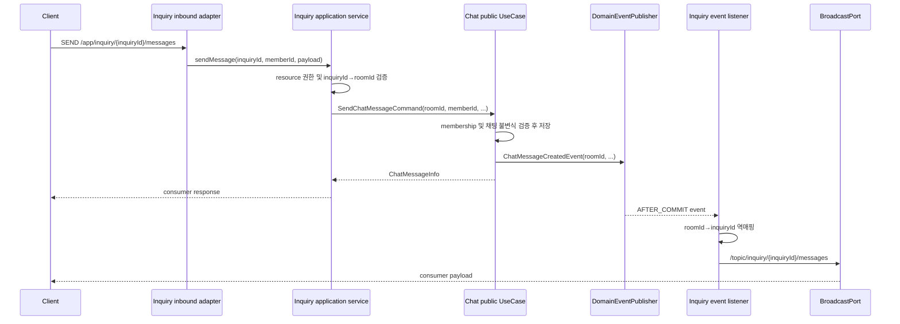

# ADR-026: Chat engine과 소비 도메인의 실시간 책임을 분리한다

## Status

Accepted — PR3 #1127 구현 기준 (2026-07-18)

이 ADR의 결정은 Community invitation-only thread를 Chat engine에 연결하는 PR3에 적용됐다.
아래 `PR3 current implementation`이 기존 예시보다 우선하는 현재 계약이며, client가 보는 정확한
REST/STOMP path·payload는 [`community-thread-client-contract.md`](../guides/community-thread-client-contract.md)에
고정한다. 이 문서의 Context와 대안 설명은 결정을 남기는 historical record다.

## Context

2026년 7월 기준, `chat` 도메인은 inquiry, community 등 여러 bounded context가 재사용하는 내부
engine으로 설계되어 있다. Chat engine은 채팅방, 참여자, 메시지, 읽음 watermark, 답장, 첨부파일,
고정 메시지 같은 채팅 자체의 규칙을 제공한다.

PR [#1136](https://github.com/UMC-PRODUCT/umc-product-server/pull/1136) 이전에는
`ChatMessageBroadcastListener`가 `/topic/chat/rooms/{roomId}/messages`로 직접 broadcast했다.
그러나 이 구조에서는 Chat engine이 다음 소비 도메인 정보를 알아야 했다.

- 어떤 business resource가 어떤 `roomId`를 소유하는가
- 현재 사용자가 inquiry/community resource를 조회하거나 메시지를 전송할 수 있는가
- 외부에 노출할 STOMP destination과 payload가 무엇인가
- 메시지 생성 또는 고정 메시지 변경이 소비 도메인의 상태를 어떻게 바꾸는가

이 정보는 Chat engine의 채팅 불변식이 아니라 각 소비 도메인의 정책이다. 예를 들어 inquiry는 문의
작성자와 담당 운영진을 허용하지만, community는 게시물 참여자나 별도 역할을 허용할 수 있다. Chat
engine이 이를 직접 판단하면 consumer type 분기와 다른 도메인의 Query UseCase 의존이 engine에
누적된다.

현재 관련 계약과 구현은 다음 위치에 있다.

- Chat command/query 계약:
  `src/main/java/com/umc/product/chat/application/port/in`
- 메시지 생성 이벤트:
  `chat/domain/event/ChatMessageCreatedEvent.java`
- 고정 메시지 변경 이벤트:
  `chat/domain/event/ChatRoomPinnedMessageChangedEvent.java`
- 공통 구독 인가 확장점:
  `global/websocket/application/port/in/StompSubscriptionAuthorizer.java`
- 공통 authorizer registry:
  `global/websocket/application/service/StompSubscriptionAuthorizerRegistry.java`
- broker 보호:
  `global/websocket/interceptor/StompAuthChannelInterceptor.java`
- 범용 broadcast port:
  `global/websocket/application/port/out/BroadcastPort.java`

### 문제점

1. **Consumer 권한을 Chat membership만으로 대체할 수 없다.** Chat membership은 해당 방에서 메시지를
   읽고 쓸 수 있는 engine 규칙이다. 반면 resource의 공개 범위, 운영진 역할, 삭제 상태 같은 business
   권한은 consumer aggregate와 정책이 판단해야 한다. 둘 중 하나만 확인하면 권한이 어긋난다.
2. **raw `roomId`를 외부 계약으로 노출하면 도메인 격리가 호출자 관례에 의존한다.** 클라이언트가
   consumer API에 임의의 다른 방 ID를 전달할 수 있으면, consumer resource와 방의 소유 관계를
   건너뛸 수 있다.
3. **구독은 simple broker가 처리하므로 consumer controller까지 도달하지 않는다.** `/topic/**` 구독
   전에 destination 소유 도메인을 찾고 권한을 위임하는 공통 확장점이 필요하다.
4. **저장 트랜잭션과 실시간 전송의 일관성 경계가 다르다.** DB commit 전에 broadcast하면 rollback된
   메시지가 클라이언트에 보일 수 있다. 반대로 broadcast 실패를 메시지 저장 실패로 취급하면 일시적인
   broker 장애가 핵심 채팅 기능을 막는다.
5. **이벤트에는 consumer resource ID가 없다.** Chat engine이 consumer를 모르는 설계를 유지하려면,
   consumer가 자신의 aggregate에 저장한 `chatRoomId`로 이벤트를 역매핑해야 한다.

### 결정이 필요한 이유

Inquiry와 Community가 Chat engine을 사용하기 전에 동일한 책임 경계와 구현 패턴을 확정해야 한다.
그렇지 않으면 각 consumer가 engine API를 직접 노출하거나, 구독 인가와 broadcast를 서로 다른
방식으로 구현해 보안 및 운영 특성이 달라질 수 있다.

프로젝트의 Hexagonal Architecture 규칙상 한 도메인은 다른 도메인의 entity/repository를 직접 참조할
수 없고, 공개 UseCase와 ID만 사용해야 한다. 따라서 이 결정은 Chat engine, consumer domain,
global WebSocket infrastructure 사이의 의존 방향도 함께 고정한다.

## Decision

우리는 **Chat engine은 채팅 불변식과 도메인 이벤트를 소유하고, 소비 도메인은 business resource,
외부 API/STOMP destination, 구독·전송 권한, broadcast를 소유하도록 분리**하기로 결정한다.

| 관심사 | Chat engine | 소비 도메인 | Global WebSocket |
|-------|-------------|------------|------------------|
| 식별자 | `roomId`, `messageId` | resource ID와 `chatRoomId` 매핑 | destination 문자열 |
| 권한 | Chat membership과 메시지 불변식 | resource 조회·전송·pin/unpin 권한 | JWT 인증과 authorizer 위임 |
| 외부 API | 제공하지 않음 | REST/GraphQL/STOMP adapter 제공 | `/ws`, broker 보안 경계 제공 |
| 실시간 전송 | domain event 발행 | topic, payload, broadcast 소유 | generic `BroadcastPort` 구현 |
| 상태 변화 | 읽음, 고정 메시지 등 Chat 상태 | inquiry/community 상태와 알림 | business 상태를 알지 않음 |
| 장애 복구 | 저장된 Chat 상태 보존 | 조회 API와 client backfill 제공 | broker 오류 전달·관측 기반 제공 |

### 1. Chat engine의 책임

Chat engine은 다음만 담당한다.

- 채팅방 생성·삭제, 참여·퇴장
- 방 membership 검증
- 메시지 생성, 답장 대상 및 첨부파일 정합성 검증
- 방 단위 메시지 순서와 발신자 읽음 처리
- 사용자가 실제 확인한 `lastSeenMessageId` 기반 읽음 watermark 갱신
- 메시지 고정·해제 및 방 상세의 전체 고정 메시지 조회
- consumer가 전달한 `roomId` 집합에 대한 채팅방 요약 조회
- `ChatMessageCreatedEvent`, `ChatRoomPinnedMessageChangedEvent` 발행

Chat engine은 다음을 하지 않는다.

- inquiry/community 타입이나 aggregate를 참조하지 않는다.
- consumer resource ID와 `roomId`의 소유 관계를 저장하지 않는다.
- REST, GraphQL, STOMP destination을 외부에 직접 제공하지 않는다.
- consumer topic을 조립하거나 `BroadcastPort`를 직접 호출하지 않는다.
- inquiry 상태 전환, community 알림 같은 consumer 후속 동작을 처리하지 않는다.

### 2. 소비 도메인의 책임

각 소비 도메인은 다음을 담당한다.

- aggregate 또는 자체 mapping에 engine의 `chatRoomId`를 ID로 보관한다.
- business resource ID에서 `chatRoomId`로의 매핑을 검증한다.
- resource 조회, 메시지 전송, 참여자 변경, pin/unpin 권한을 검증한다.
- REST/GraphQL/STOMP inbound adapter와 외부 DTO를 소유한다.
- Inbound adapter가 호출할 consumer Port In과 facade application service를 소유한다.
- 자신의 destination namespace와 broadcast payload를 소유한다.
- Chat domain event의 `roomId`를 자신의 resource로 역매핑한다.
- 메시지 생성, 고정 메시지 변경에 따른 consumer 상태 전환과 알림을 처리한다.
- resource 삭제·보관 시 engine 방을 삭제할지 유지할지 lifecycle 정책을 결정한다.

소비 도메인은 Chat entity/repository에 직접 접근하지 않고 공개 Chat UseCase만 호출한다. Consumer
aggregate와 Chat aggregate 사이에는 객체 관계나 cross-domain JPA FK를 두지 않는다.

### 3. Global WebSocket infrastructure의 책임

공통 WebSocket 계층은 business resource를 알지 않고 다음 보안 경계만 제공한다.

- `CONNECT`와 STOMP 1.2 `STOMP` 명령의 JWT 인증
- `/topic*`, `/queue*`, `/user/**`에 대한 client 직접 발행 차단
- client inbound의 server-only `MESSAGE` 명령 차단
- `/user/queue/errors`는 recoverable error용 exact destination으로 공통 허용
- 그 외 `/topic*`, `/queue*`, `/user/**` SUBSCRIBE를
  `StompSubscriptionAuthorizerRegistry`로 위임하고 exact-match 승인이 없으면 차단

Registry는 destination을 지원하는 authorizer가 **정확히 하나이고**, 해당 authorizer가 승인한 경우에만
구독을 허용한다. authorizer 없음, 거부, 복수 매칭, 인증 주체 없음은 모두 fail-closed 처리한다.

### 4. 소유권 및 보안 불변식

모든 consumer 구현은 다음 불변식을 지킨다.

1. 외부 요청은 consumer resource ID만 받는다. Engine `roomId`를 client 입력으로 직접 받지 않는다.
2. 하나의 Chat room은 하나의 consumer resource가 소유한다. Consumer의 `chatRoomId`에는 unique
   constraint 또는 동등한 애플리케이션 불변식을 둔다.
3. Consumer 권한과 Chat 방 접근 권한을 모두 만족해야 한다. 변경은 Chat membership을 요구하고,
   조회는 방의 `ChatRoomReadScope`가 정한다(`MEMBER_ONLY` 기본, `PUBLIC`이면 비멤버 조회 허용).
   Subscription authorizer 승인은 Chat membership 생성이나 변경을 대신하지 않는다.
   자세한 내용은 아래 `Amendment: room read scope`를 참고한다.
4. Consumer가 engine 방을 생성한 뒤 resource에 `chatRoomId`를 저장하는 과정은 하나의 application
   transaction에서 수행한다.
5. `StompSubscriptionAuthorizer.supports`는 자신이 소유한 exact destination namespace만 선택한다.
   다른 consumer와 namespace가 겹치면 registry가 복수 매칭으로 거부한다.
6. Chat event를 소유하지 않은 consumer event handler는 예외를 던지지 않고 무시한다. 이를 위해
   consumer application service가 사용하는 `findByChatRoomId` Port Out은 `Optional`을 반환한다.
7. Consumer adapter는 Chat event를 consumer command로 변환한 뒤 consumer Port In만 호출한다.
   Consumer application service가 Chat event 타입이나 다른 도메인의 repository를 직접 의존하지 않는다.

### 5. 명령 처리 흐름

클라이언트는 `roomId`가 아니라 consumer resource ID로 요청한다. Inquiry를 예로 들면 다음과 같다.



Consumer application service가 수행할 순서는 다음과 같다.

1. 현재 사용자와 business resource를 조회한다.
2. resource 조회/전송 권한을 검증한다.
3. resource가 보유한 `chatRoomId`를 얻는다.
4. 공개 Chat command/query UseCase를 호출한다.
5. Chat `Info`를 consumer `Response`로 변환한다.

### 6. 구독 인가 흐름

Consumer는 자신의 destination 형식을 해석하는 authorizer를 제공한다.

```java
@Component
@RequiredArgsConstructor
class InquiryStompSubscriptionAuthorizer implements StompSubscriptionAuthorizer {

    private final CheckInquiryChatAccessUseCase checkInquiryChatAccessUseCase;

    @Override
    public boolean supports(String destination) {
        return InquiryStompDestination.matches(destination);
    }

    @Override
    public boolean isAuthorized(Long memberId, String destination) {
        return InquiryStompDestination.parse(destination)
            .map(inquiryId -> checkInquiryChatAccessUseCase.canRead(memberId, inquiryId))
            .orElse(false);
    }
}
```

Destination parser는 예를 들어 `^/topic/inquiry/([0-9]+)/messages$`처럼 전체 경로가 일치하는 경우만
허용한다. 단순 `startsWith`로 resource ID를 잘라내지 않는다. 인가 과정은 side effect 없이 조회만
수행하며, malformed destination은 예외 대신 `false`로 처리한다.

### 7. Event-to-broadcast 흐름

Consumer event listener는 Chat event를 consumer command로 변환하고 consumer Port In에 위임한다.
실제 `roomId` 역매핑과 broadcast는 consumer application service가 수행한다.

```java
@Component
@RequiredArgsConstructor
class InquiryChatEventListener {

    private final HandleInquiryChatEventUseCase handleInquiryChatEventUseCase;

    @TransactionalEventListener(phase = TransactionPhase.AFTER_COMMIT)
    public void on(ChatMessageCreatedEvent event) {
        handleInquiryChatEventUseCase.handle(BroadcastInquiryChatMessageCommand.of(
            event.eventId(),
            event.roomId(),
            event.messageId(),
            event.senderMemberId(),
            event.contentType().name(),
            event.content(),
            event.fileMetadataIds(),
            event.replyToMessageId()
        ));
    }
}
```

`InquiryChatEventCommandService`는 `HandleInquiryChatEventUseCase`를 구현한다. 이 service가 consumer의
`LoadInquiryPort.findByChatRoomId`와 global `BroadcastPort`를 주입받아, 소유한 room일 때만 consumer
destination과 payload를 만들어 전송한다. 이렇게 하면 event adapter는 다른 adapter나 repository가
아닌 consumer Port In에만 의존한다.

Listener는 `AFTER_COMMIT`에서 실행한다. DB rollback 이전에 broadcast해서 존재하지 않는 메시지를
클라이언트가 보는 상황을 막기 위함이다. `BroadcastPort`가 예외를 전파하므로 consumer listener는
실패 metric과 로그 정책을 소유한다.

실시간 broadcast는 상태의 source of truth가 아니라 best-effort 갱신 신호다. Broker 장애나 연결
단절이 발생해도 저장된 메시지는 consumer 조회 API로 복구할 수 있어야 한다. 클라이언트는 중복 또는
순서 역전을 고려해 `messageId`로 deduplicate/order하고, gap이 의심되면 메시지 조회 API로 backfill한다.

`ChatRoomPinnedMessageChangedEvent`는 `roomId`와 nullable `pinnedMessageId`만 전달한다. Consumer는
이를 자신의 topic에 전달하고, 클라이언트는 consumer 방 상세 API를 다시 조회해 전체
`ChatMessageInfo pinnedMessage`를 복원한다.

### 단계적 진행 / PR 분할

- **Phase 1 (PR #1136)**: Chat 직접 broadcast 제거, domain event 유지, 공통 subscription authorizer
  계약과 fail-closed registry 도입, pinned read model 완성.
- **Phase 2 (각 consumer PR)**: resource→roomId mapping, consumer facade UseCase, authorizer, event
  listener, destination/payload, contract/integration test 구현.
- **Phase 3 (운영 hardening)**: session별 활성 subscription 상한, SUBSCRIBE rate limit, broadcast 실패
  metric/alert, 필요 시 외부 broker relay와 consumer delivery outbox 도입.

## Alternatives Considered

### 대안 A: Chat engine이 `/topic/chat/rooms/{roomId}`를 직접 소유

Chat membership만 확인해 engine이 모든 방을 동일한 topic으로 broadcast하는 방식이다.

장점:

- Consumer마다 listener와 destination 조립 코드를 작성하지 않아도 된다.
- Chat message 저장부터 broadcast까지 한 모듈에서 추적하기 쉽다.

단점:

- Client에 raw engine `roomId`가 노출된다.
- Inquiry/community resource 권한과 lifecycle을 engine이 알 수 없다.
- Consumer별 payload, 상태 전환, 알림 정책을 지원하려면 engine에 consumer 분기가 누적된다.
- Chat membership과 business resource 권한의 불일치를 막기 어렵다.

선택하지 않은 이유:
Chat engine이 consumer 정책을 알게 되어 재사용 가능한 내부 engine이라는 경계가 무너지고,
cross-domain 의존 방향도 복잡해진다.

### 대안 B: Global WebSocket interceptor가 모든 consumer 정책을 직접 분기

공통 interceptor가 destination prefix를 보고 inquiry/community Query UseCase를 직접 호출하는
방식이다.

장점:

- 구독 인가 코드가 한 클래스에 모인다.
- Consumer마다 authorizer를 만들 필요가 없다.

단점:

- Global infrastructure가 모든 consumer 도메인을 의존한다.
- 새 consumer를 추가할 때마다 공통 보안 코드를 수정해야 한다.
- 하나의 interceptor가 destination parsing과 모든 business policy를 소유하는 God component가 된다.

선택하지 않은 이유:
공통 계층은 위임 메커니즘만 제공하고 실제 정책은 resource를 소유한 도메인에 두어야 의존 방향과
변경 격리가 유지된다.

### 대안 C: Consumer가 Chat command 반환 직후 동기 broadcast

Consumer service가 `SendChatMessageUseCase.send` 반환값을 받아 같은 호출 흐름에서 즉시
`BroadcastPort`를 호출하는 방식이다.

장점:

- 별도 event listener와 room 역매핑 조회가 필요 없다.
- 요청-응답 흐름 안에서 broadcast 성공 여부를 바로 알 수 있다.

단점:

- DB commit 전에 broadcast될 수 있어 rollback된 메시지가 노출될 수 있다.
- REST, scheduler 등 다른 진입점이 Chat UseCase를 호출하면 broadcast를 누락하기 쉽다.
- 일시적인 broker 실패가 consumer command의 핵심 트랜잭션과 결합된다.

선택하지 않은 이유:
저장 성공과 실시간 전달은 서로 다른 신뢰성 경계다. Chat domain event를 단일 진입점으로 사용하고
consumer가 commit 이후 전달을 담당하는 편이 누락과 결합도를 줄인다.

## Consequences

### Positive

- Chat engine은 consumer type을 몰라도 여러 도메인에서 재사용할 수 있다.
- Business resource 권한과 destination이 resource 소유 도메인에 함께 위치한다.
- Client가 임의의 engine `roomId`를 주입하는 경로를 consumer adapter에서 차단할 수 있다.
- 새 consumer는 공통 authorizer/broadcast infrastructure를 재사용하면서 자신의 정책만 추가한다.
- Broker 또는 STOMP 구현이 바뀌어도 Chat domain과 consumer policy는 영향을 적게 받는다.

### Negative

- Consumer마다 facade UseCase, authorizer, event listener, destination parser, payload mapper를 구현해야
  한다.
- Chat event마다 각 consumer listener가 `roomId` 역매핑 조회를 수행할 수 있어 consumer 수가 늘면
  조회 비용이 증가한다.
- 실시간 broadcast는 best-effort이므로 client backfill과 운영 metric이 필요하다.
- Consumer resource와 Chat membership 동기화가 consumer application service의 추가 책임이 된다.

### Neutral / Trade-offs

- Chat engine은 consumer를 모르지만 member ID와 room membership은 안다. 이는 consumer policy가
  아니라 채팅 불변식을 보호하기 위한 의도적인 defense-in-depth다.
- Domain event는 consumer resource ID 대신 engine `roomId`를 유지한다. Engine 독립성은 얻지만
  consumer listener에 역매핑 비용이 생긴다.
- `app.event-outbox.enabled=false`이면 event는 local Spring bus로 즉시 발행되고, `true`이면 outbox
  poll 주기만큼 지연될 수 있다. 어느 경우든 consumer listener는 commit 이후 동작해야 한다.
- 중요한 consumer 상태 전환이 at-least-once delivery를 요구한다면 `eventId` 기반 멱등성과 consumer
  전용 outbox/consumer를 추가해야 한다. 일반 WebSocket broadcast 실패를 Chat 저장 실패로 되돌리지는
  않는다.

## Implementation Notes

### 변경 영역 요약

1. **Chat domain/application** (`com.umc.product.chat.*`): engine UseCase, membership/메시지 불변식,
   domain event를 소유한다. 외부 inbound adapter와 broadcast listener는 두지 않는다.
2. **Consumer domain/application** (`com.umc.product.inquiry.*`, `com.umc.product.community.*`):
   `chatRoomId`, business access policy, Chat facade Port In/Service, event 처리 Port In/Service를 소유한다.
3. **Consumer adapter (in)**: REST/GraphQL/STOMP endpoint, `StompSubscriptionAuthorizer`, Chat event
   listener, consumer DTO/payload를 소유한다. 모든 adapter는 consumer Port In만 호출한다.
4. **Global WebSocket application/adapter** (`com.umc.product.global.websocket.*`): authorizer registry,
   JWT principal, broker 보호, generic `BroadcastPort`와 STOMP adapter를 소유한다.
5. **DB**: consumer table 또는 mapping table에 `chat_room_id`를 저장한다. Cross-domain JPA 관계는
   만들지 않으며, consumer 내부에서 가능한 범위의 unique constraint를 둔다.
6. **테스트**: engine contract, consumer mapping/access, authorizer, event-to-broadcast, 실제 STOMP
   구독을 레이어별로 검증한다.

### Consumer 패키지 예시

```text
inquiry/
├── domain/
│   └── Inquiry.java                                  # chatRoomId 보관
├── application/
│   ├── port/in/
│   │   ├── command/SendInquiryChatMessageUseCase.java
│   │   ├── command/HandleInquiryChatEventUseCase.java
│   │   └── query/CheckInquiryChatAccessUseCase.java
│   ├── port/out/LoadInquiryPort.java                 # findByChatRoomId → Optional
│   └── service/
│       ├── command/InquiryChatCommandService.java
│       ├── command/InquiryChatEventCommandService.java
│       └── query/InquiryChatAccessQueryService.java
└── adapter/in/
    ├── web/InquiryChatController.java
    ├── websocket/InquiryStompSubscriptionAuthorizer.java
    └── event/InquiryChatEventListener.java
```

`InquiryChatController`, `InquiryStompSubscriptionAuthorizer`, `InquiryChatEventListener`는 각자 consumer
Port In만 호출한다. Chat public UseCase와 consumer `LoadPort`, `BroadcastPort`의 조합은 consumer
application service 안에서 수행한다.

### Consumer 구현 체크리스트

- [ ] 외부 API가 engine `roomId` 대신 consumer resource ID를 받는가?
- [ ] 모든 command/query 전에 resource→roomId와 consumer 권한을 검증하는가?
- [ ] Chat membership 생성·변경이 consumer 참여자 lifecycle과 동기화되는가?
- [ ] `supports`가 exact destination만 선택하고 malformed input을 fail-closed 처리하는가?
- [ ] event listener가 `findByChatRoomId`로 자기 resource만 처리하는가?
- [ ] listener가 `AFTER_COMMIT`에서 broadcast하는가?
- [ ] message event 중복·순서 역전 시 client가 `messageId`로 복구 가능한가?
- [ ] pinned event 수신 후 consumer 상세 API 재조회 경로가 있는가?
- [ ] resource 삭제·보관 시 Chat room lifecycle 정책이 정의됐는가?
- [ ] broadcast 실패 metric/log와 API backfill 경로가 있는가?

### 필수 테스트 계약

Consumer마다 다음 테스트를 추가한다.

1. 올바른 resource ID가 소유한 `roomId`로 변환된다.
2. 다른 consumer/resource의 `roomId`를 주입할 수 없다.
3. 조회·전송·pin/unpin은 consumer 권한 거부 시 Chat UseCase를 호출하지 않는다.
4. authorizer 하나가 승인할 때만 실제 SUBSCRIBE가 성공한다.
5. malformed destination, 비인가 사용자, authorizer 없음/복수 매칭은 거부된다.
6. 소유한 room의 `ChatMessageCreatedEvent`만 consumer topic으로 전달된다.
7. 소유하지 않은 room event는 예외와 broadcast 없이 무시된다.
8. `ChatRoomPinnedMessageChangedEvent`의 pin/unpin payload와 상세 재조회 흐름이 동작한다.
9. 실제 SockJS/STOMP 연결에서 JWT 인증, 구독 인가, broadcast 수신을 검증한다.
10. broker 장애가 저장된 메시지나 consumer aggregate를 rollback하지 않으며 조회 API로 복구된다.

## References

- PR: [UMC-PRODUCT/umc-product-server#1136](https://github.com/UMC-PRODUCT/umc-product-server/pull/1136)
- [ADR-011: Inquiry domain with WebSocket STOMP](./011-inquiry-domain-with-websocket-stomp.md)
- [ADR-018: DomainEventPublisher 추상화](./018-abstract-spring-event-publisher-for-future-broker.md)
- [ADR-019: Transactional Event Outbox](./019-introduce-transactional-event-outbox.md)

## PR3 current implementation

Issue #1127의 Community thread는 위 결정을 다음과 같이 구체화한다.

### Ownership and persistence

- CommunityThread가 메타데이터, membership/role/state, capacity, pin/mute, projection, report와
  외부 API/destination을 소유한다. Chat은 message/reply/attachment/mention/reaction/edit/tombstone/read
  invariant와 generic event만 소유한다.
- CommunityThread와 CommunityThreadMember는 direct JPA entity다. 두 domain 사이에는 scalar
  `chatRoomId`만 있고 JPA FK·entity/repository 참조·`@OneToMany`는 없다.
- `chatRoomId`는 내부 역매핑용이며 REST, STOMP request/response, event payload에 노출하지 않는다.
  Community service가 Chat public UseCase를 호출하고 thread lock 뒤 ChatRoom lock에서 membership과
  reply/mention/idempotency를 재검증한다.
- Community soft delete는 Chat hard delete를 호출하지 않는다. Chat history와 Community detail/list가
  reconnect/backfill의 source of truth다.

### Current transport boundary

- REST `/api/v1/community`는 thread control/query/recovery/moderation만 담당한다. History query,
  report와 `/api/v1/community/admin/thread-message-reports`는 REST에 남기되 message create/edit/
  tombstone, reaction add/remove, read mutation은 REST에 만들지 않는다.
- `/ws` SockJS/STOMP는 six `/app/community/threads/...` SEND command를 통해 message/reaction/read
  mutation을 담당한다. subscription은 정상 event와 ACK를 위한
  `/user/queue/community/threads/events`, recoverable error를 위한 `/user/queue/errors` 두
  namespace만 사용하며 공용 thread topic은 금지한다.
- Global WebSocket은 JWT CONNECT, broker-direct SEND 차단, destination registry 위임, typed recoverable
  error와 rate-limit만 제공한다. Community가 subscribe/SEND business permission과 payload를 소유한다.

정확한 SEND namespace는 다음 여섯 개뿐이다.

```text
/app/community/threads/{threadId}/messages
/app/community/threads/{threadId}/messages/{messageId}/edit
/app/community/threads/{threadId}/messages/{messageId}/delete
/app/community/threads/{threadId}/messages/{messageId}/reactions/add
/app/community/threads/{threadId}/messages/{messageId}/reactions/remove
/app/community/threads/{threadId}/read
```

정확한 subscription namespace는 다음 두 개뿐이다.

```text
/user/queue/community/threads/events
/user/queue/errors
```

공용 thread topic, raw `roomId` 경로, message/reaction/read REST mutation은 제공하지 않는다.
client는 각 session에서 event queue와 error queue를 한 번씩 구독하며, 한 회원의 여러 활성
session이 구독하면 모든 session이 같은 사용자 대상 event를 받는다.

### Commit, relay, and recovery

Chat/Community state event는 commit 이후 outbox relay에서 전송한다. per-recipient fan-out은 모든
수신자를 시도하고 실패를 집계한 뒤 stable `eventId`를 유지해 retry한다. broker failure는 business
transaction을 rollback하지 않으며, client는 history/detail/member REST query로 backfill한다.
ACK는 storage acknowledgement가 아닌 caller correlation이며, recoverable error는
`/user/queue/errors`로 보낸다. CONNECT/protocol/direct-broker-SEND/malformed-SUBSCRIBE 오류만 terminal
STOMP ERROR로 남긴다.

User Destination 전환은 per-recipient fan-out을 제거하지 않는다. relay는 event마다 현재 ACTIVE
멤버를 계산해 각 member의 `/user/queue/community/threads/events`로 전송한다. 따라서
kick/leave 후 기존 session에 구독이 남아 있어도 후속 event의 recipient에서 제외된다.

현재 구현 경로는 `CommunityThreadRealtimeEventListener` →
`CommunityThreadRealtimeFanOutService` → `CommunityThreadChatRealtimeRelay`/`CommunityThreadLifecycleRealtimeRelay`
→ `CommunityThreadRealtimeDelivery` → `CommunityThreadRealtimeBroadcastAdapter`다. Chat의
`ChatMessageCreatedEvent`, `ChatMessageUpdatedEvent`, `ChatMessageDeletedEvent`,
`ChatMessageReactionChangedEvent`, `ChatReadUpdatedEvent`는 generic source이고, Community의
`CommunityThreadInvitedEvent`, `CommunityThreadUpdatedEvent`, `CommunityThreadDeletedEvent`,
`CommunityThreadMemberKickedEvent`, `CommunityThreadMemberLeftEvent`는 lifecycle source다.
`EventOutboxRelayService`가 `NON_TRANSACTIONAL` event를 outbox commit 뒤 publish하며, listener 예외는
fan-out 실패로 집계되어 재시도된다. 따라서 코드의 `@EventListener`가 임의의 pre-commit broadcast를
의미하는 것은 아니다.

recoverable error payload는 `WebSocketErrorPayload`의 nullable command/client IDs, numeric status,
stable code/message, retryable이며 session을 닫지 않는다. message/reaction/read gap은
`GET /api/v1/community/threads/{threadId}/messages`, metadata/member/settings gap은 thread
detail/list/member REST query로 복구한다. terminal kick/leave/delete event에는 broker replay를
가정하지 않는다.

### Alarm-ready seam

알람 delivery consumer는 PR3에서 구현하지 않는다. 미래 consumer를 위해
`CommunityThreadInvitedEvent`, `CommunityThreadMessageCreatedEvent`,
`CommunityThreadMentionedEvent`라는 ID-only immutable business facts만 남긴다. text, title, name,
token, deeplink, provider payload, mute/offline/DND decision과 notification dependency는 포함하지
않는다. `CommunityThreadInvitedEvent`는 lifecycle `thread.invited` realtime source이기도 하지만,
`CommunityThreadMessageCreatedEvent`와 `CommunityThreadMentionedEvent`는 Chat generic realtime
event와 분리된 alarm-ready fact이며 realtime fan-out source로 다시 소비하지 않는다.

세 fact의 구현은 `community/application/event/CommunityThreadMessageCreatedEvent.java`,
`CommunityThreadMentionedEvent.java`와 `CommunityThreadInvitedEvent.java`이며 payload는 thread,
message, sender/inviter와 recipient/invited/mentioned member의 ID snapshot만 갖는다. 알림 발송,
FCM/APNs, token, deeplink, title/name, mute/offline/DND 결정과 notification dependency는 PR3에서
구현하지 않는다.

### Broker, readiness, and observability gates

- `WebSocketMessageBrokerConfig`는 모든 프로필에서 선택 가능한 instance-local `SIMPLE` broker와 shared
  external `RELAY`를 분기한다. `WebSocketBrokerPropertiesValidator`는 `RELAY`를 선택한 경우에만 relay
  host/virtual-host/system·client credential 누락과 port 범위를 fail-fast로 검증한다.
- dev/prod에서 relay를 선택하면 `tls-enabled=true`여야 한다. `StompRelayTcpClientFactory`가 Reactor Netty
  TLS와 HTTPS hostname verification을 적용하며, `WebSocketBrokerProperties.Relay.toString()`은
  credential을 redacted한다. secret은 환경/secret injection에서만 읽고 로그에 남기지 않는다.
- `StompBrokerRelayMonitor`의 availability/reconnect 관측과 `WebSocketBrokerRelayStartupValidator`의
  `startup-timeout` 내 readiness가 relay 운영 기동 조건이다.
- simple broker의 구독과 session registry는 instance-local이다. rolling deploy의 일시적 instance 중첩을
  포함해 다중 instance에서 무손실 실시간 전달이 필요해지면 shared RabbitMQ STOMP plugin/relay
  provisioning, secret injection, ALB SockJS fallback stickiness, configured heartbeat보다 긴 idle timeout과
  전환 검증을 scale-out 선행 조건으로 갖춘다. simple 운영 중 연결 종료·전달 공백은 client reconnect와
  REST backfill로 복구한다.
- `CommunityThreadRealtimeMetrics`는 send/reject/rate-limit/fan-out/broadcast-failure/backfill을
  유한한 `operation`/`outcome`/`reason` bucket으로만 기록한다. `threadId`, `memberId`, `messageId`,
  `eventId`, raw destination은 metric tag가 될 수 없다. relay availability/reconnect 및
  `EventOutboxRelayMetrics` retry/failed도 low-cardinality를 유지한다. 이름은
  `community.thread.realtime.send.commands`, `.reject.commands`, `.rate.limit.rejections`,
  `.fanout.events`, `.fanout.recipients`, `.broadcast.failures`, `.backfill.requests`로 고정한다.

## Amendment: room read scope

Status: Accepted - 이슈 #1244 (2026-08-11)

원 결정은 Chat 방 접근을 membership 단일 규칙으로 두었다. 그러나 Community thread는 상세 조회가
비참여자에게도 공개인 반면 메시지 조회만 membership을 요구해, 스레드에 진입한 비참여자가 대화를
읽을 수 없는 모순이 있었다. 조회 경로의 차단 지점이 Community와 Chat 두 곳이라 소비 도메인만
고쳐서는 해결되지 않는다.

Chat engine에 consumer 분기를 넣는 대신 방 속성으로 조회 범위를 표현하기로 한다.

- `ChatRoomReadScope`는 `MEMBER_ONLY`(기본)와 `PUBLIC`을 갖고 `chat_room.read_scope`에 저장한다.
  값은 방을 만든 소비 도메인이 `CreateChatRoomCommand`로 정하며, engine은 소비 도메인을 알지 않는다.
- `ChatRoomAccessPolicy.verifyMember`는 모든 변경 경로가 그대로 사용한다. 조회 경로만
  `verifyReadable`을 사용하며, 참여자이거나 방이 `PUBLIC`이어야 한다. 참여자 여부를 먼저 확인하므로
  `MEMBER_ONLY` 방의 조회 비용은 기존과 같다.
- 방을 찾지 못하면 존재 여부를 노출하지 않도록 `CHAT_ROOM_ACCESS_DENIED`로 막는다.

따라서 보안 불변식 3번은 "조회는 방의 read scope, 변경은 membership"으로 나뉜다. `PUBLIC`을 선택한
소비 도메인은 resource 단위 조회 권한 검증을 자신이 계속 소유한다. Chat은 방이 공개인지만 알고
어떤 사용자가 그 resource를 볼 수 있는지는 판단하지 않는다.

Community thread 방만 `PUBLIC`으로 만든다. 기존 방은 마이그레이션에서 소유 관계를 따라 backfill하며,
그 밖의 모든 방과 앞으로 추가될 소비 도메인은 명시하지 않는 한 `MEMBER_ONLY`로 남는다.

`PUBLIC`이 "누구나"를 뜻하지 않는다는 점을 Community가 보여준다. 방은 `PUBLIC`이지만 Community는
KICKED 요청자의 목록/상세/메시지 조회를 자신의 계층에서 차단한다. Chat은 방이 공개인지만 알고
강퇴 같은 resource 상태는 모른다.

실시간 fan-out 수신자는 여전히 ACTIVE 멤버로 한정한다. 비참여자는 history query로만 대화를 읽고
push event를 받지 않는다.
