# GraphQL Schema

현재 GraphQL schema의 Relay 중심 관계를 나타낸다. 모든 `ID`는 전역 ID이며 root 목록은
`Connection -> Edge -> node` 구조를 사용한다.

```mermaid
flowchart TD
  Query["Query"]
  Mutation["Mutation"]
  Node["Node<br/>id: ID!"]
  PageInfo["PageInfo"]

  Query -->|node / nodes| Node

  subgraph Member 도메인
    Member["Member implements Node"]
    MemberConnection["MemberSearchResultConnection"]
    MemberEdge["MemberSearchResultEdge"]
    MemberResult["MemberSearchResult"]
    MemberChallenger["MemberChallenger"]

    MemberConnection -->|edges| MemberEdge
    MemberConnection -->|pageInfo| PageInfo
    MemberEdge -->|node| MemberResult
    Member -->|challengers| MemberChallenger
  end

  subgraph Organization 도메인
    Gisu["Gisu implements Node"]
    Chapter["Chapter implements Node"]
    School["School implements Node"]
    GisuConnection["GisuConnection"]
    ChapterConnection["ChapterConnection"]
    SchoolConnection["SchoolNameConnection"]

    GisuConnection --> PageInfo
    GisuConnection -->|edges.node| Gisu
    ChapterConnection --> PageInfo
    ChapterConnection -->|edges.node| Chapter
    SchoolConnection --> PageInfo
  end

  subgraph Project 도메인
    Project["Project implements Node"]
    ProjectConnection["ProjectConnection"]
    ProjectMember["ProjectMember"]
    ProjectApplication["ProjectApplication"]
    ProjectForm["ProjectApplicationForm"]

    ProjectConnection --> PageInfo
    ProjectConnection -->|edges.node| Project
    Project -->|members| ProjectMember
    Project -->|applicationForm| ProjectForm
    ProjectMember -->|application| ProjectApplication
  end

  subgraph Recruiting 도메인
    RecruitingApplication["RecruitingApplication implements Node"]
    RecruitingSeason["RecruitingSeason implements Node"]
    RecruitingConnections["PublicRound / SeasonSummary / Evaluator / Question / Evaluation / Session / Review / DecisionHistory Connections"]
    RecruitingPayloads["Mutation별 Payload"]

    RecruitingConnections --> PageInfo
    Mutation -->|single input| RecruitingPayloads
  end

  Node -.-> Member
  Node -.-> Gisu
  Node -.-> Chapter
  Node -.-> School
  Node -.-> Project
  Node -.-> RecruitingApplication
  Node -.-> RecruitingSeason

  Query -->|members| MemberConnection
  Query -->|gisus| GisuConnection
  Query -->|chapters| ChapterConnection
  Query -->|schools| SchoolConnection
  Query -->|projects| ProjectConnection
  Query -->|recruiting 목록| RecruitingConnections
```

상세 필드와 nullability의 최종 계약은 `src/main/resources/graphql/*.graphqls`이며, 구현 규칙은
[`graphql-relay-conventions.md`](graphql-relay-conventions.md)를 따른다.
