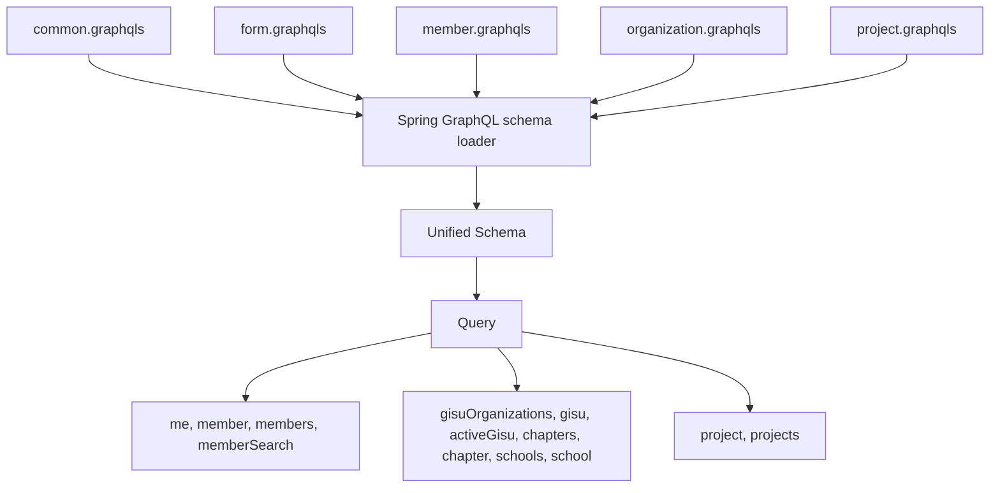
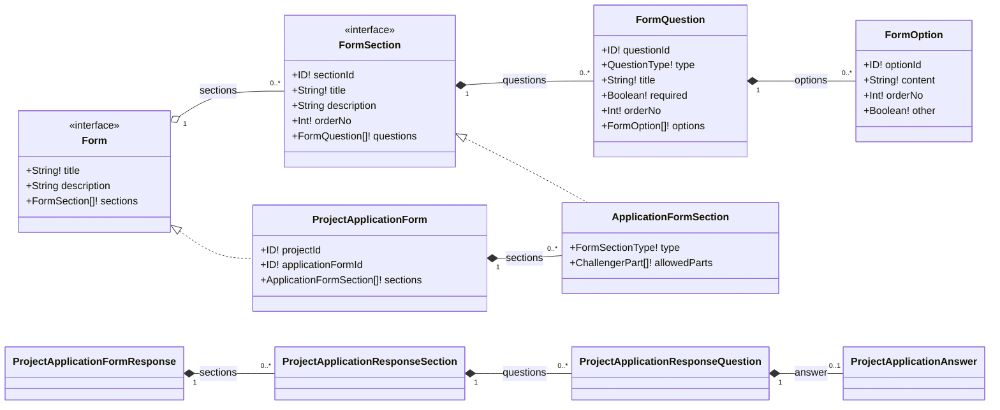
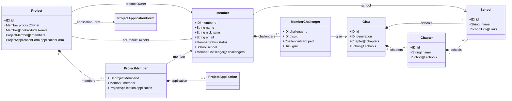

# GraphQL Schema

현재 GraphQL pilot은 다섯 SDL 파일을 Spring GraphQL이 합쳐 하나의 unified schema로 로드한다.
파일은 선언 소유권을 나누지만 endpoint와 전역 type namespace는 공유한다.

| 파일 | 소유 계약 |
| --- | --- |
| `common.graphqls` | `Long`, `ChallengerPart` |
| `form.graphqls` | 공통 Form interface, 질문·옵션 type, form enum |
| `member.graphqls` | canonical `Member`와 member query |
| `organization.graphqls` | root `Query`, canonical `Gisu`, `Chapter`, `School` |
| `project.graphqls` | Project query와 Project concrete type |

## Form과 Project

`ProjectApplicationForm`과 `ApplicationFormSection`은 공통 interface를 구현한다. Project에만 필요한
`type`, `allowedParts`는 `ApplicationFormSection`에 남고 질문·옵션은 공통 object type을 재사용한다.

## Member, Organization, Project

회원 identity는 `Member` 하나를 사용하고, 조직 identity는 `Gisu`, `Chapter`, `School`을 사용한다.
Project의 owner와 member field도 member schema가 소유하는 같은 `Member` type을 참조한다.

`ProjectApplicant`는 지원 당시 정보를 나타내는 Project-owned snapshot이므로 canonical `Member`와 별도 type이다.
그 외 진입 경로별 field 수 차이는 `Summary`나 `Detail` type을 추가하지 않고 client selection set으로 조절한다.

상세 설계 기준은 [GraphQL Schema 관계](onboarding/graphql/schema-relationships.md), 권한 적용 방식은
[GraphQL 권한 관리](onboarding/graphql/authorization.md)를 참고한다.
