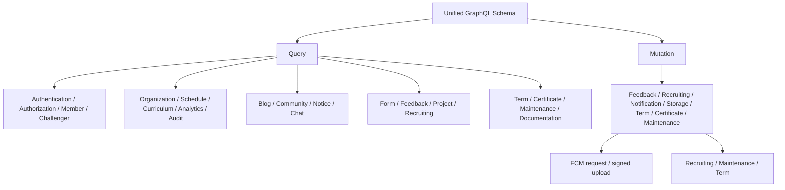
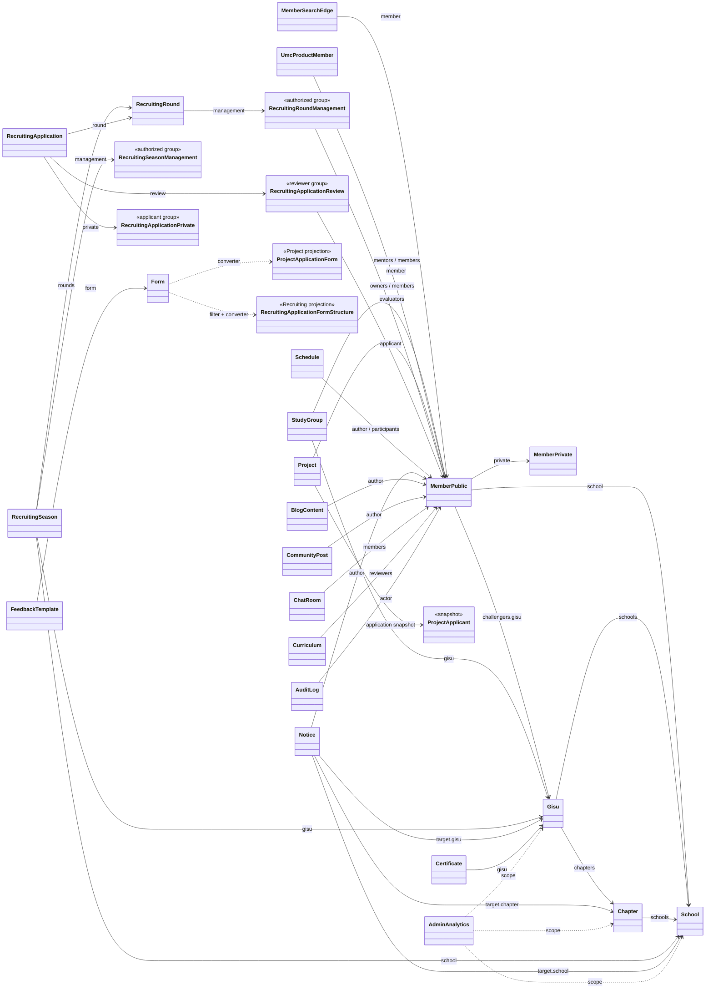

# GraphQL Schema Snapshot

GraphQL pilot은 `src/main/resources/graphql` 아래의 도메인 IDL을 하나의 runtime schema로 조립한다.
파일 구조와 소유권 규칙은 [GraphQL IDL README](../src/main/resources/graphql/README.md), 설계 기준은
[GraphQL Schema 관계](onboarding/graphql/schema-relationships.md)를 참고한다.

## Root

## Domain 관계

Provider resource를 그대로 노출할 때는 canonical type을 직접 참조한다. 소비 문맥에서 구조를
필터링하거나 정책을 결합하면 소비 도메인이 projection과 converter를 소유한다.
