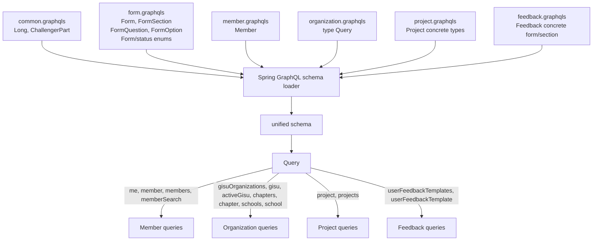
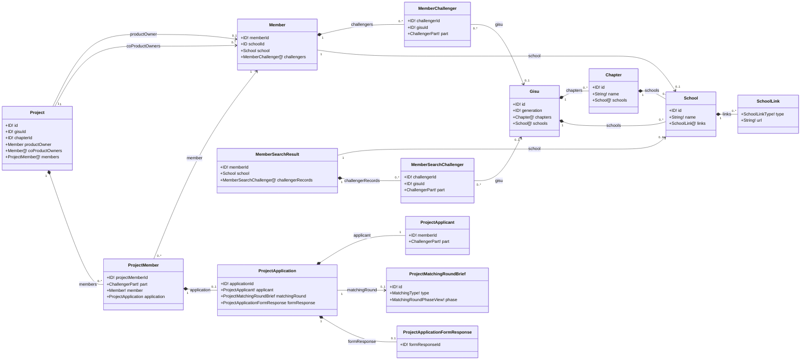
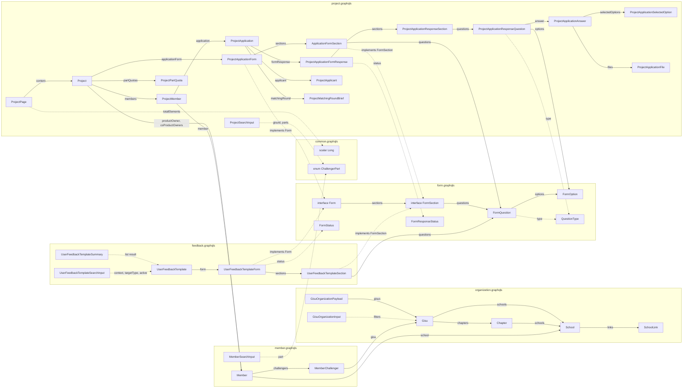

# GraphQL Schema

현재 GraphQL pilot은 여섯 SDL 파일을 Spring GraphQL이 합쳐 하나의 unified schema로 로드한다.
파일은 type 소유권을 나누지만 endpoint와 전역 type namespace는 공유한다.

| 파일 | 소유 계약 |
| --- | --- |
| `common.graphqls` | `Long`, `ChallengerPart` |
| `form.graphqls` | `Form`, `FormSection`, `FormQuestion`, `FormOption`, `FormStatus`, `FormResponseStatus`, `QuestionType` |
| `member.graphqls` | 공통 `Member` type과 member query |
| `organization.graphqls` | organization `Query`와 `Gisu`, 학교·지부 type |
| `project.graphqls` | Project query와 Project concrete extension |
| `feedback.graphqls` | Feedback query와 concrete form/section |

`ProjectApplicationForm`/`ApplicationFormSection`은 각각 `Form`/`FormSection`의 Project concrete
extension이다. `UserFeedbackTemplateForm`/`UserFeedbackTemplateSection`은 각각 같은 공용 계약을
구현하는 Feedback concrete extension이다. 질문·옵션과 form/status enum은 `form.graphqls`가 단일
소유한다.



## ERD 스타일 관계도

아래 diagram은 database ERD가 아니라 unified GraphQL schema의 type 관계를 나타낸다. GraphQL
interface 구현은 `<|..`, 응답 내부의 중첩 구조는 `*--`, 다른 domain type 참조는 `-->`로 표시한다.
cardinality는 schema의 nullability와 list 형태를 기준으로 작성했으며 JPA 연관관계나 foreign key를
의미하지 않는다.

### Form, Project, Feedback

```mermaid
classDiagram
  direction LR

  class Form {
    <<interface>>
    +String! title
    +String description
    +FormSection[]! sections
  }
  class FormSection {
    <<interface>>
    +ID! sectionId
    +String! title
    +Int! orderNo
    +FormQuestion[]! questions
  }
  class FormQuestion {
    +ID! questionId
    +QuestionType! type
    +Boolean! required
    +Int! orderNo
    +FormOption[]! options
  }
  class FormOption {
    +ID! optionId
    +String! content
    +Int! orderNo
    +Boolean! other
  }

  class Project {
    +ID! id
    +ProjectStatus! status
    +ProjectApplicationForm applicationForm
  }
  class ProjectApplicationForm {
    +ID! projectId
    +ID! applicationFormId
    +ApplicationFormSection[]! sections
  }
  class ApplicationFormSection {
    +FormSectionType! type
    +ChallengerPart[]! allowedParts
    +FormQuestion[]! questions
  }
  class ProjectApplicationFormResponse {
    +ID! formResponseId
    +FormResponseStatus! status
    +ProjectApplicationResponseSection[]! sections
  }
  class ProjectApplicationResponseSection {
    +ID! sectionId
    +ProjectApplicationResponseQuestion[]! questions
  }
  class ProjectApplicationResponseQuestion {
    +ID! questionId
    +FormOption[]! options
    +ProjectApplicationAnswer answer
  }
  class ProjectApplicationAnswer {
    +ID! answerId
    +QuestionType! answeredAsType
    +String textValue
  }
  class ProjectApplicationSelectedOption {
    +ID questionOptionId
    +String! answeredAsContent
  }
  class ProjectApplicationFile {
    +ID! fileId
    +String! originalFileName
    +String! url
  }

  class UserFeedbackTemplate {
    +ID! templateId
    +UserFeedbackContext! context
    +UserFeedbackTargetType! targetType
    +Boolean! active
  }
  class UserFeedbackTemplateSummary {
    +ID! templateId
    +ID! formId
    +String! title
    +Boolean! active
  }
  class UserFeedbackTemplateForm {
    +ID! formId
    +FormStatus! status
    +Boolean! anonymous
    +Boolean! allowDuplicateResponses
    +UserFeedbackTemplateSection[]! sections
  }
  class UserFeedbackTemplateSection {
    +ID! sectionId
    +FormQuestion[]! questions
  }

  Form <|.. ProjectApplicationForm
  Form <|.. UserFeedbackTemplateForm
  FormSection <|.. ApplicationFormSection
  FormSection <|.. UserFeedbackTemplateSection
  Form "1" o-- "0..*" FormSection : sections
  FormSection "1" *-- "0..*" FormQuestion : questions
  FormQuestion "1" *-- "0..*" FormOption : options

  Project "1" --> "0..1" ProjectApplicationForm : applicationForm
  ProjectApplicationForm "1" *-- "0..*" ApplicationFormSection : sections
  ApplicationFormSection "1" *-- "0..*" FormQuestion : questions
  ProjectApplicationFormResponse "1" *-- "0..*" ProjectApplicationResponseSection : sections
  ProjectApplicationResponseSection "1" *-- "0..*" ProjectApplicationResponseQuestion : questions
  ProjectApplicationResponseQuestion "1" --> "0..*" FormOption : options
  ProjectApplicationResponseQuestion "1" *-- "0..1" ProjectApplicationAnswer : answer
  ProjectApplicationAnswer "1" *-- "0..*" ProjectApplicationSelectedOption : selectedOptions
  ProjectApplicationAnswer "1" *-- "0..*" ProjectApplicationFile : files

  UserFeedbackTemplateSummary ..> UserFeedbackTemplate : list projection
  UserFeedbackTemplate "1" *-- "1" UserFeedbackTemplateForm : form
  UserFeedbackTemplateForm "1" *-- "0..*" UserFeedbackTemplateSection : sections
  UserFeedbackTemplateSection "1" *-- "0..*" FormQuestion : questions
```



Project의 `ApplicationFormSection.type`, `allowedParts`는 concrete type에만 존재한다. Feedback의
`UserFeedbackTemplateSection`은 같은 `FormSection` interface를 구현하지만 두 Project 전용 field를
노출하지 않는다.

### Member, Organization, Project



Project는 member schema가 소유하는 공통 `Member` type을 직접 참조한다. `Member`,
`MemberSearchResult`가 참조하는 `School`과 `Gisu`는 organization schema가 소유한다.

## 전체 Type 관계



### Project selection 호환성

기존 Project query의 선택 경로와 field는 유지한다. `project.productOwner`,
`project.coProductOwners`, `project.members.member`, `project.members.application`,
`project.applicationForm.sections.questions.options` 경로와 기존 `Project` field 선택을 이 pilot이
변경하거나 확장하지 않는다. 새 Project field는 이 문서 범위에 추가하지 않는다.

### Feedback query 및 권한

Feedback은 query-only다. `userFeedbackTemplates` 목록과 `userFeedbackTemplate` 상세는 pilot에서
`SUPER_ADMIN` 전용 관리자 조회이며, 두 query 모두 `FEEDBACK READ` 권한을 검사한다. 목록 input filter는
`context`, `targetType`, `active`다. 상세 결과는 nullable이고 대상이 없으면 data는 `null`, GraphQL error는
`FEEDBACK-0001` `NOT_FOUND` 및 HTTP `404`를 반환한다. `active: false`인 template도 FEEDBACK READ
권한을 가진 관리자에게는 계속 읽힌다.

```graphql
query {
  userFeedbackTemplates(input: { active: true }) {
    templateId
    context
    targetType
    active
    formId
    title
  }
  userFeedbackTemplate(id: 42) {
    templateId
    form {
      title
      sections {
        title
        questions { questionId type options { optionId content } }
      }
    }
  }
}
```

mutation과 응답자 access는 제공하지 않으며, local fixture가 `SUPER_ADMIN` 계정을 보장한다고 가정하지
않는다.

### Pilot migration note: 제거된 type 이름

기존 client의 fragment 또는 `__typename`이 제거된 `MemberBrief`, `MemberSummary`,
`ApplicationFormQuestion`, `ApplicationFormOption` 이름을 사용한다면 각각 `Member`, `Member`,
`FormQuestion`, `FormOption`으로 마이그레이션해야 한다. 이 note 밖에서는 제거된 이름을 schema type으로
사용하지 않는다.
