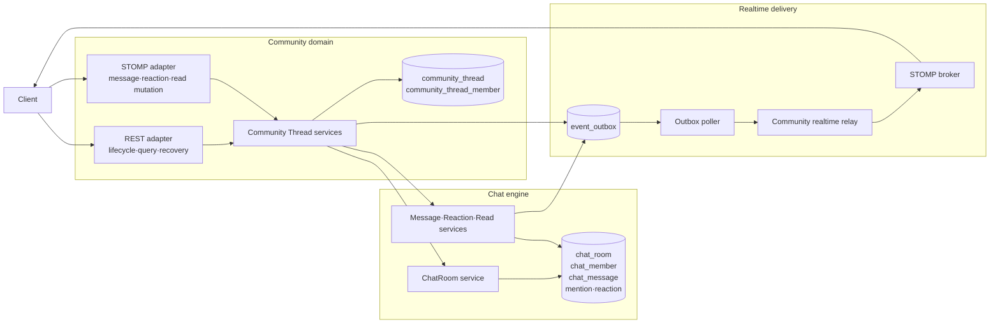
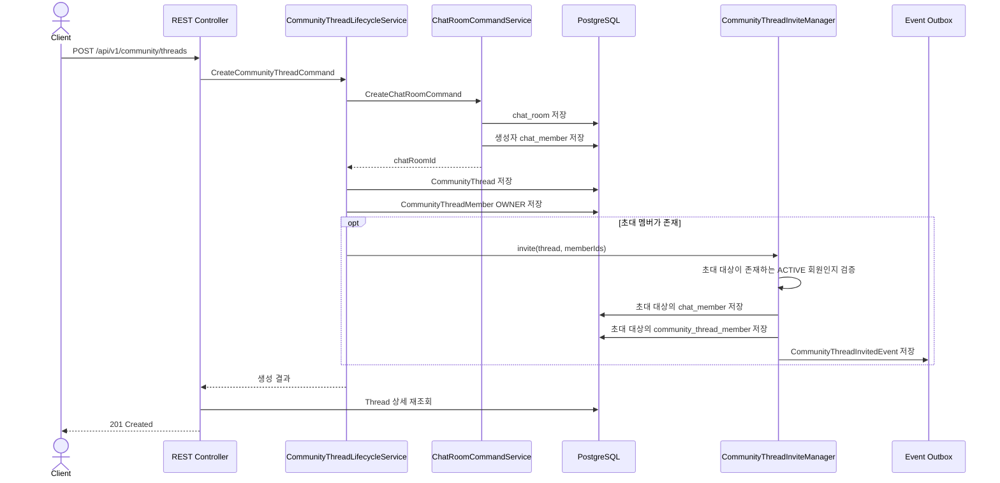
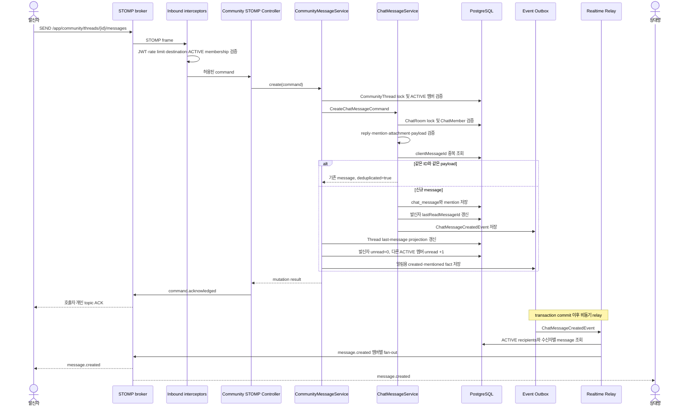
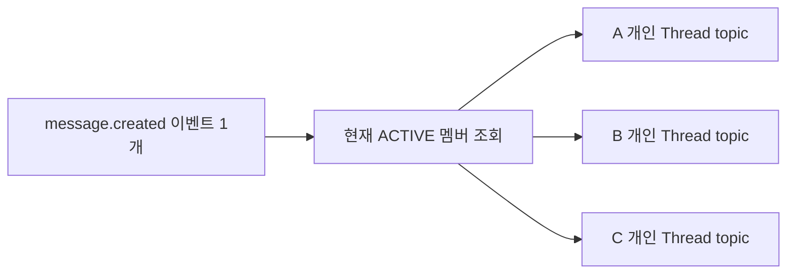
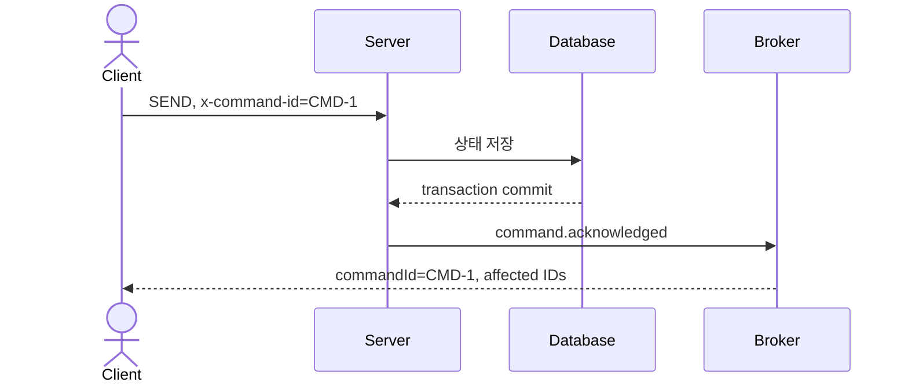
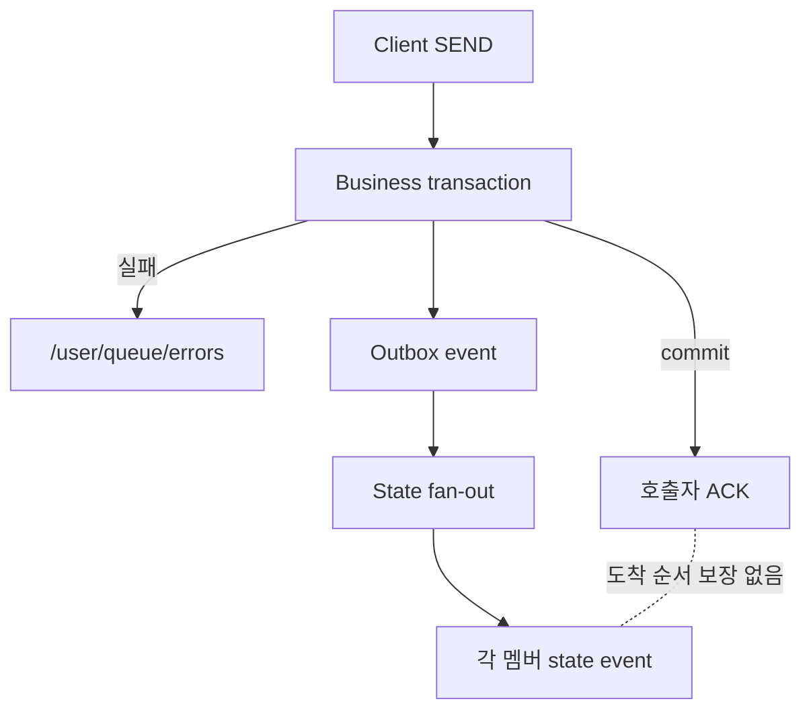
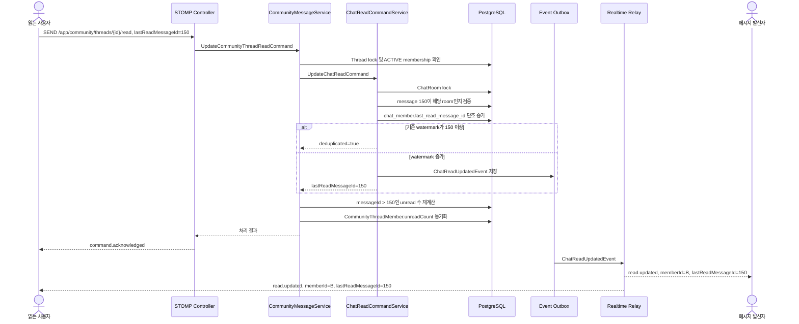
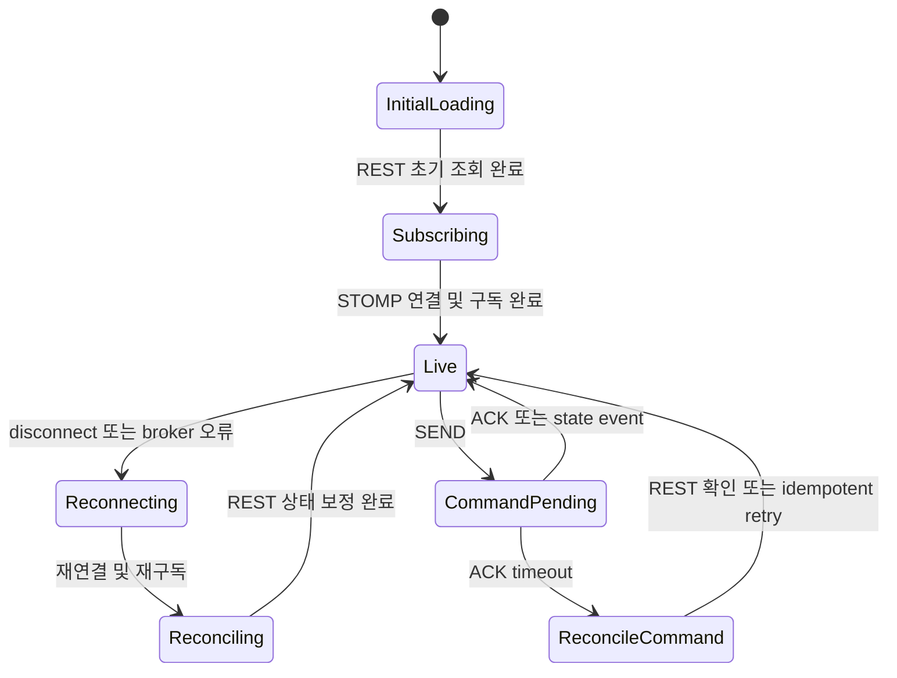
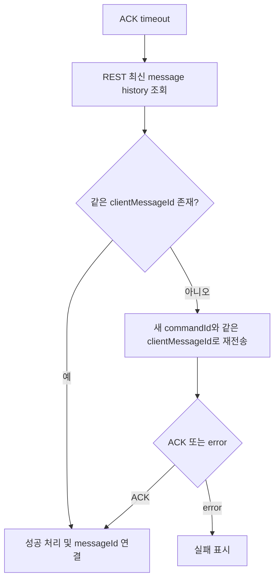

# Community Thread 실시간 통신 아키텍처

> 상태: PR #1166 구현 기준
> 갱신일: 2026-07-21
> 범위: Community Thread, Chat engine, STOMP, fan-out, ACK, REST fallback

## 1. 문서 목적

이 문서는 Community Thread의 생성, 메시지 전송, 실시간 상태 전달, 읽음 처리와 장애 복구가
Community와 Chat engine 사이에서 어떻게 동작하는지 설명한다. 현재 멤버별 topic을 선택한 이유와
향후 Thread 공용 topic으로 전환할 때의 변경 범위도 함께 기록한다.

핵심 결정은 다음과 같다.

- 외부 계약은 `threadId`를 사용하고 Chat engine의 `chatRoomId`를 노출하지 않는다.
- REST는 lifecycle, query, recovery, moderation을 담당한다.
- WebSocket/STOMP는 message, reaction, read의 interactive mutation을 담당한다.
- Community는 Thread 메타데이터와 membership 정책을 소유한다.
- Chat engine은 room, message, reaction, read watermark의 불변식을 소유한다.
- 실시간 상태는 Outbox commit 이후 at-least-once로 전달한다.
- 현재는 ACTIVE 멤버를 매번 계산해 멤버별 destination으로 fan-out한다.

## 2. `CommunityThread`라는 이름을 사용하는 이유

외부 기능명은 Thread이지만 내부 Entity는 `CommunityThread`다.

- Java의 `java.lang.Thread`와 이름 충돌 및 검색 혼선을 피한다.
- 일반 Chat room이 아니라 Community가 소유하는 category, membership, role, invite, report 정책을
  가진 Aggregate임을 표현한다.
- Chat engine의 `ChatRoom`과 Community 공개 모델의 책임을 구분한다.

API와 DTO에서는 문맥이 명확하므로 `threadId`, `ThreadSummaryInfo`처럼 짧은 이름을 사용할 수 있다.

## 3. 도메인 책임과 데이터 소유권



### Community 책임

- Thread title, description, category, icon
- OWNER, ADMIN, MEMBER role
- ACTIVE, LEFT, KICKED membership state
- invite, rejoin, kick, leave, ownership transfer
- pin, mute, unread count와 last-message projection
- Thread message report와 외부 REST/STOMP 계약

### Chat engine 책임

- ChatRoom과 ChatMember
- 메시지, 첨부, reply, mention
- edit와 tombstone
- reaction aggregate
- `lastReadMessageId` watermark
- message create idempotency

`CommunityThread.chatRoomId`는 두 도메인을 연결하는 unique scalar다. JPA relation이나 cross-domain FK는
만들지 않는다.

## 4. 기수 정책

`CommunityThread`는 기수 ID를 저장하지 않는다. Thread 자체는 특정 기수에 귀속되지 않으며,
기수 전환 뒤에도 같은 Thread와 Chat history를 유지한다.

초대 자격은 현재 활성 기수와 Challenger 이력 유무에 무관하다. 존재하는 `ACTIVE` 회원이면 초대할
수 있다. 초대 후보 응답은 최신 Challenger 이력이 있으면 challengerId, part, generation을 함께
내리고, 이력이 없으면 세 필드를 `null`로 반환한다.

| 동작 | Challenger/Gisu 사용 방식 |
| --- | --- |
| 멤버 목록 조립 | 최신 Challenger 이력의 part와 generation을 표시하고, 이력이 없으면 `null` 반환 |
| 메시지 신고 | Challenger/Gisu를 조회하지 않고 로그인 회원의 `memberId`를 신고자 식별자로 저장 |

다음 동작은 기수와 무관하다.

- Thread 생성과 조회
- 메시지 생성, 수정, 삭제
- reaction과 read 처리
- STOMP destination 및 realtime fan-out
- 기존 Community membership 접근 권한

따라서 기수는 Thread의 persistence 속성이나 접근 자격이 아니며, 존재하는 Challenger 이력을
표시할 때만 사용하는 조직 정보다.

## 5. REST와 WebSocket 책임 구분

### REST

REST는 안정적인 조회와 복구가 필요한 기능을 담당한다.

| Method | Path | 책임 |
| --- | --- | --- |
| GET, POST | `/api/v1/community/threads` | 목록과 생성 |
| GET, PATCH, DELETE | `/api/v1/community/threads/{threadId}` | 상세, 수정, soft delete |
| POST, DELETE | `/api/v1/community/threads/{threadId}/pin` | pin, unpin |
| POST, DELETE | `/api/v1/community/threads/{threadId}/mute` | mute, unmute |
| GET | `/api/v1/community/threads/{threadId}/members` | 멤버 조회 |
| GET | `/api/v1/community/threads/{threadId}/invitable` | 초대 가능한 활성 회원 조회 |
| POST | `/api/v1/community/threads/{threadId}/invite` | 초대와 LEFT 재참여 |
| DELETE | `/api/v1/community/threads/{threadId}/members/{memberId}` | 강퇴 |
| POST | `/api/v1/community/threads/{threadId}/leave` | 나가기 |
| PATCH | `/api/v1/community/threads/{threadId}/members/{memberId}/role` | 역할과 소유권 변경 |
| GET | `/api/v1/community/threads/{threadId}/messages` | 최신·과거 메시지와 reconnect backfill |
| POST | `/api/v1/community/messages/{messageId}/report` | 메시지 신고 |

### WebSocket/STOMP

SockJS/STOMP endpoint는 `/ws`다. CONNECT frame에는 JWT를, 모든 SEND에는 canonical lowercase UUID인
`x-command-id`를 넣는다.

| Command | SEND destination |
| --- | --- |
| message create | `/app/community/threads/{threadId}/messages` |
| message edit | `/app/community/threads/{threadId}/messages/{messageId}/edit` |
| message tombstone | `/app/community/threads/{threadId}/messages/{messageId}/delete` |
| reaction add | `/app/community/threads/{threadId}/messages/{messageId}/reactions/add` |
| reaction remove | `/app/community/threads/{threadId}/messages/{messageId}/reactions/remove` |
| read update | `/app/community/threads/{threadId}/read` |

현재 구독 namespace는 다음과 같다.

```text
/topic/community/threads/{threadId}/members/{memberId}/events
/topic/community/members/{memberId}/events
/user/queue/errors
```

## 6. WebSocket 입력 어댑터 파일 구분

`community/adapter/in/websocket`은 transport adapter다. 도메인 상태를 직접 저장하지 않고 application
UseCase에 위임한다.

### Command 진입과 공통 실행

| 파일 | 책임 |
| --- | --- |
| `CommunityThreadStompController` | 6개 STOMP SEND command를 UseCase로 전달 |
| `CommunityStompCommandSupport` | Principal, `x-command-id`, ACK, error, metric 공통 처리 |
| `CommunityStompCommandContext` | member ID, username, command ID 보관 |
| `CommunityStompCommandOutcome` | command 결과와 영향받은 ID 보관 |
| `CommunityStompCommandType` | message/reaction/read command 종류 |
| `CommunityStompCorrelation` | error와 원 command의 상관관계 보관 |

### Destination과 권한

| 파일 | 책임 |
| --- | --- |
| `CommunityStompDestinationParser` | 허용된 SEND/SUBSCRIBE 경로와 ID를 엄격하게 파싱 |
| `CommunityStompSendAuthorizer` | SEND 전에 ACTIVE membership 검증 |
| `CommunityStompSubscriptionAuthorizer` | 본인의 topic인지와 ACTIVE membership 검증 |

### ACK, error, idempotency와 관측

| 파일 | 책임 |
| --- | --- |
| `CommunityStompAckPublisher` | 호출자 topic에 best-effort ACK 전송 |
| `CommunityStompErrorMapper` | 예외를 typed WebSocket error로 변환 |
| `CommunityStompClientMessageIdResolver` | message create payload에서 `clientMessageId` 추출 |
| `CommunityStompUuid` | canonical lowercase UUID 검증 |
| `CommunityStompRateLimitRejectionObserver` | command별 rate-limit 거부 metric 기록 |

### Request와 event DTO

| 파일 | 책임 |
| --- | --- |
| `CreateCommunityThreadMessageRequest` | message type, content, file, mention, reply, client ID 검증 |
| `EditCommunityThreadMessageRequest` | 수정 content 검증 |
| `DeleteCommunityThreadMessageRequest` | unknown field가 없는 tombstone 요청 |
| `ChangeCommunityThreadReactionRequest` | 단일 grapheme emoji 검증 |
| `UpdateCommunityThreadReadRequest` | positive `lastReadMessageId` 검증 |
| `CommunityCommandAcknowledgement` | command 처리 성공 정보 |
| `CommunityStompEventEnvelope` | `command.acknowledged` envelope |

`message.created`, `read.updated` 같은 공유 상태는 application의 `CommunityThreadRealtimeEvent`와 typed
payload가 담당한다.

## 7. Thread와 ChatRoom 생성



Community lifecycle transaction 안에서 Chat UseCase가 같은 transaction에 참여한다. 따라서 ChatRoom만
생성되고 CommunityThread 생성이 실패하는 중간 상태를 방지한다.

## 8. 메시지 전송과 상태 전달



발신자도 `message.created`를 받는다. `clientMessageId`를 이용해 optimistic UI의 임시 메시지와 서버의
`messageId`를 연결한다.

## 9. Fan-out

Fan-out은 상태 이벤트 하나를 현재 수신 대상 멤버 각각에게 전달하는 과정이다.



개인별 WebSocket 연결이나 영구 channel을 생성하는 것은 아니다. 사용자는 `/ws` 연결 하나를 유지하고
논리적인 STOMP destination을 여러 개 구독한다. 비용은 연결 수가 아니라 application이 broker에
수신자 수만큼 publish하는 데서 발생한다.

### 현재 멤버별 destination을 선택한 근거

1. SUBSCRIBE 이후 강퇴·탈퇴된 사용자의 기존 subscription을 broker가 자동으로 회수하지 못한다.
2. 서버가 매 event마다 ACTIVE recipient를 계산하면 membership 변경을 즉시 delivery에 반영할 수 있다.
3. reaction의 `reactedByMe`처럼 수신자마다 다른 read model을 조립할 수 있다.
4. 초대받은 사용자는 아직 Thread topic을 구독하지 않았으므로 개인 member topic이 필요하다.
5. 최대 멤버 수가 100명으로 제한되어 fan-out 상한이 명확하다.

이 방식은 성능 최적화보다 권한 정확성과 현재 read model의 단순성을 우선한 선택이다.

### 비용 모델

```text
멤버별 topic publish 수 = 초당 이벤트 수 × 평균 ACTIVE recipient 수
공용 topic publish 수     = 초당 이벤트 수
```

최종 client frame 수는 두 방식이 유사하다. 차이는 application이 N번 publish하느냐, broker가 한 번 받은
event를 N명에게 복제하느냐다. 동시 접속자 1,000명 수준에서는 전체 접속자 수보다 평균 Thread 인원과
초당 이벤트 수가 더 중요한 판단 기준이다.

## 10. ACK

ACK는 command를 보낸 사용자에게 “서버 transaction이 성공했다”는 결과를 연결해 주는 응답이다.



ACK에는 다음 정보가 포함된다.

| 필드 | 용도 |
| --- | --- |
| `commandId` | SEND 요청과 ACK/error 연결 |
| `command` | message create, reaction add, read update 등 command 종류 |
| `messageId` | 영향을 받은 message 또는 read watermark |
| `clientMessageId` | optimistic message와 서버 message 연결 |
| `deduplicated` | 동일한 상태가 이미 처리되어 기존 결과를 반환했는지 표시 |

ACK는 다음을 보장하지 않는다.

- 다른 멤버에게 상태 event가 도착했다는 것
- client가 ACK를 반드시 수신했다는 것
- ACK와 `message.created`의 도착 순서
- broker fan-out 완료

ACK는 best-effort command reply다. ACK timeout은 실패가 아니라 결과를 모르는 상태다.



## 11. 읽음 처리와 확인



client는 특정 멤버의 `lastReadMessageId`가 150이면 `messageId <= 150`인 메시지를 읽은 것으로 계산한다.
메시지마다 read row를 생성하지 않는다.

현재 Community 공개 계약에는 다른 멤버의 read watermark를 REST로 복구하는 API가 없다. 자신의 unread
count는 Thread list/detail로 복구할 수 있지만, 놓친 `read.updated`를 다시 가져올 수는 없다. 정확한
read receipt 복구가 필요하면 Thread member response에 `lastReadMessageId`를 추가하거나 별도의
read-status REST query를 제공해야 한다.

## 12. `reactedByMe`

`reactedByMe`는 현재 viewer가 해당 emoji reaction을 눌렀는지 UI에 표시하기 위한 값이다.

```json
{
  "emoji": "👍",
  "count": 3,
  "reactedByMe": true
}
```

`count`만으로는 현재 사용자가 세 명 중 한 명인지 알 수 없다. REST message history처럼 특정 사용자
기준 read model에는 유용하지만, 공용 WebSocket state event에 반드시 필요한 값은 아니다.

향후 공용 topic을 도입한다면 WebSocket reaction event는 다음처럼 수신자 공통 형태로 바꿀 수 있다.

```json
{
  "messageId": "100",
  "actorMemberId": "20",
  "emoji": "👍",
  "operation": "ADDED",
  "count": 3
}
```

client는 `actorMemberId == currentMemberId`인지 보고 자신의 reaction 상태를 갱신한다. REST history는
계속 `reactedByMe`를 제공해 reconnect 상태를 복구한다.

따라서 `reactedByMe` 하나만으로 멤버별 topic을 영구적으로 유지해야 하는 것은 아니다. 현재 설계의 더
중요한 근거는 강퇴·탈퇴 이후 기존 shared subscription의 권한 회수 문제다.

## 13. Client 중복 병합 규칙

Outbox relay와 reconnect에서는 동일 상태가 반복될 수 있다. client는 ID별 책임을 구분해야 한다.

| ID | 책임 |
| --- | --- |
| `eventId` | 같은 WebSocket event의 중복 적용 방지 |
| `messageId` | create/update/delete가 가리키는 동일 서버 message 병합 |
| `clientMessageId` | optimistic message, retry와 서버 message 연결 |
| `commandId` | 한 번의 SEND 시도와 ACK/error 연결 |

권장 client 자료구조는 다음과 같다.

```text
processedEventIds: Set<eventId>
messagesById: Map<messageId, Message>
pendingMessagesByClientId: Map<clientMessageId, PendingMessage>
pendingCommandsById: Map<commandId, PendingCommand>
```

message create를 재시도할 때는 새로운 `x-command-id`와 기존 `clientMessageId`, 동일한 canonical
payload를 사용한다. 같은 `clientMessageId`에 다른 payload를 보내면 idempotency conflict다.

## 14. Client REST fallback



### 최초 진입

1. REST로 Thread 상세과 최신 message history를 조회한다.
2. `/ws`에 연결하고 개인 Thread topic과 error queue를 구독한다.
3. 구독 완료 직후 최신 message history를 한 번 더 조회한다.
4. REST 조회와 구독 사이에 발생한 event를 `messageId`로 병합한다.

### 재연결

1. STOMP 재연결
2. destination 재구독
3. 최신 message history 조회
4. Thread detail과 필요한 member list 조회
5. `eventId`, `messageId`, `clientMessageId`로 local state 병합
6. live 상태 전환

message ID의 숫자가 연속인지로 누락을 판단하지 않는다. ID는 전체 table 기준으로 증가할 수 있어 다른
room의 message가 중간 번호를 사용할 수 있다.

### ACK timeout

message create ACK가 오지 않으면 결과를 실패로 확정하지 않는다.



edit, tombstone, reaction add/remove, read watermark는 같은 목표 상태로 재시도해도 no-op으로 처리할 수
있다. 가능하면 먼저 REST history/detail로 현재 상태를 확인한다.

### Event별 fallback

| 놓친 event | REST fallback |
| --- | --- |
| `message.created`, `message.updated`, `message.deleted` | message history |
| `reaction.changed` | message history |
| `thread.updated` | Thread detail |
| `thread.invited` | Thread list와 detail |
| `member.kicked`, `member.left` | Thread detail 또는 member list의 결과/접근 거부 |
| `thread.deleted` | Thread list/detail의 삭제 또는 접근 불가 |
| 자신의 unread count | Thread list/detail |
| 다른 멤버의 `read.updated` | 현재 fallback 없음 |

## 15. Destination과 전송 경계 관리

향후 topic 변경 비용을 제한하려면 destination 문자열을 controller, service, listener에 퍼뜨리지 않는다.
destination 생성과 파싱은 전용 경계에서 관리한다.

```text
thread member topic
/topic/community/threads/{threadId}/members/{memberId}/events

member topic
/topic/community/members/{memberId}/events

future shared thread topic
/topic/community/threads/{threadId}/events
```

Thread 상태 relay는 `CommunityThreadRealtimeBroadcastPort`만 호출하고, 실제
`SimpMessagingTemplate`과 destination 문자열은 adapter가 소유한다. ACK와 error는 Thread 상태
broadcast와 의미가 다르므로 command reply 경계에서 별도로 다룬다.

이 경계를 유지하면 개인 topic에서 공용 topic, STOMP에서 다른 transport로 바뀌어도 application
service와 도메인 로직의 변경을 줄일 수 있다.

## 16. 공용 Thread topic 전환 규모

현재 개인 destination과 recipient별 payload에 직접 연결된 코드는 production 약 14개 파일, test 약
14개 파일이다. 핵심 변경 대상은 realtime delivery, broadcast adapter/port, destination parser,
subscription authorizer와 관련 E2E test다.

도메인 Entity, Chat command service, DB schema, Outbox와 REST API는 대부분 유지할 수 있다.

### 단순 경로 전환

모든 상태를 `/topic/community/threads/{threadId}/events`로 publish한다.

- backend production 약 3~5개 파일
- test 약 3~5개 파일
- 약 1~2일
- 강퇴된 기존 subscriber의 권한 회수와 개인화 payload 문제를 해결하지 못하므로 권장하지 않는다.

### Hybrid 전환

공통 상태는 Thread topic, 개인 응답은 개인 topic으로 유지한다.

```text
공용 Thread topic
- message.created/updated/deleted
- reaction.changed
- read.updated
- thread.updated

개인 topic
- command.acknowledged
- error
- thread.invited
- kick/leave terminal notification
```

- backend production 약 8~12개 파일
- backend test 약 8~12개 파일
- client 구독과 병합 로직 변경
- backend 약 3~6일, client와 통합 QA 약 2~4일

### 완전한 공용 topic 전환

ACK/error를 제외한 상태를 공용 topic으로 옮기고 동적 권한 회수까지 보장한다.

- session/subscription registry
- kick/leave/delete 시 subscription 취소 또는 session 종료
- 다중 application instance의 session ownership 처리
- 수신자 공통 canonical event 모델
- dual-subscribe/dual-publish 배포 전략
- backend production 약 14~20개 파일
- backend/E2E test 약 12~20개 파일
- 전체 약 1.5~3주

이는 realtime transport와 client contract의 중간 규모 리팩터링이며 Community/Chat 전체 재작성은 아니다.

## 17. 안전한 전환 순서

1. 공통 state payload와 viewer-specific REST read model을 분리한다.
2. 공용 Thread destination과 subscription authorization을 추가한다.
3. client가 개인·공용 topic을 모두 구독하고 `eventId`로 중복 제거하도록 배포한다.
4. server가 동일 stable event ID로 dual-publish한다.
5. 강퇴·탈퇴 subscription 회수와 다중 instance 동작을 검증한다.
6. 개인 state fan-out을 중단하고 ACK/error/invitation 개인 경로만 유지한다.
7. 구형 client 종료 뒤 개인 Thread state destination을 제거한다.

## 18. Observability와 전환 판단

공용 topic 전환 시점은 접속자 수만으로 정하지 않는다. 다음 값을 함께 본다.

- 초당 realtime event 수
- event당 ACTIVE recipient 수 분포
- broker publish 시도와 실패율
- fan-out 처리 시간
- Outbox pending/processing 적체와 oldest age
- reconnect와 backfill 요청 빈도

현재 metric은 send/reject/rate-limit/fan-out/broadcast-failure/backfill을 operation, outcome, reason 같은
고정 bucket으로 기록한다. `threadId`, `memberId`, `messageId`, raw destination을 metric tag로 사용하지
않는다.

다음 상황이 반복되면 Hybrid 또는 공용 topic 전환을 검토한다.

- fan-out latency가 realtime SLO를 지속해서 초과
- Outbox backlog가 증가하고 회복되지 않음
- broker publish failure와 retry가 증가
- `초당 이벤트 × 평균 recipient`가 load-test 한계에 접근
- Thread 최대 인원이 100명을 넘어 확대
- 공개형 대규모 Thread 도입

## 19. 현재 결정 요약

현재 Community Thread는 최대 100명의 invitation-only 공간이며, 강퇴·탈퇴 이후 event 접근을 즉시
차단하고 현재 viewer 기준 read model을 제공하기 위해 멤버별 destination fan-out을 사용한다. 이
결정은 대규모 fan-out 최적화보다 권한 정확성과 현재 구현의 단순성을 우선한다.

동시에 realtime delivery를 Port와 adapter로 격리하고, client가 REST fallback과 ID 기반 중복 병합을
수행하도록 계약해 향후 Hybrid 또는 공용 Thread topic 전환이 Community/Chat 핵심 도메인 재작성으로
확대되지 않게 한다.
