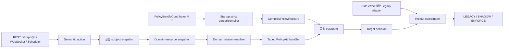
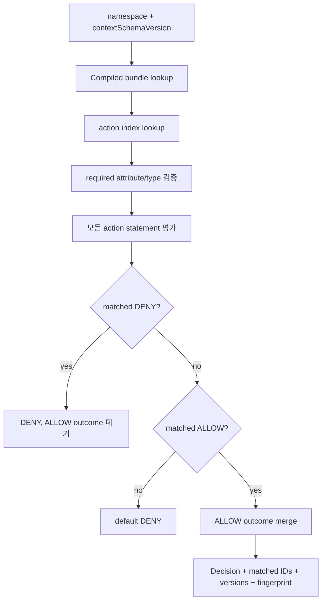
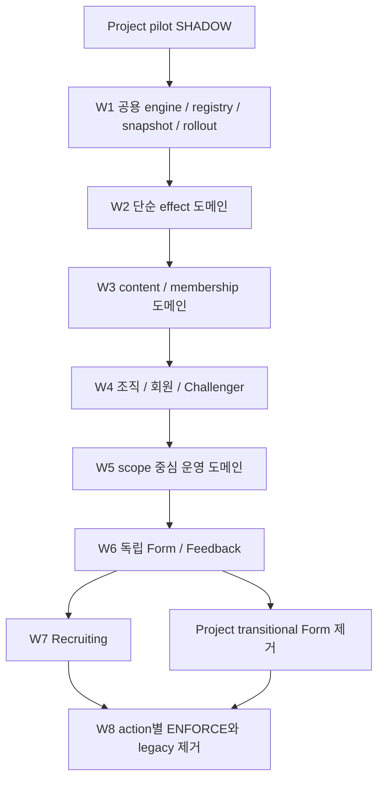

# 전 도메인 JSON Policy 전환 계획

## 목표

Authorization 문법과 evaluator는 `authorization` 도메인이 한 벌만 소유한다. 각 업무 도메인은
자신의 action, attribute, outcome schema와 JSON bundle만 소유한다.



요청마다 evaluator를 생성하거나 JSON을 다시 parse하지 않는다.

```text
애플리케이션 시작
  contributor 수집
  → 모든 bundle strict parse/compile
  → action별 statement index 생성
  → immutable registry 게시

요청
  namespace + action
  → 해당 action의 compiled statement만 조회
  → typed attribute로 평가
```

bundle 하나라도 compile에 실패하면 registry를 게시하지 않고 애플리케이션 시작을 실패시킨다.
Runtime hot reload와 외부 경로 주입은 지원하지 않는다.

## 현재 기반 구현

`POLICY_MANAGED`로 분류한 namespace는 모두 `PolicyBundleContributor`를 등록한다.

| Namespace | 현재 JSON 범위 | 남은 핵심 작업 |
|---|---|---|
| `project` | Project pilot 전체 semantic action | 운영 SHADOW 관찰과 action별 ENFORCE |
| `audit` | 감사 로그 조회 | ENFORCE receipt |
| `authorization` | ChallengerRole 조회·관리 | legacy evaluator 제거 |
| `blog` | content/series/comment 작성자·관리자 | 목록·부가 capability 최종 점검 |
| `certificate` | 발급·폐기 운영진 | ENFORCE receipt |
| `chat` | room membership, message/reaction/read | legacy policy 제거 |
| `maintenance` | SUPER_ADMIN 우회 | ENFORCE receipt |
| `notification` | FCM 발송, token 삭제 | SUPER_ADMIN 의미 최종 검토 |
| `storage` | uploader/SUPER_ADMIN 삭제 | ENFORCE receipt |
| `term` | 약관 생성 | ENFORCE receipt |
| `analytics` | dashboard/school entry | 목록 scope resolver outcome 전환 |
| `challenger` | challenger/point/record evaluator | 검색 scope, curriculum 연계 action |
| `curriculum` | workbook 관리·release·submission | `CURRICULUM` 미구현 evaluator와 mission TODO |
| `member` | member evaluator | search/summary scope outcome |
| `notice` | create/read/update/delete/recipient | 목록 visibility, viewer 조립, reminder |
| `organization` | Gisu/chapter/school/study-group evaluator | 직접 scope와 UMC PRODUCT 정책 |
| `schedule` | schedule/attendance evaluator | capability와 운영 목록 scope |
| `community` | post/comment evaluator | thread/member/message/report/WebSocket |
| `feedback` | target type outcome, response submit | target mismatch 정책 승인 후 ENFORCE |
| `recruiting` | evaluator, season/decision/registration/summary/export | application ownership, evaluator, 질문·면접·목록 scope |
| `form` | 독립 `form-1.0` target bundle | usage binding, capability principal, runtime rollout |

이 표에서 “현재 JSON 범위”는 JSON과 target adapter가 존재하는 범위다. `domain-coverage.json`의
`SHADOW`는 해당 도메인의 actor-facing surface가 모두 rollout에 연결되었을 때만 사용한다.
일부 slice만 연결된 도메인은 `PLANNED`를 유지한다.

2026-07-24 기준 분류 결과는 다음과 같다.

```text
POLICY_MANAGED 21개
├── SHADOW  10개
├── PLANNED 11개
└── ENFORCED 0개
```

## Namespace와 최종 module 경계

Context schema는 namespace마다 독립적으로 versioning한다. 한 도메인 안에서도 resource effect,
목록 scope, masking/capability가 서로 다른 입력과 outcome을 사용하면 module을 분리하되 하나의
bundle과 context schema로 compile한다.

| Namespace | Context schema | 최종 module 경계 |
|---|---|---|
| `analytics` | `analytics-1.x` | `analytics-resource`, `analytics-scope` |
| `audit` | `audit-1.0` | `audit-resource` |
| `authorization` | `authorization-1.0` | `challenger-role-resource` |
| `blog` | `blog-1.0` | `blog-resource` |
| `certificate` | `certificate-1.0` | `certificate-resource` |
| `challenger` | `challenger-1.x` | `challenger-resource`, `challenger-scope` |
| `chat` | `chat-1.0` | `chat-resource` |
| `community` | `community-1.x` | `community-content`, `community-thread`, `community-message`, `community-report` |
| `curriculum` | `curriculum-1.x` | `original-workbook`, `challenger-workbook`, `mission`, `submission` |
| `feedback` | `feedback-1.0` | `feedback-resource` |
| `form` | `form-1.x` | `form-resource`, 필요 시 `form-usage` |
| `maintenance` | `maintenance-1.0` | `maintenance-resource` |
| `member` | `member-1.x` | `member-resource`, `member-scope` |
| `notice` | `notice-1.x` | `notice-resource`, `notice-scope`, `notice-reminder` |
| `notification` | `notification-1.0` | `notification-resource` |
| `organization` | `organization-1.x` | `organization-resource`, `organization-scope`, `umc-product-resource` |
| `project` | `project-1.0` | 기존 7개 module. 독립 Form 전환 후 `form` 제거 |
| `recruiting` | `recruiting-1.x` | `recruiting-resource`, `application-resource`, `evaluation-resource`, `interview-resource`, `recruiting-scope` |
| `schedule` | `schedule-1.x` | `schedule-resource`, `schedule-scope` |
| `storage` | `storage-1.0` | `storage-resource` |
| `term` | `term-1.0` | `term-resource` |

Module 추가가 action/optional attribute 추가만 수반하면 context schema MINOR를 올린다. 기존
attribute 타입이나 의미, required 여부, outcome merge 의미가 바뀌면 context schema MAJOR를
올린다. Bundle과 모든 module의 version envelope는 항상 같아야 한다.

## 도메인별 Target 정책

### 현재 규칙으로 바로 확정할 수 있는 도메인

| Namespace | Semantic action | Target effect |
|---|---|---|
| `audit` | `audit-log:list` | active 중앙 운영진 또는 `SUPER_ADMIN` |
| `authorization` | `challenger-role:read` | 인증 회원 |
|  | `challenger-role:create/delete` | active 중앙 CORE 또는 `SUPER_ADMIN` |
| `blog` | content/series create | `SUPER_ADMIN` |
|  | content/series read/update | 작성자. read는 `SUPER_ADMIN`도 허용 |
|  | content/series delete | 작성자 또는 `SUPER_ADMIN` |
|  | comment update/delete | update는 작성자, delete는 작성자 또는 `SUPER_ADMIN` |
|  | `blog:admin-view` | `SUPER_ADMIN`; 목록·상세 masking도 같은 decision 사용 |
| `certificate` | `certificate:issue-admin/revoke` | target Gisu의 active 중앙 총괄단 또는 `SUPER_ADMIN` |
| `chat` | room/message/reaction/read-status read·write | room member |
|  | message update | room member이면서 message author |
|  | message delete | room member이면서 author 또는 trusted moderator |
| `maintenance` | `maintenance:bypass` | `SUPER_ADMIN` |
| `notification` | `notification:send-fcm` | active 중앙 총괄단 이상 |
|  | `notification:delete-token` | token owner 또는 active 중앙 총괄단 이상 |
| `storage` | `storage-file:delete` | uploader 또는 `SUPER_ADMIN` |
| `term` | `term:create` | `SUPER_ADMIN` |

이 표에서 `SUPER_ADMIN`을 추가하지 않은 기존 정책에는 migration만을 이유로 새 override를 넣지
않는다. 예를 들어 Notification은 현행 정책에 `SUPER_ADMIN` override가 없으므로 별도 권한 변경
승인 전에는 target에도 넣지 않는다.

### 조직·회원·Challenger

| Namespace | Action family | Target effect 또는 outcome |
|---|---|---|
| `organization` | Gisu/Chapter/School create·update·delete | active 중앙 CORE 또는 `SUPER_ADMIN` |
|  | StudyGroup read | subject school의 active 학교 운영진 또는 `SUPER_ADMIN` |
|  | StudyGroup create·update·delete | subject school의 active 학교 회장단 또는 `SUPER_ADMIN` |
|  | StudyGroup list | `organization.scope.schoolIds`, `gisuIds`를 `SET_UNION` |
|  | UMC PRODUCT read/manage | leadership, 본인 관계를 resource snapshot으로 계산한 뒤 별도 action으로 결정 |
| `challenger` | create, record read | active 학교 회장단 또는 `SUPER_ADMIN` |
|  | update/delete, point delete, record create/delete | active 중앙 CORE 또는 `SUPER_ADMIN` |
|  | point create/update | target Gisu 중앙 운영진 또는 target 학교 회장단 |
|  | search/list | `challenger.scope.gisuIds`, `schoolIds`, `partTypes`, `memberIds`를 union |
| `member` | `member:read` | Challenger 이력이 있는 인증 회원 |
|  | `member:delete` | active 중앙 CORE 또는 `SUPER_ADMIN` |
|  | search/summary/GraphQL field | `member.scope.*`와 masking outcome으로 통일 |

`organization.scope.*`, `challenger.scope.*`, `member.scope.*`의 구체적인 set은 기존 QueryDSL
predicate가 선택하는 ID를 canonical set으로 변환해 legacy와 비교한 뒤 확정한다. 목록 결과 자체를
두 번 조회하지 않고, 동일 snapshot에서 scope만 두 번 계산한다.

### Schedule·Curriculum·Notice·Analytics

| Namespace | Action family | Target effect 또는 outcome |
|---|---|---|
| `schedule` | schedule read/create | Challenger 이력 또는 `SUPER_ADMIN` |
|  | update/delete | author 또는 `SUPER_ADMIN` |
|  | force-delete | `SUPER_ADMIN` |
|  | attendance submit | participant Challenger |
|  | attendance read/approve | target Gisu active 운영진 또는 `SUPER_ADMIN` |
|  | capability/list | `schedule.scope.scheduleIds`, `gisuIds`, `chapterIds`, `schoolIds` union |
| `curriculum` | original workbook manage/release | active 중앙 운영진 또는 `SUPER_ADMIN` |
|  | workbook submission read | active 학교 운영진 또는 `SUPER_ADMIN` |
|  | Challenger workbook/mission | owner, mentor, target Challenger relation을 새 resource snapshot으로 정의한 뒤 action matrix 승인 |
| `notice` | create | Notice target에 대해 active creator relation |
|  | read | target Challenger, active 중앙 CORE, target을 관리하는 active role |
|  | update/delete | author 또는 `SUPER_ADMIN` |
|  | recipient read/check | target의 active manager |
|  | list | `notice.scope.gisuIds`, `chapterIds`, `schoolIds`, `partTypes`, `memberIds` union |
|  | reminder | 인증 경계와 호출 주체를 먼저 확정하고 `SYSTEM` 또는 `MEMBER` action으로 분리 |
| `analytics` | dashboard/school read | active 중앙·지부·학교 운영진 또는 `SUPER_ADMIN` |
|  | aggregation scope | `analytics.scope.all`, `gisuIds`, `chapterIds`, `schoolIds`, `partTypes` union |

Curriculum mission과 Notice reminder는 현행 코드에 권한 공백 또는 주체 모호성이 있으므로 legacy
parity만으로 target ALLOW를 만들지 않는다. Resource snapshot, 호출 principal, action matrix를
별도 검토한 뒤 JSON을 추가한다.

### Community

현재 post/comment 정책은 다음과 같이 고정한다.

- read: 인증 사용자
- update: 작성자
- delete: 작성자, `SUPER_ADMIN`, active 중앙 회장단
- write: service boundary의 active Challenger 검증으로 이동

현행 evaluator가 resource 작성자의 Challenger 이력을 검사하는 transitional `write` 규칙은
SHADOW 관측에만 사용한다. 최종 target은 `relation.subjectActiveChallenger`를 required attribute로
사용하고 권한 차이를 명시적으로 승인받는다.

다음 surface는 각 aggregate별 resource snapshot을 추가한다.

```text
community-thread:read/update/delete/member-manage
community-message:create/read/update/delete
community-report:create/read/decide
community-websocket:subscribe/send
```

Thread membership, ownership, message author, report target, WebSocket room membership은 서로 다른
role set으로 펼치지 않고 resource별 boolean relation으로 계산한다.

### Feedback와 독립 Form

Feedback:

- `feedback-template:resolve`는 `feedback.targetType` outcome을 반환한다.
- dominance는 `ADMIN > EXPERIENCED_CHALLENGER > NEW_CHALLENGER`다.
- `feedback-response:submit`은 계산된 target type과 template target type이 같아야 한다.
- 현행 submit이 target type을 재확인하지 않는 차이는 자동 expected difference로 승인하지 않는다.

Form:

- form/section/question/option 관리: `relation.usageOwnerAuthorized`
- response 생성: `relation.consumerAuthorized`
- 기명 response 변경: `MEMBER`이면서 `relation.isRespondent`
- 익명 response 변경: 검증된 `CAPABILITY(FORM_RESPONSE_ACCESS, responseId)`
- raw access key는 policy attribute나 log에 넣지 않는다.

Form은 `FormUsageBinding(formId, usageType, ownerResourceId)`과 Project/Recruiting/Feedback typed
provider가 모두 준비된 뒤 runtime SHADOW를 시작한다. 그 전에는 `form-1.0` bundle을 startup에서
compile하되 authoritative decision으로 사용하지 않는다.

### Recruiting

먼저 확정하는 action:

| Action | Target |
|---|---|
| `recruiting:operate-school` | target 학교 active 운영진, target Gisu active 중앙 운영진, `SUPER_ADMIN` |
| `recruiting:manage-all` | active 중앙 운영진 또는 `SUPER_ADMIN` |
| `recruiting-season:create` | target 학교/중앙 운영진 또는 `SUPER_ADMIN` |
| `recruiting-application:decide` | 실제 application의 Gisu·학교 운영진 또는 `SUPER_ADMIN` |
| `recruiting-registration:manage` | 실제 application Gisu의 중앙 운영진 또는 `SUPER_ADMIN` |
| `recruiting-summary:read`, `recruiting:export` | target Gisu 중앙 운영진 또는 `SUPER_ADMIN` |

후속 module은 applicant ownership, evaluator assignment, 질문·면접·round/application 목록을
각각 별도 semantic action으로 등록한다. Annotation capability와 실제 aggregate action은 둘 다
평가한다. 전자는 화면 진입, 후자는 object-level authorization이며 서로 대체하지 않는다.

### Project

Project는 이미 정의한 `project-1.0` target matrix를 유지한다. 전 도메인 전환 때문에 권한을
다시 느슨하게 만들지 않는다.

- 만료 ChallengerRole은 전부 제외한다.
- Project, Application, Statistics, MatchingRound는 resource Gisu/Chapter와 같은 tuple만 허용한다.
- MatchingRound `gisuId`는 필수·immutable이며 Chapter, Project Application과 일치해야 한다.
- scheduler는 `SYSTEM("matching-round-scheduler")` principal만 사용한다.
- scope, Form masking, capability, command enforcement는 같은 compiled decision을 사용한다.
- 독립 Form 전환이 완료되면 Project bundle의 transitional `form` module을 제거한다.

## 도메인 분류

모든 production 최상위 패키지는 `domain-coverage.json`에 반드시 등록한다.

| 분류 | 의미 |
|---|---|
| `POLICY_MANAGED` | actor-facing authorization을 JSON policy로 관리 |
| `AUTHENTICATION_BOUNDARY` | credential 검증과 principal 생성 경계 |
| `INTERNAL_ONLY` | 외부 actor가 직접 호출하지 않는 내부 기능 |
| `NO_ACTOR_AUTHORIZATION` | 현재 production actor-facing 구현이 없음 |
| `INFRASTRUCTURE` | 공용 설정·모델·문서 지원 코드 |

새 도메인이 분류 없이 추가되면 CI를 실패시킨다. `POLICY_MANAGED`는 `PLANNED`, `SHADOW`,
`ENFORCED` 중 하나이고 나머지는 `EXEMPT`다.

## 공용 subject 계약

```text
AuthorizationPrincipal
├── ANONYMOUS
├── MEMBER(memberId)
├── SYSTEM(systemId)
└── CAPABILITY(capabilityType, boundResourceId)
```

- 외부 요청은 principal kind, role, systemId를 직접 만들 수 없다.
- `SYSTEM`은 scheduler/internal adapter만 생성한다.
- `CAPABILITY`는 credential을 먼저 검증한 adapter/service만 생성한다.
- JWT, raw access key, token, secret은 context와 decision/log에 넣지 않는다.

`AuthorizationSubjectSnapshot`은 system role, ChallengerRole tuple, Challenger tuple,
Gisu 기간, 학교-지부 관계, 하나의 `evaluatedAt`을 포함한다.

Role은 다음 tuple을 분해하지 않는다.

```text
roleType
gisuId
organizationType
organizationId
responsiblePart
gisuStartAt
gisuEndAt
```

모든 target relation은 같은 tuple에서 조건을 만족해야 한다. 서로 다른 role의 Gisu와
organization을 조합하지 않는다. ChallengerRole의 유효 기간은 모든 도메인에서 다음과 같다.

```text
gisuStartAt <= evaluatedAt < gisuEndAt
```

`SUPER_ADMIN`은 member system role이므로 Gisu와 무관한 전역 override다.

Subject 조회 책임은 최종적으로 `AuthorizationService`에서 독립
`PolicySubjectSnapshotService`로 분리한다.

```text
PolicySubjectSnapshotService
├── member/role/gisu/challenger batch 조회
├── AUTHORITY_SNAPSHOT cache
└── immutable AuthorizationSubjectSnapshot 반환

AuthorizationService ─┐
Domain context builder ├──> PolicySubjectSnapshotService
Batch capability API  ─┘
```

`AuthorizationService`는 `ResourcePermissionEvaluator` 목록을 주입받으므로 evaluator 또는 그
하위 policy service가 다시 `AuthorizationService`를 eager 주입하면 Spring bean cycle이 생긴다.
따라서 evaluator 진입 경로는 이미 전달받은 `SubjectAttributes`/snapshot만 사용한다. Member ID만
있는 command/query 진입은 독립 snapshot service를 사용한다. 분리 완료 전의 lazy provider는
호환 수단일 뿐 최종 구조가 아니다.

## 정책 작성 단위

각 namespace는 다음을 소유한다.

```text
policies/{namespace}/
├── README.md
├── bundle.json
├── *.policy.json
├── expected-differences.json
├── generated/{namespace}-policy-artifacts.md
└── rollout/enforcement-receipts.json
```

`PolicyDomainSchema`는 JSON보다 먼저 다음 계약을 정의한다.

```text
ActionSchema
  requiredAttributes
  optionalAttributes
  allowedOutcomes

AttributeSchema
  name
  PolicyValueType
  enum symbols

OutcomeSchema
  key
  PolicyValueType
  merge strategy
```

권한 의미는 `ResourceType + PermissionType`가 아니라 semantic action으로 표현한다.

```text
나쁜 최종 identity
  SCHEDULE + WRITE

semantic action
  schedule:create
  schedule:update
  attendance:submit
  attendance:approve
```

## Context builder 규칙

도메인 context builder는 다음 순서를 지킨다.

1. 요청에서 resource ID만 받는다.
2. 도메인 port/use case로 resource snapshot을 조회한다.
3. 공용 subject snapshot과 resource의 관계를 tuple 단위로 계산한다.
4. 등록된 `PolicyAttributeKey<V>`로 immutable `PolicyAttributeSet`을 만든다.
5. namespace, action, attribute set, 동일한 `evaluatedAt`을 evaluator에 전달한다.

Engine 내부와 context builder 사이에 `Object`, `Map<String, Object>`, `JsonNode`를 전달하지
않는다. Optional attribute는 null이 아니라 map 누락으로 표현한다.

## 평가 규칙



- 첫 match에서 중단하지 않는다.
- statement/file 순서에 결과가 의존하지 않는다.
- DENY가 하나라도 일치하면 최종 DENY다.
- 아무 statement도 일치하지 않으면 default DENY다.
- required attribute 누락과 타입 오류는 evaluation failure다.
- ENFORCE에서 failure를 legacy allow로 fallback하지 않는다.

Outcome merge는 `BOOLEAN_OR`, `SET_UNION`, `DOMINANCE`, `EXACTLY_ONE`을 사용한다. Scope,
masking, target type도 boolean과 같은 공용 rollout을 사용하도록 generic decision executor를
사용한다.

## Form 분리

`policies/form/form.policy.json`은 현재 Project의 `project-1.0` context를 사용하는 transitional
module이다. 독립 Form 정책은 `policies/form/bundle.json`과
`policies/form/form-resource.policy.json`의 `form-1.0` 계약이다.

최종 전환에는 immutable binding이 필요하다.

```text
FormUsageBinding
- formId
- usageType
- ownerResourceId
```

사용처별 provider는 Form이 정의한 typed fact만 반환한다.

```text
ProjectFormUsagePolicyContextProvider
RecruitingFormUsagePolicyContextProvider
FeedbackFormUsagePolicyContextProvider
```

익명 response access key는 SHA-256 hash를 검증한 뒤 다음 principal로 바꾼다.

```text
CAPABILITY(FORM_RESPONSE_ACCESS, formResponseId)
```

raw key 검증은 authentication/credential boundary이고, bound response에 대한 read/update/
submit/delete는 policy다.

## Rollout

```text
PLANNED
→ LEGACY + target startup compile
→ SHADOW
→ ENFORCE read/capability
→ ENFORCE list/scope/masking
→ ENFORCE command/scheduler
→ legacy 제거
```

SHADOW는 하나의 immutable snapshot에 대해 legacy와 target decision만 둘 다 계산한다. Command,
DB write, event publish, 외부 호출은 한 번만 실행한다.

비교 대상:

```text
effect
canonical scope
masking/view mode
obligation
capability result
failure
```

허용된 차이는 wildcard가 아닌 정확한 context predicate로
`expected-differences.json`에 기록한다. 이 파일은 target 결과를 바꾸는 allowlist가 아니다.

공통 승인 차이는 다음뿐이다.

- 만료 Gisu ChallengerRole 권한 제거
- role tuple 상관관계 보존
- System/Scheduler principal 위조 방지
- 한 평가 batch의 `evaluatedAt` 통일

그 외 권한 확대·축소는 generated action matrix, fingerprint, expected difference 검토가
필요하다.

## 실행 wave



1. 공용 registry, action index, subject snapshot, rollout, artifact/receipt gate
2. audit/term/maintenance/notification/storage/certificate
3. blog/chat/community
4. authorization/organization/challenger/member
5. schedule/curriculum/notice/analytics
6. 독립 Form과 Feedback
7. Recruiting
8. 도메인별 ENFORCE 관찰 후 legacy 제거

각 도메인은 다음 PR 단위로 진행한다.

```text
PR A: context schema + snapshot
PR B: target JSON + statement tests + artifact
PR C: SHADOW wiring
PR D: receipt + action별 ENFORCE
PR E: legacy cleanup
```

## ENFORCE 조건

각 action은 최소 24시간, 고위험 action은 72시간 SHADOW에서 다음을 만족해야 한다.

```text
UNEXPECTED_DIFFERENCE = 0
TARGET_FAILURE = 0
승인되지 않은 권한 확대 = 0
surface 미연결 = 0
p95 증가율 <= 10%
```

도메인의 모든 action이 ENFORCE된 뒤 7일간 안정적으로 유지해야 legacy adapter와 직접
role/owner/membership 검사를 제거한다.

## 완료 조건

- 모든 actor-facing 도메인이 bundle 또는 명시적 exemption을 가진다.
- 모든 REST/GraphQL/WebSocket/scheduler/internal batch surface가 semantic action에 연결된다.
- 모든 bundle은 startup에 한 번 compile되고 immutable registry에서 평가된다.
- Project의 transitional Form module이 제거되고 `form-1.0`이 authoritative하다.
- 만료 ChallengerRole이 어느 도메인에서도 권한을 만들지 않는다.
- list scope, capability, masking과 실제 command enforcement가 같은 decision을 사용한다.
- migrated domain에서 직접 `GetChallengerRoleUseCase.is...`와 raw role stream 권한 판단이 없다.
- policy artifact, fingerprint, expected difference, enforcement receipt가 CI와 배포물에 포함된다.
