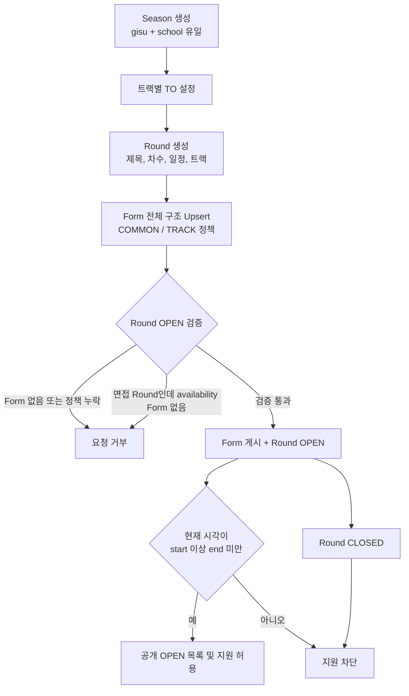
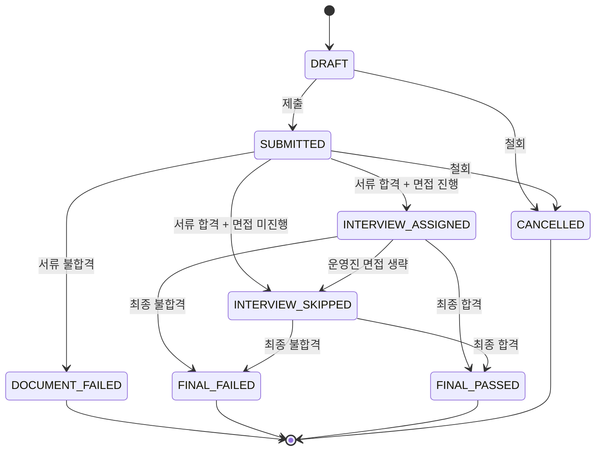
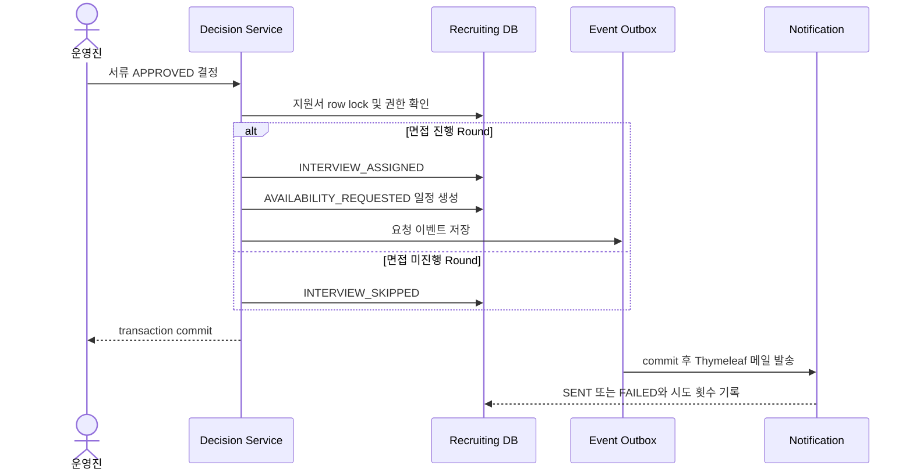
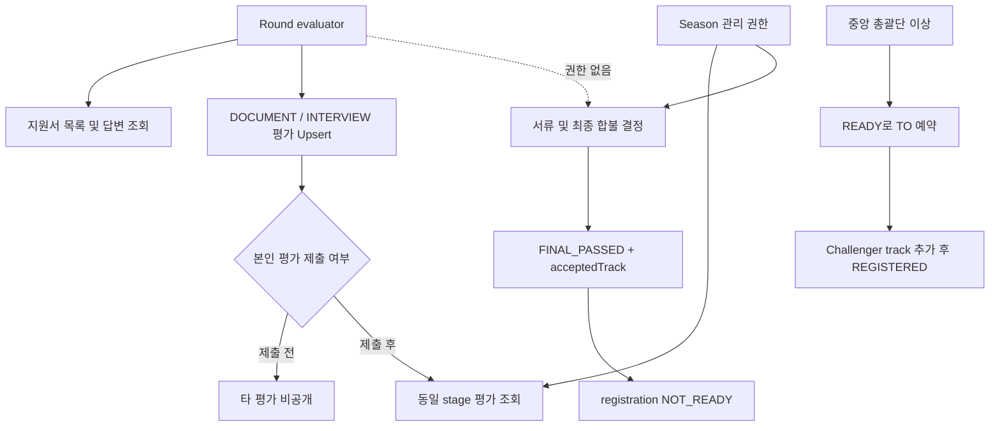

# Recruiting Entity And Flow Diagrams

이 문서는 Recruiting 엔티티 관계와 핵심 생명주기를 시각화한다. 필드 제한, API 목록과 후속 작업은 [Recruiting 온보딩](../recruiting/README.md)을 참고한다.

## 엔티티 관계

아래 관계는 DB의 자식 엔티티가 부모를 참조하는 FK 방향이다. Java 부모 엔티티에는 역방향 `@OneToMany`를 두지 않는다.

```mermaid
erDiagram
    RECRUITING_SEASON ||--o{ RECRUITING_SEASON_TRACK_QUOTA : "defines quota"
    RECRUITING_SEASON ||--o{ RECRUITING_ROUND : "contains"
    RECRUITING_ROUND ||--o| RECRUITING_APPLICATION_FORM : "owns one"
    RECRUITING_ROUND ||--o{ RECRUITING_ROUND_EVALUATOR : "whitelists"
    RECRUITING_ROUND ||--o{ RECRUITING_ROUND_INTERVIEW_QUESTION : "shares"
    RECRUITING_ROUND ||--o{ RECRUITING_APPLICATION : "receives"
    RECRUITING_APPLICATION_FORM ||--o{ RECRUITING_FORM_SECTION_POLICY : "classifies"
    RECRUITING_APPLICATION_FORM ||--o{ RECRUITING_APPLICATION : "uses"
    RECRUITING_APPLICATION ||--o{ RECRUITING_APPLICATION_EVALUATION : "has"
    RECRUITING_APPLICATION ||--o{ RECRUITING_APPLICATION_INTERVIEW_QUESTION : "has"
    RECRUITING_APPLICATION ||--o| RECRUITING_INTERVIEW_SCHEDULE : "has"

    RECRUITING_SEASON {
        bigint id PK
        bigint gisu_id
        bigint school_id
        text memo
    }
    RECRUITING_SEASON_TRACK_QUOTA {
        bigint id PK
        bigint recruiting_season_id FK
        enum track
        int target_count
    }
    RECRUITING_ROUND {
        bigint id PK
        bigint recruiting_season_id FK
        string title
        enum type
        int round_no
        enum status
        enum_array recruitable_tracks
        boolean second_choice_enabled
        boolean interview_required
        bigint availability_form_id
    }
    RECRUITING_APPLICATION_FORM {
        bigint id PK
        bigint recruiting_round_id FK_UK
        bigint form_id
        enum status
    }
    RECRUITING_FORM_SECTION_POLICY {
        bigint id PK
        bigint recruiting_application_form_id FK
        bigint form_section_id UK
        enum type
        enum track
    }
    RECRUITING_APPLICATION {
        bigint id PK
        bigint recruiting_round_id FK
        bigint recruiting_application_form_id FK
        bigint form_response_id UK
        bigint applicant_member_id
        string applicant_email
        string application_key
        enum status
        enum registration_status
    }
    RECRUITING_ROUND_EVALUATOR {
        bigint id PK
        bigint recruiting_round_id FK
        bigint member_id
    }
    RECRUITING_ROUND_INTERVIEW_QUESTION {
        bigint id PK
        bigint recruiting_round_id FK
        bigint creator_member_id
        bigint last_modified_by_member_id
    }
    RECRUITING_APPLICATION_EVALUATION {
        bigint id PK
        bigint recruiting_application_id FK
        bigint evaluator_member_id
        enum stage
        enum decision
    }
    RECRUITING_INTERVIEW_SCHEDULE {
        bigint id PK
        bigint recruiting_application_id FK_UK
        bigint availability_form_response_id
        enum status
        string contact_snapshot
    }
```

## 외부 도메인 경계

```mermaid
flowchart LR
    Recruiting["Recruiting"]
    Organization["Organization<br/>gisuId, schoolId"]
    Authorization["Authorization<br/>permission UseCase"]
    Form["Form<br/>form, section, response ID"]
    Term["Term<br/>privacyTermId"]
    Member["Member<br/>memberId"]
    Challenger["Challenger<br/>addTrack UseCase"]

    Recruiting -. "ID로 조회" .-> Organization
    Recruiting --> "공개 UseCase" Authorization
    Recruiting --> "공개 UseCase" Form
    Recruiting -. "ID로 증적 보존" .-> Term
    Recruiting -. "ID로 소유자 기록" .-> Member
    Recruiting --> "등록 확정" Challenger
```

학교의 지부 소속은 변경될 수 있으므로 Season에 `chapterId`를 저장하지 않는다. 목록 조회 시 Organization의 현재 학교 정보를 결합한다.

## 모집 설정과 공개



Season에는 상태가 없다. 실제 지원 가능 여부는 `Round OPEN + RecruitingApplicationForm PUBLISHED + [documentStartAt, documentEndAt)`로 결정한다.

## 지원서 상태



`DOCUMENT_PASSED` 중간 상태는 없다. 서류 합격 command가 면접 정책까지 같은 transaction에서 반영한다.

## 서류 합격과 일정 요청



면접을 생략하면 기존 일정은 삭제하지 않고 `CANCELLED`로 남긴다. 이벤트 처리기는 발송 직전 일정 상태를 다시 읽어 취소된 요청 메일을 보내지 않는다.

## 평가와 최종 등록



평가자는 서류와 면접 stage 모두 평가할 수 있지만 최종 판정, TO 변경, Challenger 등록 권한은 얻지 않는다.
