# Recruiting Entity and Flow Diagrams

이 문서는 `recruiting` 도메인의 현재 엔티티 관계와 application service가 실행하는 주요 흐름을 코드 기준으로 시각화한다. 제품 정책과 API 목록은 [Recruiting Domain](recruiting.md)을 함께 참고한다.

## 표기 원칙

- 실선 ERD 관계는 Recruiting 테이블 사이의 실제 FK를 뜻한다.
- Recruiting 내부 child만 `@ManyToOne(fetch = LAZY)`로 parent를 참조한다. parent에는 `@OneToMany` collection이 없다.
- 다른 도메인은 JPA 관계로 연결하지 않고 ID와 공개 UseCase만 사용한다.
- 상태 전이는 엔티티의 domain method가 수행하고, application service는 권한·중복·동시성·외부 UseCase 호출을 조율한다.

## 엔티티 관계

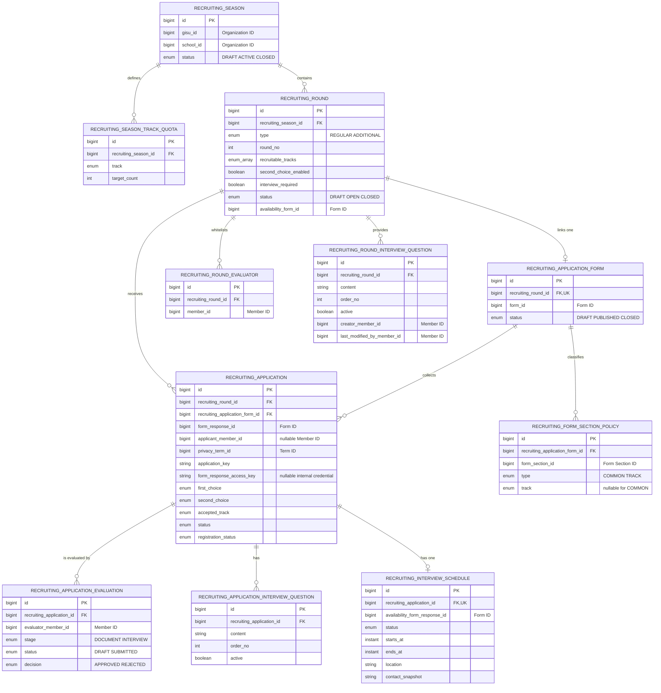

### 외부 도메인 경계

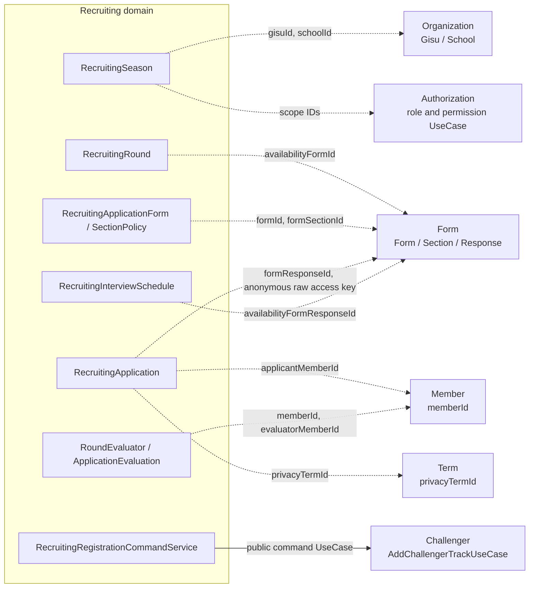

외부 ID에는 Recruiting FK를 만들지 않는다. 예를 들어 Form section 삭제 여부나 FormResponse 소유권은 Form의 공개 Query UseCase로 확인한다.

## 모집 설정 흐름

아래 흐름은 API 호출의 의존 순서를 나타낸다. Season 활성화, Round 열기, Form 게시는 별도 command지만 지원 접수를 위해 모두 완료되어야 한다.

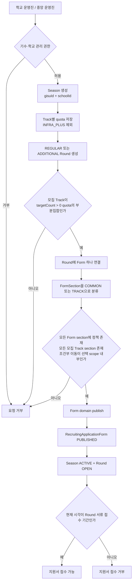

Form publish와 section policy 추가는 같은 `RecruitingApplicationForm` row의 `PESSIMISTIC_WRITE` lock을 사용한다. 따라서 게시와 정책 변경이 동시에 실행되어도 게시된 Form에 정책이 뒤늦게 추가되지 않는다.

## 로그인 지원서 작성 흐름

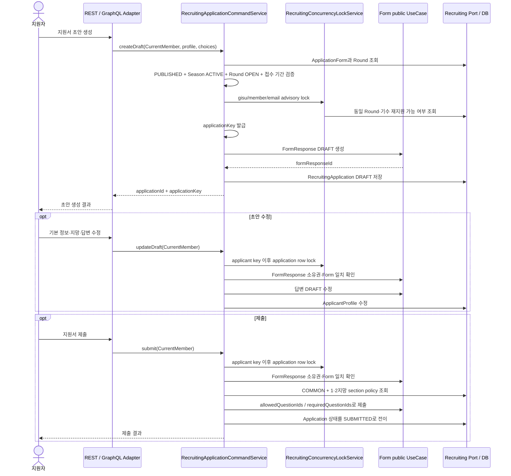

지원자가 응답해야 하는 범위는 `COMMON` section과 선택한 1·2지망의 `TRACK` section이다. 이 section들에 포함된 모든 문항은 `allowedQuestionIds`, 그중 Form에서 필수로 지정한 문항만 `requiredQuestionIds`가 된다.

## 익명 지원서 작성 흐름

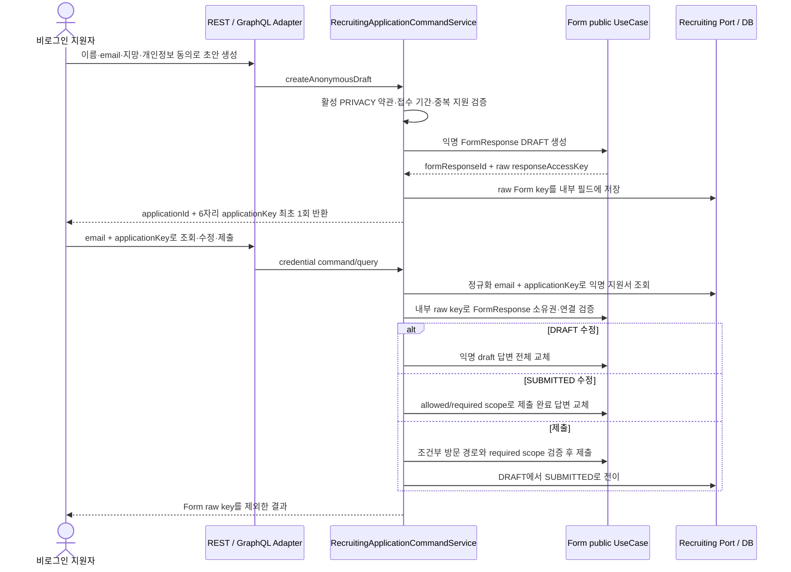

조회 결과는 `documentResultPublishedAt`과 `finalResultPublishedAt` 경계에서 각각 공개한다. 발표 전 결과는 `PENDING`이고 최종 발표 전에는 `acceptedTrack`도 숨긴다. credential REST·GraphQL 요청은 client IP 기준 분당 5회로 제한한다.

## 지원서 전형 상태

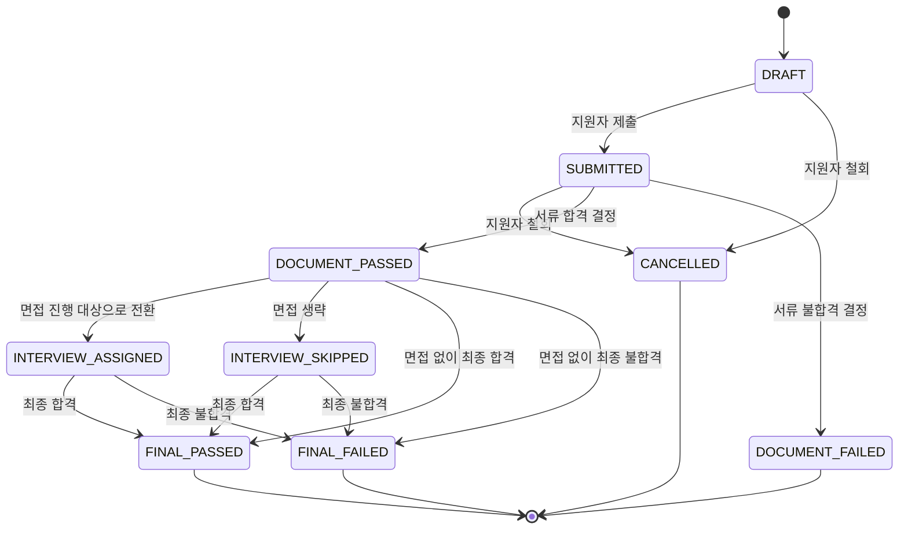

`DOCUMENT_FAILED`, `FINAL_FAILED`, `CANCELLED`만 이후 Round 재지원을 허용한다. 동일 기수에서 이미 `FINAL_PASSED`인 지원자는 다른 Round나 학교에 다시 합격할 수 없다.

현재 `RecruitingApplication.assignInterview()` domain method는 존재하지만 이를 호출하는 inbound UseCase와 REST/GraphQL mutation은 연결되어 있지 않다. 따라서 실제 API만으로 `INTERVIEW_ASSIGNED`에 진입하는 경로는 후속 구현이 필요하다.

## 평가 작성과 공개 범위

### 평가자와 면접 질문 구성

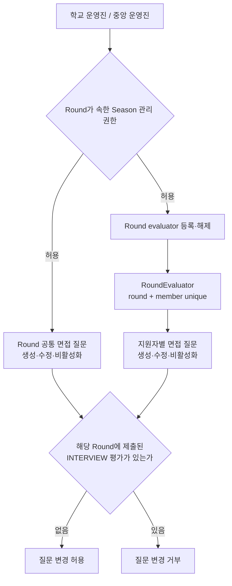

한 Round에 등록된 evaluator는 서류와 면접 평가에 모두 참여할 수 있다. 공통 질문은 Season 관리 권한, 지원자별 질문은 해당 Round의 evaluator whitelist가 필요하다. 공통 질문은 생성자와 최종 변경자 회원 ID를 별도로 보존한다.

### 평가 작성과 조회

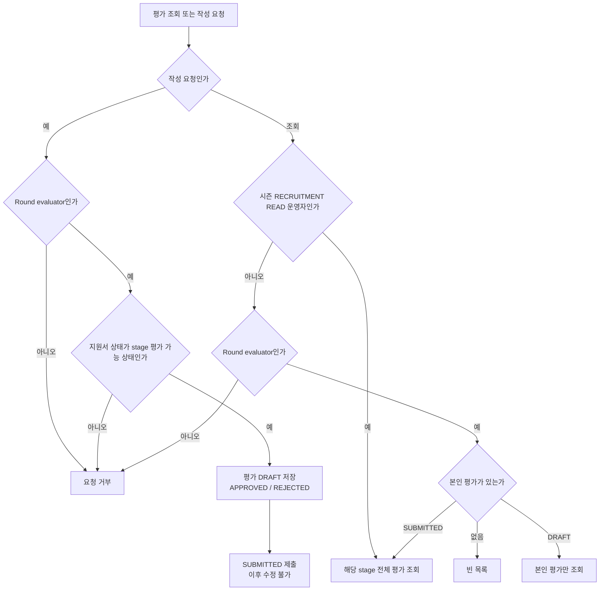

평가자 whitelist는 평가와 관련 조회만 허용한다. 서류·최종 합불 결정, quota 변경, Challenger 등록 권한은 부여하지 않는다. 질문은 최초 INTERVIEW 평가가 제출된 뒤 수정·비활성화할 수 없다.

## 면접 일정 흐름

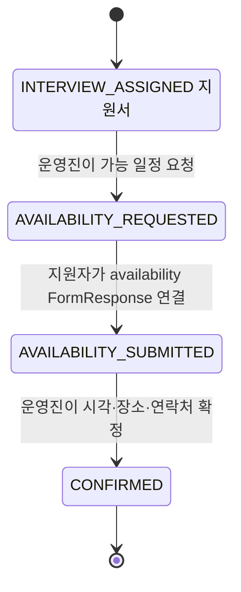

`contactSnapshot`은 요청·확정 당시 학교 연락처를 보존한다. #1146의 Form 일정 교집합과 FormResponse 소유권 계약, #1147의 Thymeleaf HTML 메일 발송은 아직 연결하지 않았으므로 현재 상태 변경만 수행한다.

## 최종 판정과 Challenger 등록

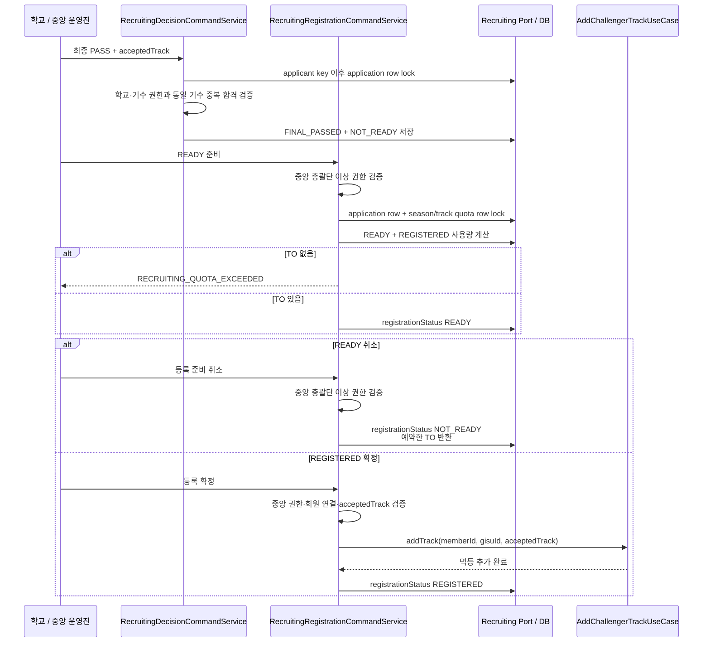

지원서 전형 상태와 등록 상태는 분리된다. `FINAL_PASSED`가 되어도 자동 등록되지 않으며, 중앙운영사무국 총괄단 이상이 `NOT_READY -> READY -> REGISTERED`를 완료해야 한다.

## 동시성 경계

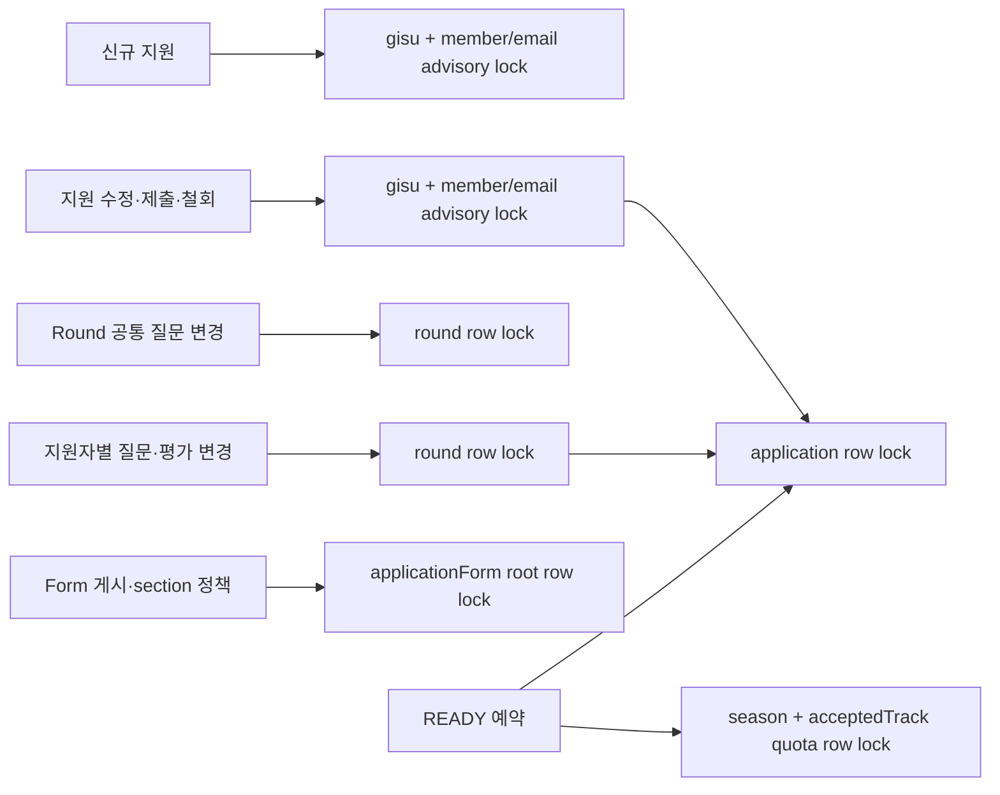

잠금 순서는 같은 경쟁 경로에서 고정한다. 지원자 중복 생성, 평가 제출과 질문 변경, Form 게시와 정책 추가, 마지막 TO 예약이 동시에 실행되어도 하나의 트랜잭션만 불변식을 통과하도록 PostgreSQL 통합 테스트로 검증한다.

## 현재 보류된 흐름

| 흐름 | 현재 상태 | 후속 작업 |
|---|---|---|
| 익명 지원서 ownership claim | API 미제공 | FormResponse ownership 이전 공개 UseCase 이후 구현 |
| Form 자체 응답 기간 동기화 | Round의 local 기간만 검증 | Form 기간 공개 UseCase 이후 동기화 |
| 다른 Form question ID 차단 | Form이 question 소속, required subset, 실제 조건부 방문 경로를 검증 | 구현 완료 |
| 면접 가능 시간 교집합 | `FindRecruitingScheduleOverlapPort`는 unavailable | #1146 |
| 요청·확정 HTML 메일 | delivery 상태만 저장 | #1147 |
| `INTERVIEW_ASSIGNED` API 전이 | domain method만 존재 | 별도 inbound UseCase와 권한 정책 필요 |
