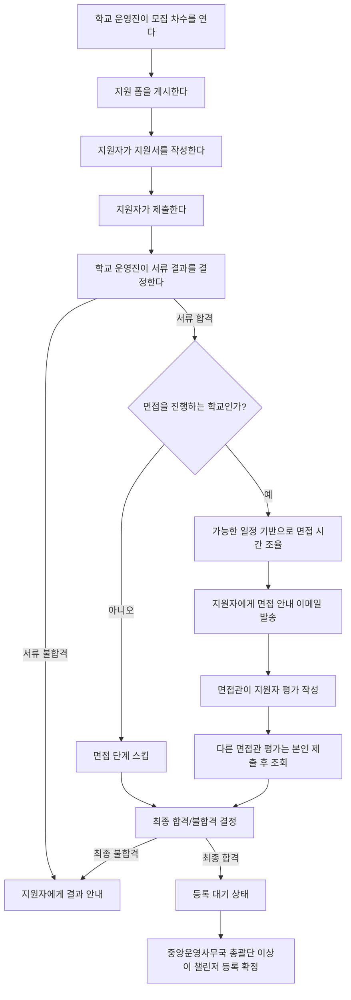
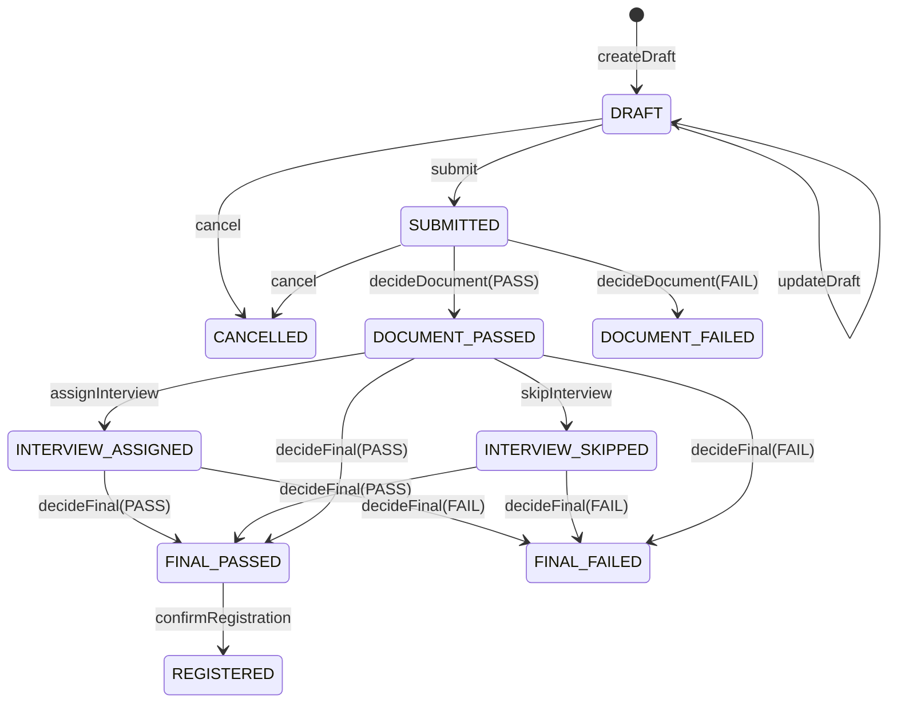

# Recruiting Domain

## 역할

`recruiting` 도메인은 학교별 신규 모집의 전형 생명주기를 관리한다. 지원서 본문과 응답 저장은 `survey`가 소유하고, recruiting은 어떤 기수/학교/차수/트랙의 모집인지, 접수된 지원서가 어느 단계에 있는지, 최종 등록이 완료되었는지를 추적한다.

## 핵심 경계

- 모집 단위는 `RecruitingSeason(gisuId, schoolId)`이다.
- 본모집/추가모집은 `RecruitingRound(type, roundNo)`로 관리한다. 추가모집은 학교마다 차수가 달라질 수 있다.
- 지원 폼은 `RecruitingApplicationForm(formId, track)`로 survey form을 참조한다. form 본문, 익명 제출, 개인정보 동의, 시작/마감 기한, 가능한 일정 질문과 일정 겹침 계산은 `survey`가 책임진다.
- 지원서는 `RecruitingApplication(formResponseId, applicationNo, applicantIdentityKey)`로 survey response를 참조한다. recruiting에는 지원서 본문과 raw email을 저장하지 않는다.
- 최종 합격과 챌린저 등록은 별도 생명주기다. 합격 처리가 끝난 뒤 중앙운영사무국 총괄단 이상이 등록 확정을 실행한다.
- `ChallengerTrack`은 `common`에 있다. `Challenger`는 기존 `part`와 신규 nullable `track`을 함께 가진다. 기존 row backfill은 하지 않고, 조회 시 당시 정책에 맞춰 두 컬럼을 해석한다.

## 기획자용 사용자 흐름



## 개발자용 상태 흐름



## 중복 지원 규칙

| 조건 | 처리 |
|---|---|
| 같은 기수, 다른 학교 지원 이력 존재 | 제출 차단 |
| 같은 차수에 이미 지원서 존재 | 제출 차단 |
| 이전 차수에서 실패 또는 철회 | 다음 차수 재지원 가능 |
| 이전 차수에서 최종 합격, 등록 대기, 등록 완료 또는 진행 중 | 재지원 차단 |
| 여러 차수에 걸친 재지원 | 실패/철회 후에만 허용 |
| 합격 지원서 | 같은 기수에서 한 applicant identity당 하나만 허용 |

## 권한 매트릭스

| 작업 | 권한 |
|---|---|
| 학교 모집 시즌/차수/폼 운영 | 해당 기수/학교의 학교 회장단 또는 중앙운영사무국 총괄단 이상 |
| 서류/최종 합불 결정 | 해당 기수/학교의 학교 회장단 또는 중앙운영사무국 총괄단 이상 |
| 면접 배정/안내/평가 운영 | 해당 기수/학교의 학교 회장단 또는 중앙운영사무국 총괄단 이상 |
| 면접관 본인 평가 작성 | 서비스 레벨에서 배정 여부 확인 |
| 다른 면접관 평가 조회 | 본인 평가 제출 이후 서비스 레벨에서 허용 |
| CSV 현황 다운로드 | 중앙운영사무국 총괄단 이상 |
| 챌린저 최종 등록 확정 | 중앙운영사무국 총괄단 이상 |

## REST API 예시

```http
GET /api/v1/recruiting/public/forms?gisuId=11&schoolId=22
GET /api/v1/recruiting/public/applications/result?applicationNo=REC-001&applicantIdentityKey=...
POST /api/v1/recruiting/applications
PUT /api/v1/recruiting/applications/{applicationId}
POST /api/v1/recruiting/applications/{applicationId}/submit
PATCH /api/v1/recruiting/applications/{applicationId}/cancel

POST /api/v1/recruiting/admin/seasons
POST /api/v1/recruiting/admin/seasons/{seasonId}/rounds
POST /api/v1/recruiting/admin/seasons/{seasonId}/rounds/{roundId}/forms
PATCH /api/v1/recruiting/admin/seasons/{seasonId}/applications/{applicationId}/document-decision
PATCH /api/v1/recruiting/admin/seasons/{seasonId}/applications/{applicationId}/final-decision
POST /api/v1/recruiting/admin/seasons/{seasonId}/applications/{applicationId}/registration-confirm
GET /api/v1/recruiting/admin/statistics.csv?gisuId=11&schoolId=22
```

## GraphQL 계획

현재 worktree에는 GraphQL 의존성, schema 파일, resolver annotation이 없다. GraphQL PR이 병합되면 REST와 같은 UseCase를 호출하는 thin resolver만 추가한다.

예상 query/mutation 표면은 다음과 같다.

- Query: seasons, rounds, publicForms, applications, applicationDetail, anonymousResult, statusSummary, interviewEvaluations
- Mutation: create/update season, create/update round, link/publish/close form, create/update/submit/cancel application, document/final decision, assign/skip interview, save/submit evaluation, confirm registration

resolver에는 상태 전이, 중복 지원, 권한 로직을 두지 않는다. 비즈니스 규칙은 application service와 domain method가 가진다.

## CSV 개인정보 규칙

CSV는 중앙운영사무국 총괄단 이상에게만 제공한다. 포함 가능한 필드는 기수, 학교, 모집 차수, form id, track, 지원서 번호, maskedEmail, 지원 상태, 등록 상태, 제출 시각이다. raw email, 지원서 본문, survey answer, 개인정보 동의 원문은 포함하지 않는다.

## UX Writing Notes

지원자에게는 `지원서 번호`와 `이메일`로 추후 결과를 확인할 수 있다는 식으로 행동 가능한 안내를 제공한다. 운영진 오류는 `모집 차수를 확인해주세요`, `이미 합격 처리된 지원자는 다시 지원할 수 없어요`, `등록 확정은 중앙운영사무국 총괄단 이상만 할 수 있어요`처럼 수정 대상과 필요한 권한을 함께 말한다.
