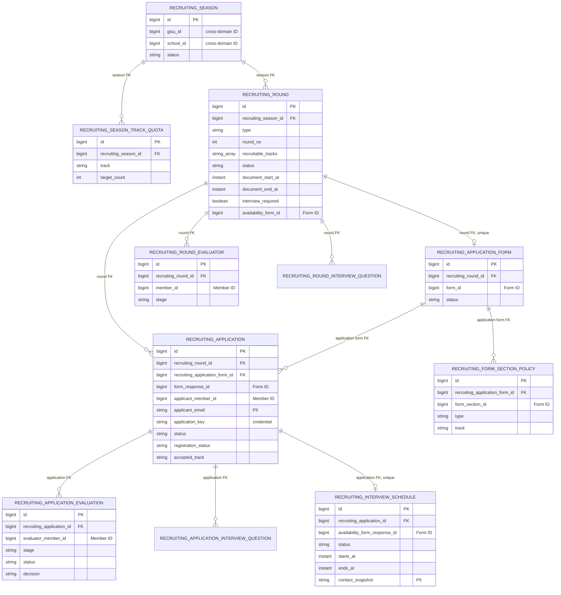
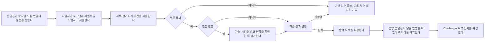

# Recruiting v2 Domain

## 역할과 경계

`recruiting`은 학교별 모집 시즌, 차수, 지원 정책, 지원서 생명주기, 평가, 기본 면접 일정, 합격 후 등록 예약을 소유한다. 지원서 문항과 답변 본문은 `form`, 실제 Challenger 구성원 정보는 `challenger`, 역할과 권한 판정은 `authorization`이 소유한다.

- 모집 단위는 `RecruitingSeason(gisuId, schoolId)`이다.
- 한 시즌은 트랙별 TO와 여러 모집 차수를 가진다.
- 한 차수는 지원 가능한 트랙, 일정, 2지망 허용 여부, 면접 여부를 가진다.
- 한 차수에는 `RecruitingApplicationForm` 하나만 연결할 수 있다.
- Recruiting은 Survey의 `formId`, `formSectionId`, `formResponseId`만 보관한다. 문항과 답변을 복제하지 않는다.
- 다른 도메인의 aggregate는 JPA 관계로 참조하지 않는다. `gisuId`, `schoolId`, `memberId`, `formId`, `formSectionId`, `formResponseId`, `termId` 같은 ID와 공개 UseCase만 사용한다.
- Recruiting 내부 child는 owning side의 `@ManyToOne(fetch = LAZY)`만 사용한다. 부모의 `@OneToMany` collection은 두지 않는다.

## ERD

아래 선은 DB의 child-to-parent FK를 표현한다. Java parent entity가 child collection을 보유한다는 뜻이 아니다.



## Entity 책임

| 모델 | 책임과 주요 불변식 |
|---|---|
| `RecruitingSeason` | 기수와 학교의 유일한 모집 단위. `DRAFT -> ACTIVE -> CLOSED` 상태를 소유한다. |
| `RecruitingSeasonTrackQuota` | 시즌/트랙별 목표 인원. 트랙은 모집 지원 트랙만 허용하고 수량은 0 이상이다. |
| `RecruitingRound` / `RecruitingRoundConfiguration` | 정규/추가 차수, 지원 트랙, 2지망, 서류·면접·결과 시각, 공지와 연락처를 검증한다. `INFRA_PLUS`와 시즌 TO가 0인 트랙은 모집할 수 없다. |
| `RecruitingApplicationForm` | Round와 Form의 1:1 연결 및 `DRAFT -> PUBLISHED -> CLOSED` 상태를 관리한다. |
| `RecruitingFormSectionPolicy` | Form section을 `COMMON` 또는 특정 모집 트랙의 `TRACK` section으로 분류한다. |
| `RecruitingApplication` / `RecruitingApplicantProfile` | 로그인 지원자의 프로필, 선택 트랙, Form response ID, 개인정보 동의, 6자리 지원 키, 전형과 등록 상태를 관리한다. |
| `RecruitingRoundEvaluator` | 차수와 `DOCUMENT`/`INTERVIEW` stage별 평가자 whitelist를 관리한다. 최종 합불 권한은 부여하지 않는다. |
| `RecruitingRoundInterviewQuestion` | 차수 공통 면접 문항과 노출 순서, active 상태를 관리한다. |
| `RecruitingApplicationInterviewQuestion` | 특정 지원자에게만 묻는 면접 문항을 관리한다. 해당 차수의 INTERVIEW 평가자만 수정할 수 있다. |
| `RecruitingApplicationEvaluation` | 지원서/평가자/stage별 하나의 `PASS`/`FAIL`/`WAIT` 평가를 관리한다. 제출 후 변경할 수 없다. |
| `RecruitingInterviewSchedule` | 가능 일정 요청, Form 응답 연결, 확정 시각·장소·연락처 snapshot과 메일 전달 상태를 보관한다. 실제 메일 발송과 일정 교집합 계산은 아직 연결하지 않는다. |

## 모집과 지원 흐름

개발 용어를 제외한 운영 흐름은 다음과 같다.



## 상태와 전이

### 지원서

| 현재 상태 | 허용 전이 |
|---|---|
| `DRAFT` | `SUBMITTED`, `CANCELLED` |
| `SUBMITTED` | `DOCUMENT_PASSED`, `DOCUMENT_FAILED`, `CANCELLED` |
| `DOCUMENT_PASSED` | `INTERVIEW_ASSIGNED`, `INTERVIEW_SKIPPED`, `FINAL_PASSED`, `FINAL_FAILED` |
| `INTERVIEW_ASSIGNED` | `FINAL_PASSED`, `FINAL_FAILED` |
| `INTERVIEW_SKIPPED` | `FINAL_PASSED`, `FINAL_FAILED` |
| `DOCUMENT_FAILED`, `FINAL_FAILED`, `CANCELLED` | 종료 상태. 다음 차수 재지원 허용 |
| `FINAL_PASSED` | 전형 종료. 등록 생명주기를 별도로 진행 |

`FINAL_PASSED`에는 1지망 또는 2지망 중 하나인 `acceptedTrack`이 반드시 필요하다. 같은 기수에서 동일 지원자에게 둘 이상의 최종 합격을 만들 수 없다.

### 등록과 TO 예약

등록은 지원서 status와 분리된 `NOT_READY -> READY -> REGISTERED` 생명주기다.

1. 최종 합격 후에도 기본값은 `NOT_READY`다.
2. 중앙운영사무국 총괄단 이상 또는 `SUPER_ADMIN`만 READY를 요청할 수 있다.
3. 서비스는 지원서 row와 시즌/트랙 quota row를 pessimistic lock으로 읽고, 같은 시즌·트랙의 `READY + REGISTERED` 수를 센다.
4. 사용량이 `targetCount` 이상이면 요청을 거부하고, 자리가 있으면 `READY`로 바꿔 TO를 예약한다.
5. READY 취소는 `NOT_READY`로 되돌아가며 자리를 반환한다.
6. 등록 확정은 `AddChallengerTrackUseCase`를 호출한 뒤 `REGISTERED`로 바뀐다. Challenger의 track 추가는 중복 호출에 대해 멱등이다.

### 평가 공개 범위

- 평가자는 whitelist에 등록된 stage만 작성하고 제출할 수 있다.
- `DRAFT -> SUBMITTED`만 허용하고 제출된 평가는 수정하지 않는다.
- 평가자는 자신의 평가를 제출하기 전에는 본인 평가만 볼 수 있다.
- 본인 평가를 제출하면 같은 지원서와 같은 stage의 동료 평가를 볼 수 있다.
- 해당 시즌의 Recruiting `READ` 권한을 가진 운영자는 제출 여부와 무관하게 같은 stage의 평가 전체를 볼 수 있다.
- evaluator whitelist는 평가 권한만 준다. 서류/최종 결과 결정이나 등록 확정 권한을 주지 않는다.

### 면접 일정 기본 상태

| 상태 | 필수 데이터 | 의미 |
|---|---|---|
| `AVAILABILITY_REQUESTED` | `contactSnapshot` | 운영진이 가능 일정 제출을 요청한 상태 |
| `AVAILABILITY_SUBMITTED` | `availabilityFormResponseId` | 지원자가 Form 가능 일정 응답을 연결한 상태 |
| `CONFIRMED` | 응답 ID, 시작/종료 시각, 장소, 연락처 snapshot | 운영진이 면접 시간을 확정한 상태 |

요청·확정 메일 상태는 각각 `PENDING`, `SENT`, `FAILED`와 시도 횟수·오류·발송 시각을 저장할 수 있다. 현재 API는 기본 schedule 상태만 제공하며 실제 HTML 메일 dispatch는 #1147 이후 연결한다.

## 재지원 규칙

| 조건 | 결과 |
|---|---|
| 같은 차수에서 동일 member 또는 정규화된 email로 다시 생성 | 차단. DB unique constraint도 보장 |
| 같은 기수의 다른 학교에 진행 중 또는 합격 지원서 존재 | 차단 |
| 같은 기수에 `DRAFT`, `SUBMITTED`, `DOCUMENT_PASSED`, `INTERVIEW_ASSIGNED`, `INTERVIEW_SKIPPED`, `FINAL_PASSED`가 존재 | 차단 |
| 이전 차수의 상태가 `DOCUMENT_FAILED`, `FINAL_FAILED`, `CANCELLED` | 다음 차수 재지원 허용 |
| 동일 기수에 이미 최종 합격한 지원자 | 추가 최종 합격 차단 |

현재 외부 API는 로그인 회원만 지원한다. application key는 저장·생성 응답에 존재하지만 익명 조회, 익명 수정, 소유권 claim에는 아직 사용하지 않는다.

## Challenger tracks 호환성

- Challenger 저장 컬럼은 기존 단일 `track`에서 `tracks text[]`로 변경됐다. 기존 non-null 값은 singleton array로 이동하고 단일 컬럼은 삭제한다.
- 과거 `part`만 있고 `tracks`가 빈 row는 조회 시 `part -> ChallengerTrack` fallback을 사용한다. `ADMIN` part의 effective tracks는 빈 목록이다.
- Recruiting에서 허용하는 트랙은 `PLAN`, `DESIGN`, `WEB_PRODUCT_ENGINEER`, `MOBILE_PRODUCT_ENGINEER`다. 공용 GraphQL enum과 Challenger 자체는 `INFRA_PLUS`를 알지만 Recruiting quota, round, 지원 선호, 합격 트랙에는 사용할 수 없다.
- 이미 다른 트랙을 가진 Challenger를 등록해도 `(memberId, gisuId)` row를 새로 만들지 않고 accepted track을 기존 `tracks`에 멱등 추가한다.

## 권한 표

| 기능 | 허용 주체 | 범위와 제한 |
|---|---|---|
| 공개 지원 폼 조회 | 비로그인 포함 | 기수·학교별 공개 Form만 조회 |
| 지원서 생성·수정·제출·철회, 본인 면접 일정 | 로그인 지원자 | `CurrentMember`와 application/FormResponse 소유권 일치 필요 |
| 시즌·차수·폼·quota·공통 문항 관리 | 학교 회장/부회장, 같은 기수 중앙운영사무국 총괄단 이상, `SUPER_ADMIN` | 학교 역할은 자기 학교 시즌만 가능 |
| stage 평가 저장·제출 | 해당 차수와 stage의 evaluator whitelist | `DOCUMENT`와 `INTERVIEW` 권한은 독립 |
| 지원자별 면접 문항 관리 | 해당 차수의 `INTERVIEW` evaluator | 첫 제출 평가가 생기면 문항 수정·비활성화 금지 |
| 최종 합불 결정 | 해당 학교 회장/부회장, 같은 기수 중앙운영사무국 총괄단 이상, `SUPER_ADMIN` | evaluator whitelist만으로는 불가 |
| READY 예약·취소, REGISTERED 확정 | 같은 기수 중앙운영사무국 총괄단 이상, `SUPER_ADMIN` | 학교 운영진과 evaluator는 불가 |
| 전체 요약·CSV | 중앙운영사무국 총괄단 이상, `SUPER_ADMIN` | `RECRUITMENT/MANAGE`, CSV는 REST 전용 |

## REST API

아래 목록은 현재 controller mapping의 정확한 표면이다.

### 공개 및 로그인 지원자/평가자

```text
GET    /api/v1/recruiting/public/forms?gisuId={gisuId}&schoolId={schoolId}

POST   /api/v1/recruiting/applications
PUT    /api/v1/recruiting/applications/{applicationId}
POST   /api/v1/recruiting/applications/{applicationId}/submit
PATCH  /api/v1/recruiting/applications/{applicationId}/cancel

PUT    /api/v1/recruiting/rounds/{roundId}/applications/{applicationId}/evaluations/{stage}
POST   /api/v1/recruiting/rounds/{roundId}/applications/{applicationId}/evaluations/{stage}/submit
GET    /api/v1/recruiting/rounds/{roundId}/applications/{applicationId}/evaluations/{stage}

PUT    /api/v1/recruiting/applications/{applicationId}/interview-schedule/availability
GET    /api/v1/recruiting/applications/{applicationId}/interview-schedule
```

### 운영진 `/api/v1/recruiting/admin`

```text
GET    /api/v1/recruiting/admin/seasons/{seasonId}
POST   /api/v1/recruiting/admin/seasons
PATCH  /api/v1/recruiting/admin/seasons/{seasonId}/status
PUT    /api/v1/recruiting/admin/seasons/{seasonId}/quotas
POST   /api/v1/recruiting/admin/seasons/{seasonId}/rounds
PATCH  /api/v1/recruiting/admin/seasons/{seasonId}/rounds/{roundId}/status
PUT    /api/v1/recruiting/admin/seasons/{seasonId}/rounds/{roundId}

POST   /api/v1/recruiting/admin/seasons/{seasonId}/rounds/{roundId}/forms
POST   /api/v1/recruiting/admin/seasons/{seasonId}/forms/{applicationFormId}/publish
POST   /api/v1/recruiting/admin/seasons/{seasonId}/forms/{applicationFormId}/close
POST   /api/v1/recruiting/admin/seasons/{seasonId}/forms/{applicationFormId}/section-policies

POST   /api/v1/recruiting/admin/rounds/{roundId}/evaluators/{stage}/{memberId}
DELETE /api/v1/recruiting/admin/rounds/{roundId}/evaluators/{stage}/{memberId}
GET    /api/v1/recruiting/admin/rounds/{roundId}/evaluators/{stage}

POST   /api/v1/recruiting/admin/rounds/{roundId}/questions
PUT    /api/v1/recruiting/admin/rounds/{roundId}/questions/{questionId}
DELETE /api/v1/recruiting/admin/rounds/{roundId}/questions/{questionId}
GET    /api/v1/recruiting/admin/rounds/{roundId}/questions
POST   /api/v1/recruiting/admin/applications/{applicationId}/questions
PUT    /api/v1/recruiting/admin/applications/{applicationId}/questions/{questionId}
DELETE /api/v1/recruiting/admin/applications/{applicationId}/questions/{questionId}
GET    /api/v1/recruiting/admin/applications/{applicationId}/questions

POST   /api/v1/recruiting/admin/applications/{applicationId}/interview-schedule/request
PUT    /api/v1/recruiting/admin/applications/{applicationId}/interview-schedule/confirmation
PATCH  /api/v1/recruiting/admin/applications/{applicationId}/final-decision
POST   /api/v1/recruiting/admin/applications/{applicationId}/registration/ready
DELETE /api/v1/recruiting/admin/applications/{applicationId}/registration/ready
POST   /api/v1/recruiting/admin/applications/{applicationId}/registration/registered

GET    /api/v1/recruiting/admin/summary
GET    /api/v1/recruiting/admin/statistics.csv
```

공개 Form 탐색은 위 route 하나이며, 지원서 credential 없이 필수 양수 `gisuId`와 `schoolId`로 게시된 Form 목록만 조회한다.

REST에는 현재 서류 결과 결정과 면접 skip route가 없다. 두 동작은 아래 GraphQL mutation에는 존재한다. `applicationNo`/`applicantIdentityKey` 결과 조회와 application key 기반 익명 조회·수정·제출·claim은 deferred 범위이므로 현재 REST/GraphQL route가 없다. 일정 교집합과 메일 발송 route도 양쪽 모두 없다.

### CSV 계약

`GET /api/v1/recruiting/admin/statistics.csv?gisuId={gisuId}&schoolId={schoolId}`의 정확한 header는 다음과 같다. `schoolId`는 선택 query parameter다.

```csv
gisuId,schoolId,roundType,roundNo,applicationId,maskedEmail,firstChoiceTrack,secondChoiceTrack,acceptedTrack,status,registrationStatus,submittedAt
```

원문 email, applicant name, application key, Form 답변, 개인정보 동의 원문은 포함하지 않는다.

## GraphQL API

실행 schema는 [`recruiting.graphqls`](../../../src/main/resources/graphql/recruiting.graphqls)다.

### Query

```text
recruitingApplicationForms
recruitingApplication
recruitingSeasonConfiguration
recruitingRoundEvaluators
recruitingRoundInterviewQuestions
recruitingApplicationInterviewQuestions
recruitingApplicationEvaluations
recruitingInterviewSchedule
recruitingStatusSummary
```

### Mutation

```text
createRecruitingSeason
updateRecruitingSeasonStatus
replaceRecruitingSeasonTrackQuotas
createRecruitingRound
updateRecruitingRoundStatus
updateRecruitingRound
linkRecruitingApplicationForm
addRecruitingFormSectionPolicy
publishRecruitingApplicationForm
closeRecruitingApplicationForm
addRecruitingRoundEvaluator
removeRecruitingRoundEvaluator
createRecruitingRoundInterviewQuestion
updateRecruitingRoundInterviewQuestion
deactivateRecruitingRoundInterviewQuestion
createRecruitingApplicationInterviewQuestion
updateRecruitingApplicationInterviewQuestion
deactivateRecruitingApplicationInterviewQuestion
createRecruitingApplicationDraft
updateRecruitingApplicationDraft
submitRecruitingApplication
cancelRecruitingApplication
decideRecruitingDocument
decideRecruitingFinal
prepareRecruitingRegistration
cancelRecruitingRegistration
confirmRecruitingRegistration
skipRecruitingInterview
requestRecruitingInterviewAvailability
submitRecruitingInterviewAvailability
confirmRecruitingInterviewSchedule
saveRecruitingApplicationEvaluation
submitRecruitingApplicationEvaluation
```

GraphQL actor는 input의 `memberId`가 아니라 공용 `@CurrentMember MemberPrincipal`에서만 가져온다. CSV는 GraphQL에 노출하지 않는다.

### 의도적으로 없는 계약

- application key/email을 이용한 익명 지원서 조회·수정·제출 query/mutation
- 익명 지원서를 로그인 member에게 이전하는 claim mutation
- FormResponse 일정 교집합 또는 schedule candidate query
- 면접 요청·확정 메일을 직접 보내는 mutation
- assignment/template/criterion/score 기반 legacy 필드
- `applicationNo`, `applicantIdentityKey`, 단일 form track 입력
- CSV query/mutation

## 보류된 연동

상세 범위와 완료 조건은 [Recruiting Deferred Integrations](../../backlog/recruiting-deferred-integrations.md)를 따른다.

- [#1146](https://github.com/UMC-PRODUCT/umc-product-server/issues/1146): Form이 schedule question, 응답 소속 검증, 익명·로그인 FormResponse와 공통 가능 시간 계산을 소유한다. Recruiting은 `availabilityFormId`와 `availabilityFormResponseId`, 확정된 면접 상태만 소유한다.
- [#1147](https://github.com/UMC-PRODUCT/umc-product-server/issues/1147): Notification이 허용된 Thymeleaf template, 변수 검증, commit 이후 outbox 발송과 재시도를 소유한다. Recruiting은 발송 상태만 추적한다.
- Form window: 별도 issue 없이 plain TODO다. Form의 published/start/end 공개 계약이 생기면 Round 일정 동기화와 실제 접수창 검증을 연결한다.
- anonymous/claim: application key 기반 익명 조회·수정·제출과 로그인 후 ownership claim은 후속 범위다. 현재 외부 표면에는 노출하지 않는다.

## Migration과 rollback 가정

Recruiting v2 migration은 기존 데이터에 대해 무손실 in-place upgrade가 아니다.

- `V2026.07.12.00.00`은 기존 Challenger 단일 `track`을 `tracks` singleton array로 옮긴 뒤 기존 컬럼을 삭제한다.
- `V2026.07.12.17.00`은 기존 recruiting application/form을 `TRUNCATE ... CASCADE`한 뒤 v2 shape로 바꾼다.
- `V2026.07.13.10.00`은 assignment/template/criterion/score 평가 테이블을 삭제하고 새 평가·일정 테이블을 만든다.
- Flyway down migration은 제공하지 않는다. 운영 반영 전 DB snapshot과 백업을 확보하고 모집이 닫힌 maintenance window에서 적용한다.
- rollback은 트래픽을 중단하고 pre-migration DB snapshot을 복원한 뒤 이전 application binary를 배포하는 방식이다. DB를 복원하지 않은 채 이전 binary만 재배포하면 안 된다.
- 적용 후 문제가 발견됐지만 v2 데이터 보존이 필요하면 rollback SQL을 즉석 작성하지 않고 forward-fix migration을 추가한다.
- migration version 중복, checksum, PostgreSQL constraint와 concurrent quota 동작은 [Recruiting 테스트 문서](../test/recruiting.md)의 검증 절차를 따른다.

## PII와 로그 정책

- application key, 원문 email, applicant name, contact snapshot, Form 답변은 로그·trace·CSV·증거 transcript에 원문으로 남기지 않는다.
- CSV email은 `EmailMasker` 결과만 사용한다. 일반 REST/GraphQL 목록 응답에는 credential과 원문 PII를 추가하지 않는다.
- prepared SQL은 바인딩 값을 출력하지 않고 `?`를 유지한다. plain SQL literal과 comment는 `[REDACTED]`로 치환한다.
- 테스트 증거에 생성 결과가 필요하면 application key와 token을 `[REDACTED]`로 기록한다.

정책 근거는 [P6Spy SQL 로그 보안 정책](../../guides/P6Spy_SQL_로그_보안_정책.md)과 [ADR-016 민감정보 로깅 정책](../../adr/016-structured-json-logging-with-mdc.md)을 참조한다.
