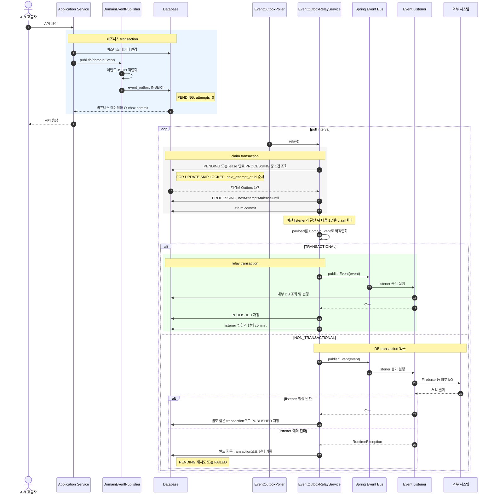
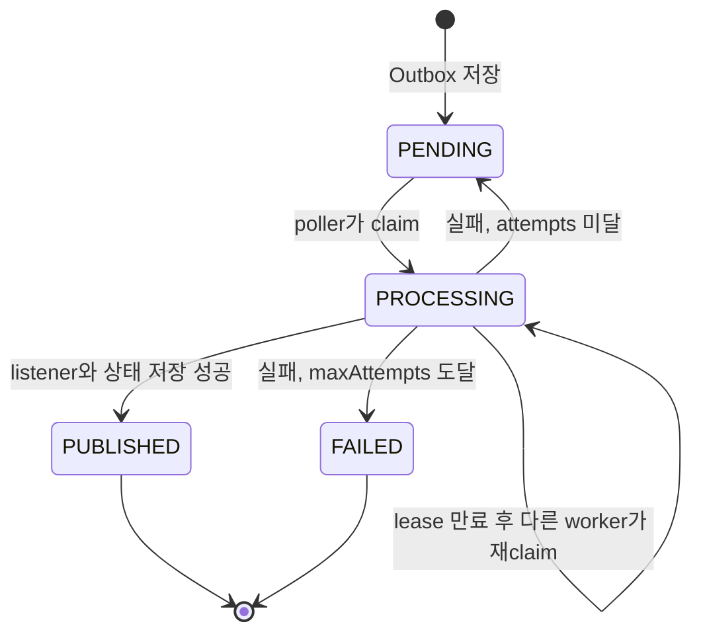

# Event Outbox 발행 및 소비 흐름

이 문서는 `DomainEventPublisher`로 발행한 이벤트가 공용 `event_outbox`에 저장되고 listener가 소비할
때까지의 실행 흐름과 `OutboxDispatchMode` 선택 기준을 설명한다.

## 전체 흐름



## 상태 전이



재시도 중인 이벤트의 상태는 `FAILED`가 아니라 `PENDING`이다. 실패할 때마다 `attempts`와
`lastError`를 기록하고, 백오프를 적용한 `nextAttemptAt` 이후 다시 처리한다. `maxAttempts`에 도달한
경우에만 `FAILED`가 되며 자동 재시도 대상에서 제외된다.

## Dispatch mode 선택 기준

`OutboxDispatchMode`는 최초 Outbox 저장의 transaction 여부가 아니다. Outbox를 claim한 relay가
listener를 어느 transaction 경계에서 실행할지 정한다.

| 이벤트가 요구하는 작업 | 권장 mode | 이유 |
| --- | --- | --- |
| 내부 DB 조회·변경과 후속 Outbox 저장 | `TRANSACTIONAL` | listener 변경과 현재 Outbox의 `PUBLISHED` 저장을 원자적으로 commit 또는 rollback한다. |
| Firebase, SMTP, 외부 webhook 등 네트워크 I/O | `NON_TRANSACTIONAL` | 외부 응답 대기 중 JDBC connection과 긴 DB transaction을 점유하지 않는다. |
| 내부 DB 작업과 외부 I/O가 혼합된 작업 | 이벤트를 두 단계로 분리 | 내부 준비 이벤트는 `TRANSACTIONAL`, 외부 실행 이벤트는 `NON_TRANSACTIONAL`로 분리한다. |

FCM 흐름이라면 대상과 token을 조회하고 batch Outbox를 만드는 요청 이벤트는 `TRANSACTIONAL`, 실제
Firebase API를 호출하는 batch 발송 이벤트는 `NON_TRANSACTIONAL`이 적절하다.

## 실패와 재시도 조건

“이벤트가 요구한 행동이 실패하면 재시도한다”는 설명은 listener가 실패를 예외로 relay까지 전파할 때만
성립한다.

| 상황 | Outbox 결과 | 주의사항 |
| --- | --- | --- |
| 일반/알 수 없는 `RuntimeException`을 던짐 | `PENDING` 재시도, 최대 횟수 도달 시 `FAILED` | 기존 호환성을 위해 retryable로 취급한다. |
| listener가 `OutboxDispatchFailure(retryable=false)`를 던짐 | attempts를 1 증가시키고 즉시 `FAILED` | 명확한 영구 오류를 동일하게 반복하지 않는다. |
| 외부 API가 부분 실패를 반환했지만 listener가 정상 반환 | `PUBLISHED` | 실패 token을 결과값으로만 삼키면 자동 재시도되지 않는다. |
| `NON_TRANSACTIONAL` 외부 호출은 성공했지만 `PUBLISHED` 저장 실패 | lease 만료 후 재시도 가능 | 외부 side effect가 중복 실행될 수 있으므로 consumer 멱등성이 필요하다. |
| worker가 `PROCESSING` 중 종료 | lease 만료 후 재claim | 다른 worker가 같은 이벤트를 이어서 처리한다. |

`NON_TRANSACTIONAL` listener는 일반 `@EventListener`로 동기 실행해야 예외가 relay까지 전달된다.
`@Async` listener는 relay가 완료와 실패를 관찰할 수 없고, transaction이 없는 상태의
`@TransactionalEventListener`는 `fallbackExecution = true`가 없으면 실행되지 않는다.

## 운영 제어

`EVENT_OUTBOX_RELAY_ENABLED=false`는 poller만 중지한다. `DomainEventPublisher`는 계속 신규 이벤트를
`PENDING`으로 저장하며, relay를 다시 활성화하면 적체된 이벤트를 처리한다. Spring local publisher로
우회하지 않으므로 환경에 따라 이벤트 내구성이 달라지지 않는다.

## `publishOnce` 멱등 발행

`DomainEventPublisher.publishOnce(event, availableAt)`는 `event_id`를 조회 키로 사용하는
멱등 발행 계약이다. 후보 이벤트의 비교 identity는 다음 네 값을 함께 사용한다.

```text
(eventClass, eventType, payloadFingerprint, availableAt.truncatedTo(MICROS))
```

`payloadFingerprint`는 serializer가 event metadata를 제외하고 business payload object key를
재귀적으로 정렬한 UTF-8 JSON의 SHA-256(소문자 64자리)이다. 배열 순서, null, 숫자 표현과 Unicode는
보존한다. 따라서 `occurredAt`이나 map 삽입 순서만 달라진 재요청은 같은 fingerprint로 취급한다.

| 요청 | 결과 |
| --- | --- |
| 새 `event_id` | `event_outbox` 한 행을 `PENDING`으로 atomic insert하고 `deduplicated=false` 반환 |
| 같은 `event_id` + class/type/fingerprint/마이크로초 `availableAt` 모두 동일 | 기존 행을 그대로 반환하고 `deduplicated=true` |
| class, type, fingerprint 또는 마이크로초 `availableAt` 중 하나라도 다름 | `EVENT-OUTBOX-0001` idempotency conflict, 기존 행은 변경하지 않음 |

저장은 PostgreSQL `INSERT ... ON CONFLICT (event_id) DO NOTHING`으로 수행한다. 단순한
`find → save` 순서를 사용하지 않으므로 동시 동일 요청에서도 행은 하나만 생긴다. 기존 배포 전
행처럼 `payload_fingerprint` 또는 `available_at`이 `NULL`인 legacy row는 저장 payload를 추론해
dedupe하지 않고 항상 conflict로 처리한다.

## 예약 시각·재시도·lease·상태 조회 의미

- `availableAt`: 최초 발송 가능 시각이다. 신규 row에서 불변이며 PostgreSQL `timestamp(6)`에 맞춰
  microsecond로 절삭한다. 재시도 시각이 바뀌어도 이 값은 바뀌지 않는다.
- `nextAttemptAt`: `PENDING`의 다음 실행 시각이다. 최초에는 `availableAt`, 실패 후에는 5초부터
  최대 5분까지의 bounded backoff 시각이다.
- `leaseUntil`: `PROCESSING` worker가 소유한 처리 임대 만료 시각이다. 저장 모델에서는 해당 상태의
  `nextAttemptAt` 값이 lease를 뜻하며, `EventOutboxStatusInfo`가 이를 `leaseUntil`로 노출한다.

상태 조회는 event ID, status, attempts, immutable `availableAt`, 상태에 맞는 시간 하나, 안전한
failure code, `publishedAt`만 반환한다. `PENDING`은 `nextAttemptAt`만, `PROCESSING`은 `leaseUntil`만
채우며 `PUBLISHED`와 `FAILED`는 둘 다 `null`이다. `OutboxPublishResult`는 도메인에서 canonicalize한
`availableAt`을 반환하고 `PENDING`일 때만 `nextAttemptAt`을 반환한다. payload·수신자·template
variables·원문 오류는 응답에 포함하지 않는다.

## claim-one relay와 실패 기록

relay는 한 번에 최대 `batchSize`건을 처리하되 매 반복마다 publishable row **한 건만**
`FOR UPDATE SKIP LOCKED`로 claim한다. claim 직후 `PROCESSING`과 5분 lease를 커밋하고 listener를
호출하며, 현재 listener가 끝난 뒤에야 다음 row를 claim한다. 이 순서로 긴 외부 호출 때문에
batch 뒤쪽 row의 lease가 먼저 만료되는 것을 막는다. `NON_TRANSACTIONAL` listener는 외부 호출
동안 JDBC transaction/connection을 점유하지 않고, 성공·실패 상태 저장만 짧은 별도 transaction에서
수행한다.

실패 저장값은 PII-safe하고 안정적인 식별자만 사용한다. `BusinessException`은
`baseCode.code`(예: `EMAIL-0005`)를, 그 밖의 예외는 fully-qualified exception class name을
`lastError`와 `sanitizedLastError`에 같은 값으로 기록한다. 상태 응답은 두 값이 일치할 때만
후자를 사용하므로 raw exception message는 노출되지 않는다. 신규
template-email 경로는 provider cause를 dispatch 경계에서 제거하고 이메일 주소·template 변수를
애플리케이션 로그와 trace span error에도 남기지 않는다. 다른 event listener가 직접 남기는
로그·span의 민감정보 처리는 해당 listener의 책임이다. relay가 발송 요청을 복원하려면 outbox
`payload`에 이메일 주소와 template 변수가 terminal retention 시점까지 일시 저장된다.

알 수 없는 `RuntimeException`과 `retryable=true` 실패는 기존 bounded backoff를 적용한다. 이메일
provider의 throttling·HTTP 5xx·상태 미확인 client/runtime 오류는 retryable이고, 그 밖의 명확한
HTTP 4xx는 non-retryable이다.

## Terminal payload retention

공용 retention scheduler는 terminal row 자체를 삭제하지 않고 payload만 비식별화한다.

- `PUBLISHED`: `published_at`으로부터 24시간이 지난 payload를 정리한다.
- `FAILED`: 마지막 `updated_at`으로부터 30일이 지난 payload를 정리한다.
- `PENDING`과 `PROCESSING`은 발행 복원에 필요하므로 정리하지 않는다.
- 정리 시 `payload='{}'`, `traceparent=NULL`, `payload_redacted_at=now`로 바꾼다.
- `event_id`, event class/type, fingerprint, 상태·attempts·시각과 현재 `last_error`가
  `sanitized_last_error` 사본과 일치하는 code/예외 class는 멱등성 tombstone으로 영구 보존한다.
- 이전 버전의 자유 형식 값과 rolling deploy 중 구버전 writer가 덮어쓴 불일치 값은 문자열 모양과
  관계없이 payload 정리 시 두 컬럼 모두 `NULL`로 바꾼다.

대상은 `(terminal time, id)` 순서로 `FOR UPDATE SKIP LOCKED`를 사용해 고르고, 기본 1시간 주기,
batch 500건, 실행당 최대 20 batch로 처리한다. 정리 후에도 동일 identity 재요청은
`deduplicated=true`, 다른 identity는 `EVENT-OUTBOX-0001` conflict다. 운영 metric job name은
`event_outbox_payload_retention`이며 처리 건수와 성공·실패만 기록하고 ID와 payload를 tag나 로그에
넣지 않는다.

## 보장 범위와 한계

outbox는 commit 이후 listener를 최소 한 번 실행하는 **at-least-once** 전달을 보장한다. listener가
정상 반환하고 상태 저장까지 끝나면 `PUBLISHED`가 되며, 이메일의 경우 이는 SES API가 요청을
수락했다는 뜻이지 수신함 도착·bounce·complaint를 뜻하지 않는다. 외부 side effect 뒤 프로세스가
종료되어 `PUBLISHED` 저장을 못 한 lease 만료 구간에서는 같은 이벤트가 다시 실행될 수 있으므로
provider-level exactly-once는 보장하지 않는다. 이메일 전용 delivery entity나 별도 poller를
추가하지 않고 공용 outbox의 claim/lease/backoff를 재사용한다.
