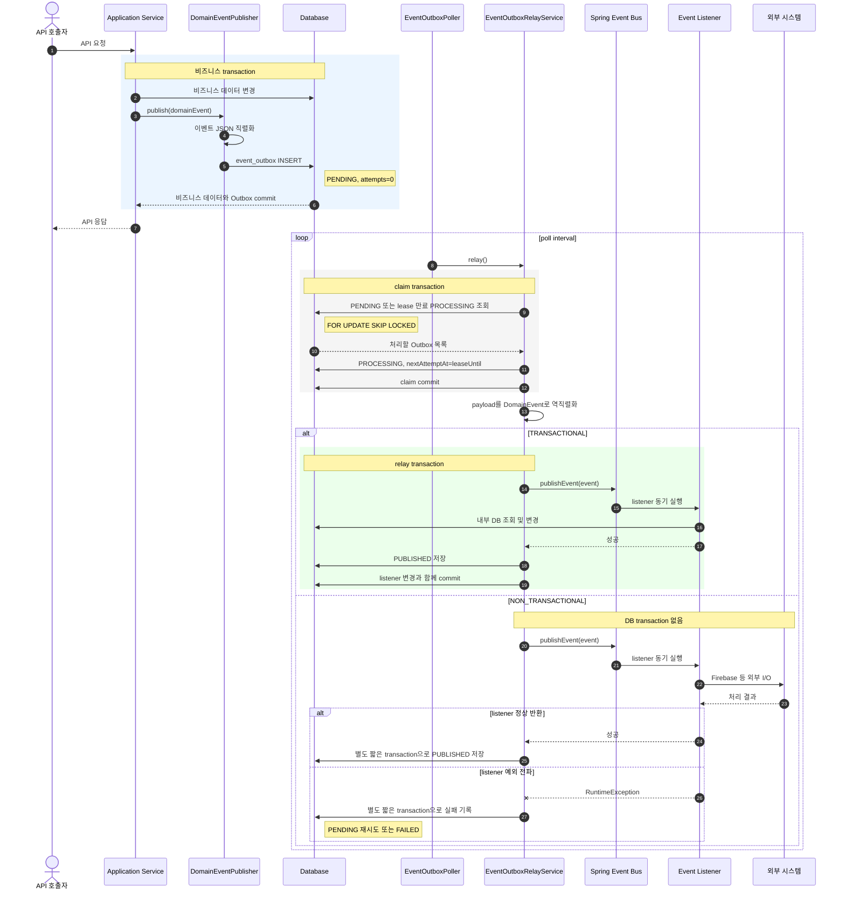
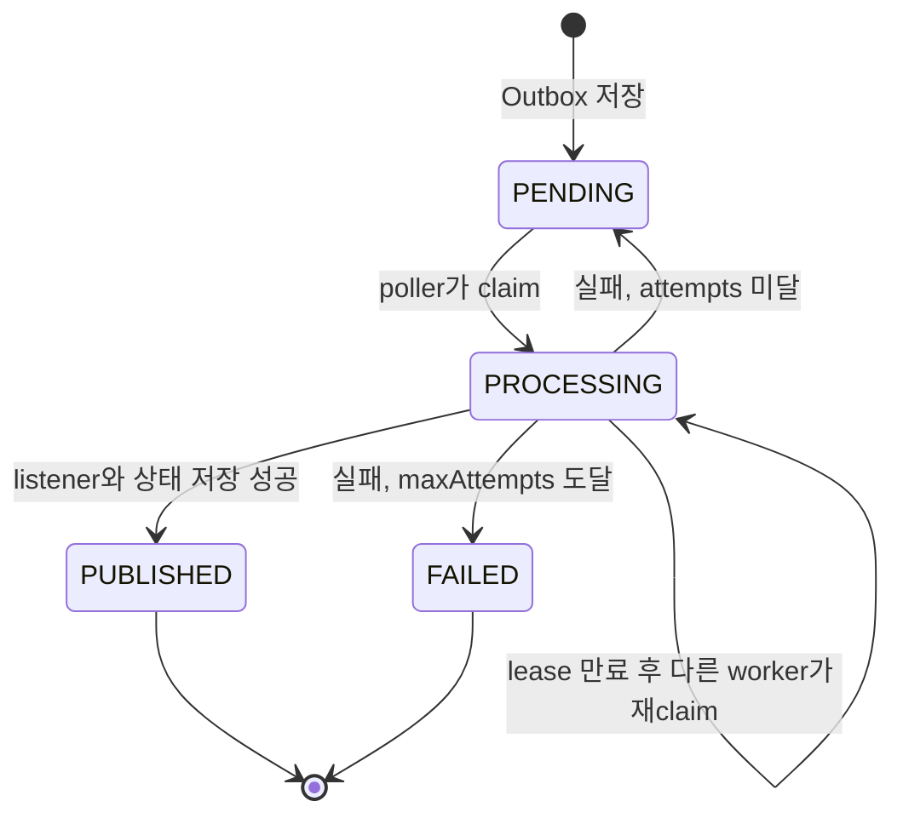

# Event Outbox 발행 및 소비 흐름

이 문서는 `DomainEventPublisher`로 발행한 이벤트가 공용 `event_outbox`에 저장되고 listener가 소비할
때까지의 실행 흐름과 `OutboxDispatchMode` 선택 기준을 설명한다.

## 전체 흐름

## 상태 전이

재시도 중인 이벤트의 상태는 `FAILED`가 아니라 `PENDING`이다. 실패할 때마다 `attempts`와
`lastError`를 기록하고, 백오프를 적용한 `nextAttemptAt` 이후 다시 처리한다. `maxAttempts`에 도달한
경우에만 `FAILED`가 되며 자동 재시도 대상에서 제외된다.

## Dispatch mode 선택 기준

`OutboxDispatchMode`는 최초 Outbox 저장의 transaction 여부가 아니다. Outbox를 claim한 relay가
listener를 어느 transaction 경계에서 실행할지 정한다.

| 이벤트가 요구하는 작업 | 권장 mode | 이유 |
| --- | --- | --- |
| 내부 DB 조회·변경과 후속 Outbox 저장 | `TRANSACTIONAL` | listener 변경과 현재 Outbox의 `PUBLISHED` 저장을 원자적으로 commit 또는 rollback한다. |
| Firebase, SMTP, 외부 webhook 등 네트워크 I/O | `NON_TRANSACTIONAL` | 외부 응답 대기 중 JDBC connection과 긴 DB transaction을 점유하지 않는다. |
| 내부 DB 작업과 외부 I/O가 혼합된 작업 | 이벤트를 두 단계로 분리 | 내부 준비 이벤트는 `TRANSACTIONAL`, 외부 실행 이벤트는 `NON_TRANSACTIONAL`로 분리한다. |

FCM 흐름이라면 대상과 token을 조회하고 batch Outbox를 만드는 요청 이벤트는 `TRANSACTIONAL`, 실제
Firebase API를 호출하는 batch 발송 이벤트는 `NON_TRANSACTIONAL`이 적절하다.

## 실패와 재시도 조건

“이벤트가 요구한 행동이 실패하면 재시도한다”는 설명은 listener가 실패를 예외로 relay까지 전파할 때만
성립한다.

| 상황 | Outbox 결과 | 주의사항 |
| --- | --- | --- |
| listener가 `RuntimeException`을 던짐 | `PENDING` 재시도, 최대 횟수 도달 시 `FAILED` | relay가 예외를 관찰할 수 있어야 한다. |
| 외부 API가 부분 실패를 반환했지만 listener가 정상 반환 | `PUBLISHED` | 실패 token을 결과값으로만 삼키면 자동 재시도되지 않는다. |
| `NON_TRANSACTIONAL` 외부 호출은 성공했지만 `PUBLISHED` 저장 실패 | lease 만료 후 재시도 가능 | 외부 side effect가 중복 실행될 수 있으므로 consumer 멱등성이 필요하다. |
| worker가 `PROCESSING` 중 종료 | lease 만료 후 재claim | 다른 worker가 같은 이벤트를 이어서 처리한다. |

`NON_TRANSACTIONAL` listener는 일반 `@EventListener`로 동기 실행해야 예외가 relay까지 전달된다.
`@Async` listener는 relay가 완료와 실패를 관찰할 수 없고, transaction이 없는 상태의
`@TransactionalEventListener`는 `fallbackExecution = true`가 없으면 실행되지 않는다.

## 운영 제어

`EVENT_OUTBOX_RELAY_ENABLED=false`는 poller만 중지한다. `DomainEventPublisher`는 계속 신규 이벤트를
`PENDING`으로 저장하며, relay를 다시 활성화하면 적체된 이벤트를 처리한다. Spring local publisher로
우회하지 않으므로 환경에 따라 이벤트 내구성이 달라지지 않는다.
