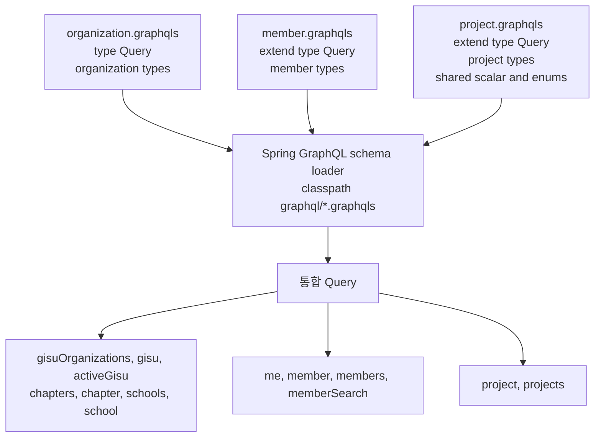
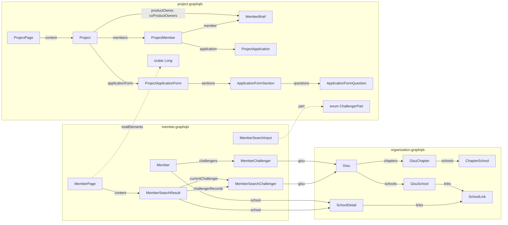
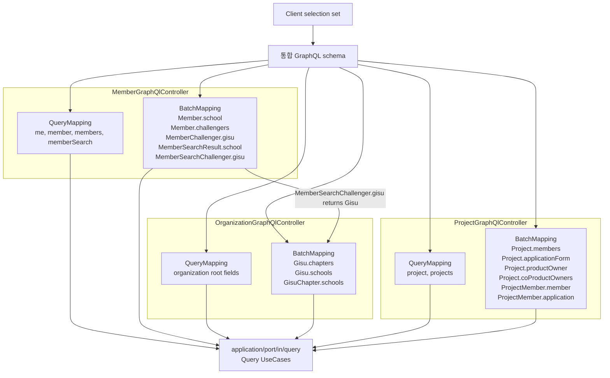

# GraphQL Onboarding

이 문서는 UMC PRODUCT 서버의 GraphQL pilot을 로컬과 dev 환경에서 실행하고, 스키마를 확인하고, query를 작성하는 방법을 정리한다.

## 현재 범위

GraphQL은 아직 pilot 범위다. 현재는 Query만 제공하고 Mutation은 제공하지 않는다.

제공 중인 도메인은 다음이다.

- `organization`: `gisu`, `chapter`, `school` 공개 조회
- `member`: `me`, `member`, `members`, `memberSearch` 조회와 `school`, `challengers`, `gisu` nested field
- `project`: `project`, `projects` 조회와 `members`, `application`, `applicationForm` nested field

스키마 파일은 `src/main/resources/graphql` 아래에 있다.

```text
src/main/resources/graphql/organization.graphqls
src/main/resources/graphql/member.graphqls
src/main/resources/graphql/project.graphqls
```

Spring GraphQL은 이 디렉터리의 `*.graphqls` 파일을 합쳐 하나의 schema로 로드한다. `extend type Query`로 root query를 도메인별 파일에서 확장한다.

## Schema 구성 및 연관 관계

### 통합 schema 조립

파일은 도메인별로 나뉘지만 endpoint와 실행 schema는 하나다. `organization.graphqls`가 root `Query`를 선언하고,
`member.graphqls`와 `project.graphqls`가 `extend type Query`로 field를 추가한다.



SDL 파일 경계는 Java package나 Hexagonal Architecture의 의존성 경계가 아니다. 모든 파일이 합쳐진 뒤 type 이름은
전역 namespace를 사용한다. 따라서 다른 파일에 선언된 type, scalar, enum도 이름으로 참조할 수 있다.

현재 공유 선언 위치는 다음과 같다.

| 공유 선언 | 선언 파일 | 사용하는 schema |
| --- | --- | --- |
| `Gisu`, `SchoolDetail` | `organization.graphqls` | `organization`, `member` |
| `Long`, `ChallengerPart` | `project.graphqls` | `project`, `member` |

### 주요 type 관계

실선은 object field가 다른 object type을 선택하는 관계이고, 점선은 input, scalar, enum을 공유하는 관계다.
`Project`는 `Member` type을 직접 재사용하지 않고 project 조회 목적에 맞춘 `MemberBrief`, `ProjectApplicant`를 사용한다.



### Resolver와 BatchMapping 연결

root field는 같은 도메인의 `@QueryMapping`이 처리한다. nested field는 selection set에 포함된 경우에만
`@BatchMapping`이 실행되며, 여러 parent의 ID를 모아 application query usecase를 한 번에 호출한다.



마지막 연결은 controller끼리 직접 호출한다는 뜻이 아니다. `MemberGraphQlController`가
`MemberSearchChallenger.gisu`를 공용 GraphQL type인 `Gisu`로 반환하면, 더 깊은 `Gisu.chapters` 또는
`Gisu.schools` selection은 GraphQL runtime이 `OrganizationGraphQlController`의 BatchMapping에 전달한다.
각 adapter는 서로를 주입하지 않고 필요한 application inbound port만 사용한다.

## 실행 경로

GraphQL endpoint는 하나다.

```text
POST /graphql
```

`/graphql`은 transport 계층 rate limit 대상이다. 기본 한도는 인증 요청 초당 20회·분당 300회,
익명 요청 초당 5회·분당 60회이며, 한도 초과 시 HTTP 429를 반환한다. `OPTIONS`와 제외 경로에는 적용하지 않는다.

로컬 실행 예시는 다음과 같다.

```bash
./gradlew bootRun
```

`bootRun`은 현재 shell에 export된 환경변수를 상속한다. `.env` 파일을 자동으로 읽지 않는다. 필요한 경우 먼저 env를 로드한다.

```bash
set -a
source .env
set +a

./gradlew bootRun
```

## 실행 도구

### GraphiQL

local과 dev profile에서는 GraphiQL이 기본 활성화되어 있다.

```text
http://localhost:8080/graphiql
```

기본값은 profile별로 다르다.

| profile | 기본값 |
| --- | --- |
| `local` | enabled |
| `dev` | enabled |
| 그 외 | disabled |

명시적으로 끄려면 다음 환경변수를 사용한다.

```bash
GRAPHQL_GRAPHIQL_ENABLED=false
```

### Apollo Sandbox

Apollo Sandbox는 documentation 정적 페이지로 제공한다.

```text
http://localhost:8080/docs/apollo-sandbox.html
```

이 페이지는 Apollo embedded Sandbox CDN script를 로드하고, 같은 origin의 `/graphql`을 초기 endpoint로 사용한다.

```js
initialEndpoint: '/graphql'
```

따라서 로컬에서 별도 CORS 설정 없이 사용할 수 있다. 외부 `studio.apollographql.com`에서 직접 서버 endpoint를 열 때는 브라우저 CORS 정책의 영향을 받는다.

## 스키마 확인 방법

가장 쉬운 방법은 GraphiQL 또는 Apollo Sandbox의 schema explorer를 보는 것이다.

코드 기준으로 확인할 때는 `src/main/resources/graphql`을 보면 된다.

```bash
find src/main/resources/graphql -maxdepth 1 -name "*.graphqls" -print
```

실행 중인 서버에서 introspection으로 확인할 수도 있다.

```bash
curl -s http://localhost:8080/graphql \
  -H 'Content-Type: application/json' \
  -d '{"query":"query { __schema { queryType { fields { name } } } }"}'
```

특정 type의 field를 확인하려면 다음처럼 조회한다.

```bash
curl -s http://localhost:8080/graphql \
  -H 'Content-Type: application/json' \
  -d '{"query":"query { __type(name: \"Member\") { fields { name type { kind name ofType { kind name } } } } }"}'
```

## Query 작성 방식

GraphQL은 REST처럼 include 옵션을 늘리는 대신, 필요한 field를 selection set에 직접 적는다.

예를 들어 member의 학교와 챌린저 이력이 필요하면 다음처럼 요청한다.

```graphql
query {
  member(id: 1) {
    memberId
    name
    school {
      schoolId
      schoolName
      chapterName
    }
    challengers {
      challengerId
      part
      status
      gisu {
        gisuId
        generation
      }
    }
  }
}
```

서버는 `Member.school`, `Member.challengers`, `MemberChallenger.gisu`를 field resolver로 처리한다. 여러 member를 조회할 때는 `@BatchMapping`을 사용해 N+1을 피한다.

## 인증 헤더

`/graphql` 경로 자체는 public path로 열려 있다. 하지만 모든 데이터가 public이라는 뜻은 아니다.

인증이 필요한 resolver는 `SecurityContext`의 `MemberPrincipal`과 권한 usecase를 사용한다. GraphiQL 또는 Apollo Sandbox에서 private query를 실행할 때는 HTTP headers에 JWT를 넣는다.

```json
{
  "Authorization": "Bearer <access-token>"
}
```

권한 정책은 resolver별로 다르다.

| 범위 | 권한 처리 |
| --- | --- |
| `organization` 조회 | 공개 조회 |
| `me` | 로그인 필요 |
| `member`, `members` | `MEMBER:READ` 검사 후 public view |
| `project`, `projects` | `PROJECT:READ` 검사 |
| `ProjectMember.application` | `PROJECT_APPLICATION:READ` 검사, 권한 없으면 `null` |

새 private resolver를 추가할 때는 `/graphql` 경로가 public이라는 사실을 전제로 method 또는 field resolver 안에서 권한 검사를 명시해야 한다.

## Organization 예시

활성 기수와 연결된 지부, 학교를 조회한다.

```graphql
query {
  activeGisu {
    gisuId
    generation
    active
    chapters {
      chapterId
      chapterName
      schools {
        schoolId
        schoolName
      }
    }
    schools {
      schoolId
      schoolName
      chapterName
    }
  }
}
```

기수 조직 목록은 `ids`, `generations`, `active` 중 정확히 하나만 selector로 받는다.

```graphql
query {
  gisuOrganizations(input: { active: true }) {
    gisus {
      gisuId
      generation
      chapters {
        chapterId
        chapterName
      }
    }
  }
}
```

`active: false`는 허용하지 않는다. active selector는 현재 활성 기수 조회 용도로만 사용한다.

## Member 예시

본인 프로필은 private view라 `email`, `status`를 포함할 수 있다.

```graphql
query {
  me {
    memberId
    name
    nickname
    email
    status
    school {
      schoolId
      schoolName
    }
  }
}
```

다른 member 조회는 권한 검사 후 public view로 내려간다. public view에서는 `email`, `status`가 `null`이다.

```graphql
query {
  members(ids: [1, 2, 2]) {
    memberId
    name
    email
    status
    challengers {
      challengerId
      part
      status
      gisu {
        generation
      }
    }
  }
}
```

`members`는 입력 ID를 중복 제거한 뒤 batch 조회한다.

회원 검색은 `memberSearch`에 검색 조건과 페이지를 전달한다. 관계 필드는 필요한 항목만 선택할 수 있으며,
`school`, `currentChallenger.gisu`, `challengerRecords.gisu`는 batch resolver로 조회한다.

```graphql
query {
  memberSearch(
    input: { keyword: "kim", part: SPRINGBOOT }
    page: { page: 0, size: 20 }
  ) {
    content {
      memberId
      name
      nickname
      email
      school {
        schoolId
        schoolName
      }
      currentChallenger {
        challengerId
        part
        challengerStatus
        gisu {
          gisuId
          generation
        }
      }
      challengerRecords {
        challengerId
        part
        challengerStatus
        gisu {
          gisuId
          generation
        }
      }
    }
    page
    size
    totalElements
    totalPages
    hasNext
  }
}
```

`memberSearch`의 검색 가능 범위는 현재 활성 기수가 아니라 요청자의 전체 챌린저·운영진 이력을 기준으로 계산한다.

| 요청자 이력 또는 역할 | 검색 가능 범위 |
| --- | --- |
| 챌린저 이력과 상위 역할이 모두 없는 단순 회원 | 검색 거부 |
| 챌린저 이력 보유 | 본인이 보유한 기수 ID에 속한 회원만 조회 |
| 과거 교내 회장 또는 부회장 | 본인 학교의 모든 기수 조회 |
| 중앙운영사무국 총괄 또는 부총괄 기록, `SUPER_ADMIN` | 기존 member-search 모집단 내 제한 없이 조회 |

학교 범위와 기수 범위를 동시에 가지면 두 범위를 OR로 결합한다. 사용자 검색 조건은 이 권한 범위와
AND로 결합되며, 권한 scope는 pagination과 count보다 먼저 DB query에 적용된다. 따라서
`totalElements`, `totalPages`, `hasNext`는 응답 후 필터링된 값이 아니라 동일한 scoped DB count를 반영한다.

페이지 입력을 생략하면 `page: 0`, `size: 20`을 사용한다. `size`는 최대 100이며 첫 버전은 sort 입력을
지원하지 않고 서버의 안정 정렬을 따른다. `page * size`로 계산한 offset은 최대 10,000이며, 10,000은 허용하고
초과하면 `BAD_REQUEST`로 거부한다. 검색 결과의 `email`은 `null`이면 `null`로 유지하고, 값이 있으면
원문을 마스킹해 반환한다. 한 글자 local-part처럼 원문과 달라지지 않는 값은 `[masked-email]`으로 대체하며,
raw email은 응답하지 않는다. `memberSearch` 복잡도는 요청한 `size`에 가중되며, alias별 비용은 전역 최대 복잡도까지
누적된다. 잘못된 입력은 최대 크기 비용으로 처리한다.

## Project 예시

프로젝트 검색은 `ProjectSearchInput`을 받는다.

```graphql
query {
  projects(input: { gisuId: 1, keyword: "server" }, page: { page: 0, size: 20 }) {
    content {
      id
      name
      status
      productOwner {
        memberId
        name
        schoolName
      }
      members {
        projectMemberId
        part
        leader
        member {
          memberId
          name
        }
        application {
          applicationId
          status
          submittedAt
        }
      }
      applicationForm {
        applicationFormId
        title
        sections {
          sectionId
          title
          questions {
            questionId
            title
            type
            options {
              optionId
              content
            }
          }
        }
      }
    }
    page
    size
    totalElements
    hasNext
  }
}
```

`ProjectMember.application`은 접근 권한이 없는 경우 GraphQL error를 내지 않고 `null`로 숨긴다. 한 응답 안에서 접근 가능한 지원서만 보여주기 위한 정책이다.

## Resolver 구현 규칙

GraphQL adapter는 `adapter/in/graphql`에 둔다.

허용되는 의존성은 application inbound port다.

```text
adapter/in/graphql -> application/port/in/query
```

금지되는 의존성은 repository, persistence adapter, domain entity 직접 노출이다.

```text
adapter/in/graphql -> adapter/out/persistence  금지
adapter/in/graphql -> JpaRepository            금지
GraphQL response -> Domain Entity 직접 반환     금지
```

응답 객체는 GraphQL 전용 DTO를 둔다. REST response DTO나 assembler를 그대로 노출하지 않는다.

하위 field가 목록에서 반복 조회될 가능성이 있으면 `@SchemaMapping` 단건 resolver보다 `@BatchMapping`을 우선한다.

## 테스트 방법

GraphQL resolver는 slice test로 검증한다.

```java
@GraphQlTest(MemberGraphQlController.class)
@Import(GraphQlRuntimeWiringConfig.class)
class MemberGraphQlControllerTest {
}
```

테스트에서 확인할 것은 다음이다.

- schema field가 실제 응답으로 매핑되는지
- root query가 올바른 usecase를 호출하는지
- nested field가 `@BatchMapping`으로 batch 조회되는지
- 권한 거부 시 private usecase를 호출하지 않는지
- public view와 private view의 field 노출 차이가 지켜지는지

관련 테스트:

```text
src/test/java/com/umc/product/organization/adapter/in/graphql/OrganizationGraphQlControllerTest.java
src/test/java/com/umc/product/member/adapter/in/graphql/MemberGraphQlControllerTest.java
src/test/java/com/umc/product/project/adapter/in/graphql/ProjectGraphQlControllerTest.java
src/test/java/com/umc/product/global/config/GraphQlRuntimeWiringConfigTest.java
```

실행:

```bash
./gradlew test --tests com.umc.product.organization.adapter.in.graphql.OrganizationGraphQlControllerTest
./gradlew test --tests com.umc.product.member.adapter.in.graphql.MemberGraphQlControllerTest
./gradlew test --tests com.umc.product.project.adapter.in.graphql.ProjectGraphQlControllerTest
./gradlew test --tests com.umc.product.global.config.GraphQlRuntimeWiringConfigTest
```

## 변경 시 체크리스트

- `src/main/resources/graphql/*.graphqls`에 schema를 먼저 추가한다.
- resolver는 `adapter/in/graphql`에 둔다.
- resolver는 application query usecase만 호출한다.
- private field는 resolver 안에서 권한을 검사한다.
- 목록 하위 field는 `@BatchMapping`으로 N+1을 피한다.
- GraphQL 전용 response DTO를 사용한다.
- `@GraphQlTest`와 `GraphQlTester`로 query 결과와 usecase 호출을 검증한다.
- schema가 추가되면 `GraphQlRuntimeWiringConfigTest` 또는 관련 slice test가 로드하는지 확인한다.
