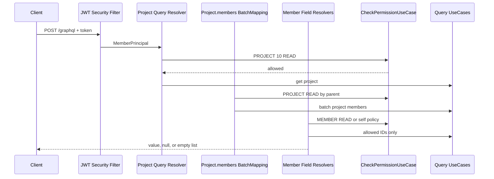

# GraphQL 권한 관리

이 문서는 GraphQL resolver의 인증·인가 책임과 nested field 권한 처리 기준을 설명한다. GraphQL도 REST와
같은 application permission을 사용하지만, selection set과 partial response를 고려해 field 단위 정책을 명시해야 한다.

## 기본 원칙

GraphQL engine은 schema의 type 관계만 보고 권한을 판단하지 않는다. 각 field에 연결된
`@QueryMapping`, `@SchemaMapping`, `@BatchMapping` 또는 instrumentation이 권한을 검사해야 한다.

부모 field 접근이 허용되어도 모든 자식 field 접근이 자동으로 허용되지는 않는다. `PROJECT READ`는 Project에
표시되는 회원 identity를 볼 근거가 될 수 있지만, 해당 회원의 email이나 challenger 이력 권한으로 승격되지 않는다.

## 권한 계층

| 계층 | 검사 대상 | 구현 위치 |
| --- | --- | --- |
| HTTP 인증 | JWT 유효성, `MemberPrincipal` 구성 | Spring Security filter |
| Root operation | query 대상 resource 접근 | `@QueryMapping` |
| Nested object | parent와 연결된 resource 접근 | `@SchemaMapping`, `@BatchMapping` |
| Sensitive field | 공개·본인·관리자 field 정책 | field resolver와 domain policy |
| Collection scope | 조회 가능한 row 범위 | application Query UseCase, QueryDSL |

`/graphql` 경로가 HTTP security에서 열려 있어도 모든 query가 public이라는 뜻은 아니다. Private resolver는
`CurrentMemberProvider` 또는 `@CurrentMember`로 요청자를 확인하고 `CheckPermissionUseCase`를 호출한다.

## Nested Query 판단 순서

```graphql
query {
  project(id: 10) {
    members {
      member {
        name
        private { email }
        challengers {
          part
        }
      }
    }
  }
}
```



GraphQL runtime은 sibling field를 병렬 또는 batch로 실행할 수 있다. 권한 로직은 실행 순서나 root path 문자열에
의존하면 안 된다. 같은 `MemberPublic.private`는 Project 아래에서 조회하더라도 동일한 Member field 정책을 적용한다.

## Resolver별 책임

### Root Query

Root resolver는 domain usecase 호출 전에 대상 resource 접근을 검사한다.

```java
checkPermissionUseCase.checkOrThrow(
    requesterMemberId,
    ResourcePermission.of(ResourceType.PROJECT, projectId, PermissionType.READ)
);
```

권한이 없으면 query field는 `FORBIDDEN` error로 실패하며 private usecase를 호출하지 않는다.

### Scalar Field

별도 resolver가 없는 scalar는 기본 property DataFetcher가 source accessor 값을 반환한다. Source에 민감 값이
있다면 schema field만 nullable로 바꾸는 것으로는 보호되지 않는다. 민감 field에는 명시적인 resolver를 두거나,
parent source에서 민감 값을 제거하고 resolver가 권한 확인 후 조회하도록 한다.

`MemberPublic` source에는 email과 status를 넣지 않는다. `MemberFieldGraphQlController`가
`MemberPublic.private`를 해석하며 요청자 본인에게만 `MemberPrivate`를 반환한다. 다른 요청자에게는
error 없이 권한 그룹 전체를 `null`로 반환한다.

### Nested Object와 Collection

목록 parent의 nested field는 `@BatchMapping`을 사용한다. Parent ID를 모아 권한을 먼저 판정하고 허용된 ID만
batch Query UseCase에 전달한다. 서로 다른 권한을 가진 parent가 섞일 수 있으므로 batch 전체를 한 번에 실패시키지 않는다.

현재 `MemberPublic.school`과 `MemberPublic.challengers`는 다음 순서로 처리한다.

1. 본인 ID는 별도 `MEMBER READ` 검사 없이 허용한다.
2. 나머지 ID는 authority snapshot을 한 번 로드해 parent별 `MEMBER READ`를 확인한다.
3. 허용된 member ID만 school/challenger batch 조회에 전달한다.
4. 거부된 parent의 `school`은 `null`, `challengers`는 빈 목록으로 redaction한다.

## 현재 정책

| Query 또는 field | 정책 |
| --- | --- |
| `gisu`, `activeGisu`, `chapters`, `chapter`, `schools`, `school` | 공개 organization 조회 |
| `umcProductOrganizationChart`, `umcProductMembers`, `umcProductMember`, `umcProductSquads` | 공개 UMC PRODUCT 조직 조회 |
| `me` | 로그인한 본인 |
| `member`, `members` | 대상별 `MEMBER READ` |
| `memberSearch` | application query가 요청자의 조회 scope를 제한 |
| `MemberPublic.private` | 본인만 `MemberPrivate` 반환, 그 외 `null` |
| `MemberPublic.school` | 본인 또는 대상 `MEMBER READ`, 그 외 `null` |
| `MemberPublic.challengers` | 본인 또는 대상 `MEMBER READ`, 그 외 빈 목록 |
| `project`, `projects` | 대상 `PROJECT READ` |
| `Project.members`, `Project.applicationForm` | parent Project별 `PROJECT READ` 재확인 |
| `ProjectMember.application` | `PROJECT_APPLICATION READ`, 거부 대상은 `null` |
| `RecruitingSeason.management` | Recruitment `READ`, 그 외 `null` |
| `RecruitingRound.management` | 해당 season의 Recruitment `READ`, 그 외 `null` |
| `RecruitingApplication.private` | 지원자 본인 또는 올바른 credential, 그 외 `null` |
| `RecruitingApplication.review` | Recruitment 운영자 또는 해당 round 평가자, 그 외 `null` |
| `form` | 인증 필요, draft는 생성자에게만 반환 |
| `managedStudyGroups` | 인증 회원의 application scope로 목록 제한 |
| `studyGroup` | 대상별 `STUDY_GROUP READ` |
| `adminAnalytics` | `ANALYTICS READ`; nested field는 허용된 root source에서만 실행 |
| `auditLogs` | `AUDIT READ` |
| `notice`, `notices` | 인증 및 Notice application scope, 상세는 `NOTICE READ` |
| `myOAuthConnections`, `myCertificates`, `myCurriculum`, `chatRooms`, `mySchedules` | 인증한 본인 context |
| Storage·Notification mutation | 인증 회원, 관리자 FCM 요청은 `FCM WRITE` 추가 검사 |
| Maintenance admin query·mutation | `SUPER_ADMIN` policy |
| `errorCodeCatalog`, 공개 약관·인증서 검증 | 공개 조회 |

Project와 Recruiting이 canonical `MemberPublic`을 반환해도 Member private 정책은 바뀌지 않는다. Field 접근
범위 차이를 `MemberSummary` 같은 별도 type으로 우회하지 않고 Member 소유 resolver에서 일관되게 판정한다.

## Partial Response와 Null Bubbling

GraphQL은 일부 field가 숨겨져도 sibling data를 유지할 수 있다.

```json
{
  "data": {
    "member": {
      "memberId": "2",
      "name": "홍길동",
      "private": null
    }
  }
}
```

| SDL 계약 | resolver가 `null`을 반환할 때 |
| --- | --- |
| `private: MemberPrivate` | `private`만 `null`, sibling 유지 |
| `private: MemberPrivate!` | 가장 가까운 nullable ancestor까지 null bubbling |
| `[MemberChallenger!]!` | 목록 자체는 `null`일 수 없으므로 빈 목록 정책이 필요 |

권한에 따라 숨길 수 있는 field는 nullable이어야 한다. Non-null 계약이 반드시 필요하면 field를 redaction하지 말고
parent object 진입 단계에서 전체 접근을 거부한다.

정책별 응답 기준은 다음과 같다.

- Root resource 권한 없음: `FORBIDDEN` error로 query field를 실패시킨다.
- Member와 Recruiting 권한 그룹 접근 불가: error 없이 nullable `null`을 반환한다.
- 존재 자체를 숨기는 relation: 문서화된 정책에 따라 `null` 또는 빈 목록을 반환한다.
- mixed visibility batch: 허용된 parent 결과는 유지하고 거부된 ID는 downstream query에서 제외한다.

## Directive

SDL directive는 선언만으로 권한을 적용하지 않는다. `SchemaDirectiveWiring`이나 instrumentation이 실제
DataFetcher를 감싸야 한다. 대상 ID, parent gisu, 본인 여부가 동적으로 결정되는 현재 구조에서는 resolver가
application permission usecase를 호출하는 방식을 우선한다.

## 테스트 기준

1. 인증되지 않은 요청은 private resolver와 domain usecase에 도달하지 않는다.
2. Root 권한 거부 시 GraphQL error classification과 path가 계약에 맞는다.
3. 공개 field는 유지되지만 같은 Member의 `private` 권한 그룹은 redaction된다.
4. 본인은 private field와 nested relation을 조회할 수 있다.
5. Mixed visibility batch에서 허용된 parent 결과가 유지된다.
6. 권한 없는 ID가 downstream batch query에 전달되지 않는다.
7. Authority snapshot과 nested data 조회가 parent마다 N+1로 실행되지 않는다.
8. Nullable field 거부가 예상하지 않은 null bubbling을 만들지 않는다.
9. Project를 통한 Member 조회가 Member private 권한으로 자동 승격되지 않는다.
10. Recruiting `management`, `private`, `review`가 권한별로 부분 응답을 유지한다.

## 변경 체크리스트

- 새 root query가 필요한 인증과 resource permission을 검사하는가?
- 새 nested field의 공개·본인·관리자 정책을 owning domain이 정의했는가?
- 민감 scalar에 기본 property DataFetcher 우회 경로가 남아 있지 않은가?
- 권한에 따라 숨길 field의 nullability가 적절한가?
- collection field가 batch 조회되고 mixed visibility를 parent별로 처리하는가?
- GraphQL error code, classification, path를 테스트했는가?
