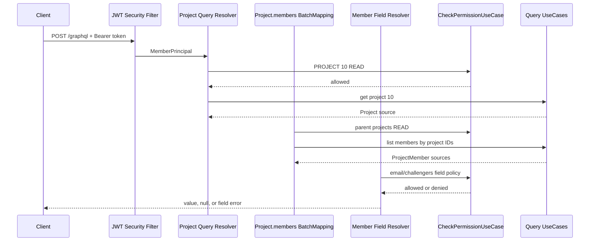

# GraphQL 권한 관리

이 문서는 UMC PRODUCT GraphQL resolver의 인증·인가 책임과 nested field 권한 처리 기준을 설명한다.
REST와 동일한 domain permission을 사용하되, GraphQL의 부분 응답과 field 단위 실행 모델을 반영한다.

## 기본 원칙

GraphQL engine은 schema의 type 관계만 보고 권한을 판단하지 않는다. 각 field에 연결된 DataFetcher,
즉 `@QueryMapping`, `@SchemaMapping`, `@BatchMapping` 또는 custom instrumentation이 권한을 검사해야
한다.

부모 field 접근이 허용됐다고 해서 모든 자식 field 접근이 자동으로 허용되지는 않는다. 예를 들어
`PROJECT READ`는 Project 내부에 표시되는 Member 이름을 볼 근거가 될 수 있지만, Member 이메일이나
challenger 이력을 조회할 권한까지 부여하지 않는다.

## 권한 계층

| 계층 | 검사 대상 | 구현 위치 |
| --- | --- | --- |
| HTTP 인증 | JWT 유효성, `MemberPrincipal` 구성 | Spring Security filter |
| Root operation | query 대상 resource 접근 | `@QueryMapping` |
| Nested object | parent와 연결된 resource 접근 | `@SchemaMapping`, `@BatchMapping` |
| Sensitive field | field별 공개·본인·관리 권한 | field resolver와 policy |
| Collection scope | 조회 가능한 row 범위 | application Query UseCase, QueryDSL |

`/graphql` endpoint가 HTTP security 설정에서 접근 가능하더라도 private query가 공개되는 것은 아니다.
인증이 필요한 resolver는 `SecurityContext`의 `MemberPrincipal`을 확인하고 permission usecase를 호출한다.

## Nested Query 실행

다음 query를 예로 든다.

```graphql
query {
  project(id: 10) {
    members {
      member {
        name
        email
        challengers {
          part
        }
      }
    }
  }
}
```



GraphQL은 같은 depth의 sibling field를 병렬 또는 batch로 실행할 수 있다. 문서의 순서는 dependency를
보여주기 위한 것이며 모든 resolver가 직렬 실행된다는 뜻은 아니다.

## Resolver가 사용할 수 있는 정보

Field resolver는 다음 값을 조합해 권한을 판단한다.

- `SecurityContext` 또는 `GraphQLContext`의 요청자 `MemberPrincipal`
- `DataFetchingEnvironment.getSource()`로 받은 parent source
- field argument의 resource ID
- application layer가 제공하는 resource 소유·gisu·상태 정보
- `SubjectAttributes`와 `ResourcePermission`

실행 경로 문자열이나 field가 어떤 root query에서 시작됐는지를 권한 기준으로 삼지 않는다. 같은
`Member.email` field는 Project 아래에 있든 Member query 아래에 있든 동일한 private field 정책을 가져야
한다. Parent resource가 특별한 접근 범위를 부여해야 한다면 source에 명시적인 resource ID 또는 access
scope를 포함하고 policy에서 판정한다.

## Resolver 종류별 책임

### Root Query

Root resolver는 대상 object 또는 collection에 진입할 권한을 확인한다. 권한이 없으면 domain usecase를
호출하기 전에 실패해야 한다.

```java
@QueryMapping
public ProjectGraphQlResponse project(@Argument Long id) {
    Long requesterMemberId = currentMemberId();
    checkPermissionUseCase.checkOrThrow(
        requesterMemberId,
        ResourcePermission.of(ResourceType.PROJECT, id, PermissionType.READ)
    );
    return ProjectGraphQlResponse.from(getProjectUseCase.getById(id));
}
```

### Scalar Field

별도 resolver가 없는 scalar field는 Spring GraphQL의 기본 property DataFetcher가 source의 getter 또는
record accessor 값을 그대로 반환한다. 따라서 source에 `email`이 있고 schema에도 `email`이 있지만
custom resolver가 없다면 field 권한 검사가 실행되지 않는다.

민감 값을 안전하게 처리하는 방법은 두 가지다.

1. Parent source에는 공개 field만 넣고 민감 field resolver가 권한 확인 후 값을 조회한다.
2. Source에 값이 있더라도 모든 민감 field에 명시적인 `@SchemaMapping` 또는 `@BatchMapping`을 둔다.

첫 번째 방식이 resolver 누락 시에도 노출되지 않는 fail-closed 구조다.

### Nested Object와 Collection

목록 parent에서 반복되는 nested field는 `@BatchMapping`을 사용한다. Parent ID를 모아 권한과 데이터를
한 번에 조회하고 각 parent에 결과를 매핑한다.

```java
@BatchMapping(typeName = "Member", field = "challengers")
public Map<MemberSource, List<MemberChallengerGraphQlResponse>> challengers(
    List<MemberSource> members
) {
    Long requesterMemberId = currentMemberId();
    SubjectAttributes subject = checkPermissionUseCase.loadSubject(requesterMemberId);

    // member별 권한을 먼저 판정한다.
    // 허용된 member ID만 challenger Query UseCase에 전달한다.
    // 원래 parent 순서와 key를 유지해 결과를 반환한다.
}
```

Batch 전체에 한 번 예외를 던지면 서로 다른 권한을 가진 parent 결과가 함께 실패할 수 있다. Mixed
visibility가 가능한 field는 member별로 허용·거부 결과를 분리하고, 거부된 key에는 정책에 따라 `null`,
빈 목록 또는 field error를 반환한다. 권한이 없는 ID는 domain query에 전달하지 않는다.

## Field 정책 분류

같은 `Member` type을 여러 domain에서 재사용한다면 field를 다음처럼 분류한다.

| Field 예시 | 정책 | 권장 결과 |
| --- | --- | --- |
| `memberId`, `nickname`, `name`, `schoolName` | Parent resource에서 표시가 허용된 공개 identity | 값 반환 |
| `profileImageLink` | Parent resource에서 표시가 허용된 공개 profile | 값 반환 |
| `school` | 본인 또는 `MEMBER READ` | 값 또는 `null` |
| `challengers` | 본인 또는 `MEMBER READ` | 목록 또는 빈 목록 |
| `email`, `status` | 본인 | 값 또는 `null` |

이 표의 최종 공개 범위는 Member domain policy로 확정해야 한다. Project resolver가 임의로 Member private
field 정책을 정의하지 않는다.

현재 Member root와 Project nested resolver는 공통 `MemberInfo` source를 반환한다.
`MemberFieldGraphQlController`가 `memberId`를 매핑하고 `email`, `status`의 기본 property DataFetcher를
명시적으로 대체한다. 두 private field는 source에 값이 있어도 요청자 본인이 아니면 `null`을 반환한다.
`MemberGraphQlController`는 `school`, `challengers`를 parent별로 판정하고, 본인이 아니면서 `MEMBER READ`
권한도 없으면 각각 `null`, 빈 목록을 반환한다. 이 redaction에는 GraphQL error를 추가하지 않는다.
새 private field를 추가할 때도 같은 Member 소유 resolver 또는 `MemberGraphQlFieldAccessPolicy`를 통해
모든 진입 경로에 동일한 정책을 적용해야 한다.

## Permission 모델

동적 resource 권한은 기존 authorization application port를 사용한다.

```java
ResourcePermission.of(ResourceType.MEMBER, memberId, PermissionType.READ)
ResourcePermission.of(ResourceType.PROJECT, projectId, PermissionType.READ)
ResourcePermission.ofType(ResourceType.FEEDBACK, PermissionType.READ)
```

- `checkOrThrow`는 단일 root 또는 전체 접근이 반드시 허용돼야 할 때 사용한다.
- `check`는 nested 결과에서 허용된 항목만 선택할 때 사용한다.
- `loadSubject`는 batch에서 요청자의 authority snapshot을 한 번 읽을 때 사용한다.
- resource가 gisu를 가지면 해당 resource의 gisu를 사용하는 scoped permission을 적용한다.
- `SUPER_ADMIN`은 global override이며 Member domain의 system role을 기준으로 한다.

권한 판정 로직을 resolver마다 복제하지 않는다. Field 공개 규칙은 domain policy 컴포넌트가 소유하고,
resolver는 요청자·대상·field context를 policy에 전달한다.

## Partial Response와 Null Bubbling

GraphQL은 일부 field가 실패해도 나머지 data를 반환할 수 있다. 다음은 field 접근 거부를 명시적
`FORBIDDEN` error로 표현하는 정책을 선택했을 때의 일반적인 예다. 현재 `Member.email`, `Member.status`는
요청자가 본인이 아니면 error 없이 `null`로 redaction한다.

```json
{
  "data": {
    "project": {
      "members": [
        {
          "member": {
            "name": "홍길동",
            "email": null
          }
        }
      ]
    }
  },
  "errors": [
    {
      "message": "이메일 조회 권한이 없습니다.",
      "path": ["project", "members", 0, "member", "email"],
      "extensions": { "classification": "FORBIDDEN" }
    }
  ]
}
```

| Schema nullability | Resolver가 `null` 또는 error를 반환할 때 |
| --- | --- |
| `email: String` | `email`만 `null`, sibling data 유지 |
| `email: String!` | 가장 가까운 nullable ancestor까지 null bubbling |
| `[MemberChallenger!]` | 목록 전체를 `null`로 만들 수 있음 |
| `[MemberChallenger!]!` | 상위 Member 또는 그 이상의 ancestor까지 전파될 수 있음 |

권한에 따라 숨길 수 있는 field는 nullable이어야 한다. Non-null 계약이 필요하다면 field를 숨기는 대신
parent object 진입 단계에서 전체 접근을 거부한다.

정책별 응답 기준은 다음과 같다.

- Root resource 권한 없음: `FORBIDDEN` error로 query field를 실패시킨다.
- 현재 Member private scalar 권한 없음: error 없이 nullable `null`을 반환한다.
- 명시적 접근 거부를 계약으로 삼는 field: nullable `null`과 field path가 포함된 error를 반환할 수 있다.
- 존재 자체를 숨겨야 하는 relation: `null` 또는 빈 목록을 반환하되 정책을 문서화한다.
- 한 batch에 허용·거부 대상이 섞임: 허용된 parent의 결과는 유지한다.

## 현재 Query별 권한

| Query 또는 field | 현재 정책 |
| --- | --- |
| `me` | 로그인한 본인 |
| `member`, `members` | 각 대상 `MEMBER READ` |
| `memberSearch` | application query에서 조회 가능 scope를 먼저 제한 |
| `Member.email`, `Member.status` | 본인만 값 반환, 그 외 `null` |
| `Member.school` | 본인 또는 대상 `MEMBER READ`, 그 외 `null` |
| `Member.challengers` | 본인 또는 대상 `MEMBER READ`, 그 외 빈 목록 |
| `project`, `projects` | `PROJECT READ` |
| `Project.members`, `Project.applicationForm` | parent Project별 `PROJECT READ` 재확인 |
| `ProjectMember.application` | `PROJECT_APPLICATION READ`, 거부 대상은 `null` |
| `userFeedbackTemplates`, `userFeedbackTemplate` | `FEEDBACK READ`, 현재 `SUPER_ADMIN`만 허용 |

Root에서 확인한 권한을 nested resolver가 무조건 다시 조회할 필요는 없다. 다만 nested resolver가 별도
진입점에서도 호출되거나 다른 resource 권한을 요구한다면 독립적으로 검사해야 한다. 중복 authority
조회 비용은 request context 또는 authorization cache로 줄이고 검사를 생략하지 않는다.

## Directive 사용 여부

SDL에 다음과 같은 directive를 선언해 권한을 표현할 수 있다.

```graphql
directive @requiresPermission(
  resource: String!
  permission: String!
) on FIELD_DEFINITION
```

이 방식은 `SchemaDirectiveWiring` 또는 instrumentation이 실제 DataFetcher를 감싸도록 구현해야 한다.
Directive 선언만 추가하면 권한 검사는 실행되지 않는다. 대상 resource ID, 본인 여부, parent gisu가
동적으로 결정되는 현재 구조에서는 application permission usecase와 field policy를 resolver에서 호출하는
방식이 우선이다. 반복되는 정적 정책이 충분히 쌓였을 때 directive 도입을 검토한다.

## 테스트 기준

권한 변경에는 최소한 다음 시나리오가 필요하다.

1. 인증되지 않은 요청은 private resolver와 domain usecase에 도달하지 않는다.
2. Root resource 권한 거부 시 data field와 GraphQL error code/path가 계약과 일치한다.
3. 공개 field는 허용되지만 같은 Member의 private field는 차단된다.
4. 본인과 `SUPER_ADMIN`은 허용된 private field를 조회할 수 있다.
5. Parent 목록에 허용·거부 대상이 섞여도 허용된 결과가 유지된다.
6. 권한 없는 ID는 batch domain query에 전달되지 않는다.
7. Authority snapshot과 nested data 조회가 parent마다 N+1로 실행되지 않는다.
8. Nullable field 거부가 예상하지 않은 null bubbling을 만들지 않는다.
9. 권한 거부 시 private usecase가 호출되지 않는다.
10. Project를 통한 Member 조회가 Member private 권한으로 자동 승격되지 않는다.

## 변경 체크리스트

- 새 root query에 인증과 resource permission 검사가 있는가?
- 새 nested field가 public인지 private인지 Member/domain policy가 정의했는가?
- 민감 scalar에 기본 property DataFetcher가 우회 경로로 남아 있지 않은가?
- 권한에 따라 숨길 field의 nullability가 적절한가?
- 목록 nested field가 batch 조회되는가?
- Mixed visibility를 parent별로 처리하는가?
- 다른 domain repository나 adapter를 직접 참조하지 않는가?
- GraphQL error code, classification, path를 테스트했는가?
- 익명·일반 사용자·본인·관리자 시나리오를 모두 검증했는가?
