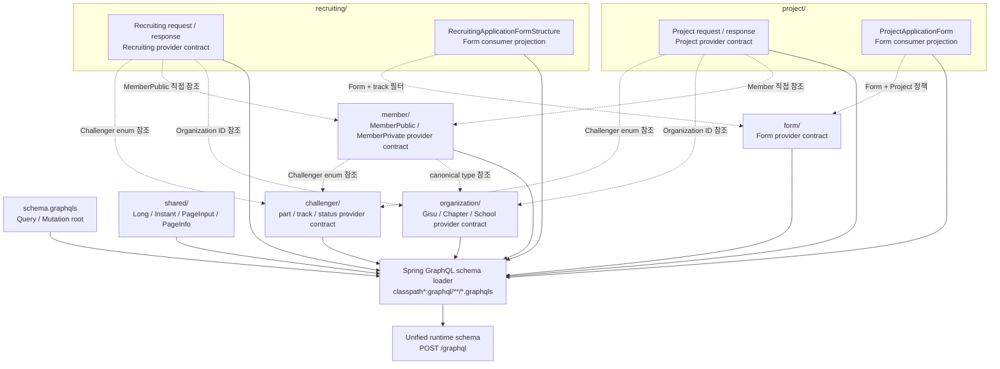
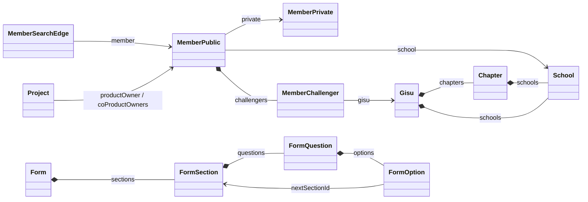
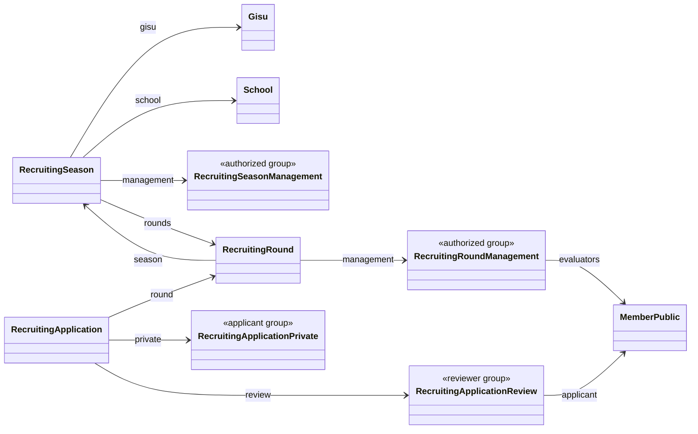
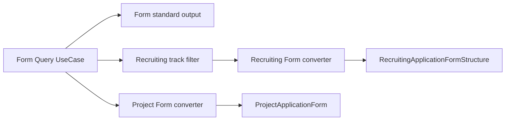
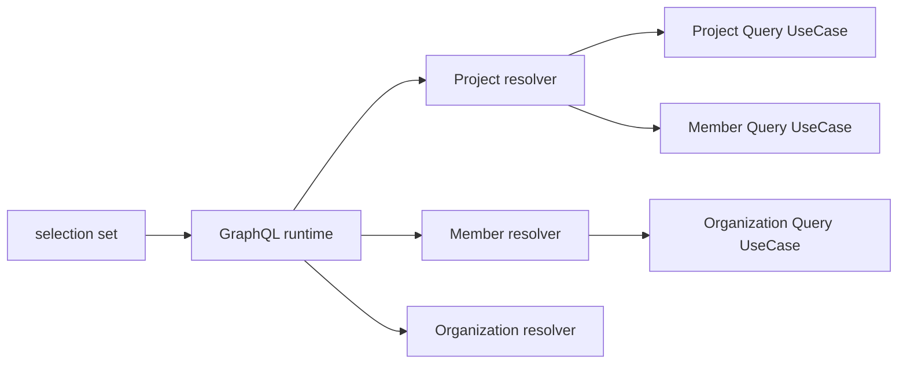

# GraphQL Schema 관계

GraphQL SDL의 소유권과 도메인 간 관계를 설명한다. 실행 계약의 source of truth는
`src/main/resources/graphql/**/*.graphqls`이고, 각 도메인의 field 표는 같은 경로의 `README.md`에 있다.

## 전체 Schema 구성

실선은 SDL이 하나의 runtime schema로 조립되는 경로이고, 점선은 domain contract 사이의 의미적
의존성이다. 각 도메인 디렉터리의 선언은 해당 도메인이 외부에 제공하는 provider contract다. 동시에
`ProjectApplicationForm`처럼 다른 provider 데이터를 소비해 만든 타입은 원본 도메인 관점에서 consumer
projection이기도 하다. 즉 provider contract는 **계약 소유권**, consumer projection은 **데이터 출처와
변환 방식**을 나타내므로 서로 배타적인 분류가 아니다.

`shared`는 여러 곳에서 사용된다는 이유가 아니라 비즈니스 owner가 없을 때만 사용한다.
`ChallengerPart`와 `QuestionType`은 각각 Challenger와 Form이 소유한다. 모든 선언은 runtime에서 전역
GraphQL type namespace를 공유한다.

## 관계 종류

| 종류 | 조건 | 예시 |
|---|---|---|
| 직접 참조 | provider resource의 의미와 lifecycle을 그대로 사용 | `Project.productOwner: MemberPublic` |
| ID 참조 | 객체 조립 없이 aggregate 식별자만 전달 | `Project.gisuId`, `RecruitingApplicationForm.formId` |
| consumer projection | 필터링하거나 consumer 정책을 결합 | `RecruitingApplicationFormStructure`, `ProjectApplicationForm` |
| snapshot | 과거 시점 값을 consumer lifecycle로 보존 | `ProjectApplicant`, 지원서의 applicant profile |

## 표준 Resource 관계

`MemberPublic`, `MemberPrivate`, `Gisu`, `Chapter`, `School`, `Form`은 provider가 표준으로 제공하는
canonical type이다. `MemberPrivate`는 별도 회원 resource가 아니라 `MemberPublic.private`에서 본인에게만
열리는 권한 그룹이다.
`MemberSummary`, `MemberBrief`, `GisuChapter`처럼 조회 경로나 persistence 관계를 type 이름으로 복제하지
않는다. 관계에 독립적인 속성과 lifecycle이 생길 때만 edge type을 도입한다.

## Recruiting Resource 관계

Recruiting은 다섯 root query로 canonical resource에 진입한다. 운영자·지원자·평가자마다 resource type을
복제하지 않고 nullable 권한 그룹 field에서 접근을 판정한다. Round 목록의 evaluator, 지원서 review,
질문처럼 반복되는 nested 관계는 `@BatchMapping`과 batch query use case로 해석한다.

## Form 소비 관계

Project는 section에 `type`, `allowedParts` 정책을 결합한다. Recruiting은 지원자의 1·2지망 track에
허용된 section만 반환한다. 두 응답은 Form과 field 모양이 일부 같아도 의미와 변경 주기가 다르므로
GraphQL interface로 묶지 않는다. 각 도메인의 converter가 application DTO를 공개 DTO로 변환한다.

## Resolver 연결

GraphQL type 참조는 Java domain aggregate 참조나 controller 간 호출을 의미하지 않는다.

다른 도메인의 데이터는 해당 도메인의 public query use case를 통해 조회한다. 목록 관계는 batch로
해석하며, field 권한은 [GraphQL 권한 관리](authorization.md)의 규칙을 따른다.

## IDL 분리 시 고려사항

각 디렉터리는 provider의 표준 request/response 계약이지만 단독으로 항상 실행 가능한 schema는 아니다.
예를 들어 Recruiting IDL은 `ChallengerTrack`, `QuestionType`, `Instant`를 참조한다.

- monolith에서는 전체 glob을 조립한다.
- schema registry에서는 의존 provider IDL과 composition한다.
- MSA 경계에서 provider 객체를 그대로 가져올 수 없으면 ID-only 계약과 consumer converter를 사용한다.
- consumer가 provider 선언을 복사하면 enum과 nullability가 독립적으로 drift하므로 금지한다.

## 변경 체크리스트

- 새 선언의 business owner가 명확한가?
- 직접 참조, ID 참조, projection, snapshot 중 어떤 관계인지 README에 기록했는가?
- 외부 ID와 변환 field에 GraphQL description이 있는가?
- projection 변환이 adapter converter에 있는가?
- schema source와 Java DTO의 field 이름·nullability가 맞는가?
- nested collection이 N+1을 만들지 않는가?
- 전체 SDL 조립 및 architecture test가 통과하는가?
