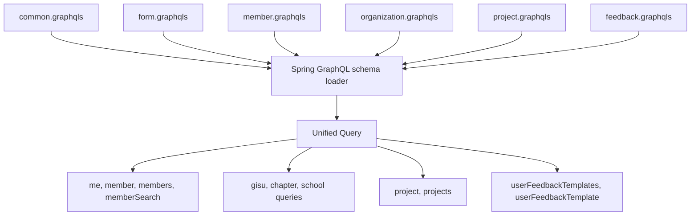
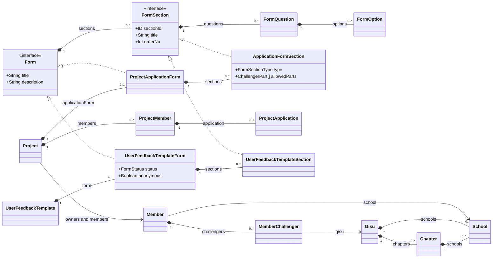

# GraphQL Schema 관계

이 문서는 UMC PRODUCT GraphQL schema의 파일 소유권과 type 간 관계를 설명한다. 실제 실행 계약의
source of truth는 `src/main/resources/graphql/*.graphqls`이며, 이 문서는 schema 변경 위치와 domain 간
참조 방향을 결정할 때 사용한다.

전체 field snapshot과 상세 관계도는 [`docs/graphql-schema.md`](../../graphql-schema.md)를 참고한다.

## Unified Schema

Spring GraphQL은 아래 SDL 파일을 합쳐 `/graphql` endpoint의 단일 schema를 구성한다. 파일 경계는
소유권과 변경 위치를 나타내며 별도 endpoint나 namespace를 만들지 않는다.

| SDL | 소유하는 계약 |
| --- | --- |
| `common.graphqls` | `Long`, `ChallengerPart` |
| `form.graphqls` | 공통 Form interface, 질문·옵션 type, form enum |
| `member.graphqls` | Member query와 Member type |
| `organization.graphqls` | root `Query`, Gisu·Chapter·School type |
| `project.graphqls` | Project query와 Project 전용 concrete type |
| `feedback.graphqls` | Feedback Template query와 Feedback 전용 concrete type |



`organization.graphqls`가 `type Query`를 선언하고, 나머지 query 보유 파일은 `extend type Query`로
field를 추가한다. type 이름은 전체 SDL에서 하나의 전역 namespace를 사용한다.

## Type 관계

아래 diagram은 database ERD가 아니라 GraphQL object/interface 관계다. `<|..`는 interface 구현,
`*--`는 응답 내부 중첩, `-->`는 다른 schema가 소유한 type 참조를 의미한다.



Cardinality는 SDL의 nullable/list 형태를 기준으로 한다. JPA association, aggregate ownership 또는
foreign key를 의미하지 않는다.

## 공통 Form 계약

`Form`과 `FormSection`은 domain별 form이 공유하는 최소 계약이다.

| 공통 계약 | Project 구현 | Feedback 구현 |
| --- | --- | --- |
| `Form` | `ProjectApplicationForm` | `UserFeedbackTemplateForm` |
| `FormSection` | `ApplicationFormSection` | `UserFeedbackTemplateSection` |
| 질문 | `FormQuestion` | `FormQuestion` |
| 옵션 | `FormOption` | `FormOption` |

Project의 section에만 필요한 `type`, `allowedParts`는 `ApplicationFormSection`에 둔다. 공통
`FormSection`이나 Feedback section에 올리지 않는다. 반대로 여러 domain에서 같은 의미와 lifecycle로
사용하는 질문·옵션은 `form.graphqls`가 단일 소유한다.

공통 interface에 field를 추가하려면 모든 concrete 구현이 같은 의미와 nullability로 해당 field를
제공할 수 있어야 한다. 한 domain에만 필요한 field라면 concrete type에 유지한다.

## Member 관계

현재 schema는 회원 identity를 `Member` 하나로 표현한다. `me`, `member`, `members`뿐 아니라
`Project.productOwner`, `Project.coProductOwners`, `ProjectMember.member`도 같은 type을 반환한다.

Member root resolver와 Project nested resolver는 공통 source model인 `MemberInfo`를 사용한다.
`MemberFieldGraphQlController`가 `memberId`를 source의 `id`에 연결하고, `email`, `status`는 요청자
본인에게만 반환한다. `school`, `challengers` 같은 nested field는 Member 소유 batch resolver가 별도
Member 권한을 검사한다. 따라서 Project 접근 권한이 Member private field 권한으로 자동 승격되지 않는다.

별도 type은 현재 상태의 summary라는 이유만으로 만들지 않는다. 승인 시점 정보, 지원 당시 프로필처럼
원본 Member와 다른 시점·불변성·lifecycle을 가진 값이라면 `ProjectApplicantSnapshot`처럼 독립 의미가
드러나는 type으로 분리한다.

## Domain 간 참조

GraphQL type은 해당 정보를 소유한 domain SDL이 선언한다.

- Organization entity는 조회 위치와 관계없이 `Gisu`, `Chapter`, `School` 단일 type을 사용한다.
- Member가 사용하는 `School`, `Gisu`는 organization schema가 소유한다.
- Project가 사용하는 member type은 member schema가 소유한다.
- Project와 Feedback이 사용하는 Form 공통 계약은 form schema가 소유한다.
- `Long`, `ChallengerPart`처럼 여러 domain이 사용하는 값은 common schema가 소유한다.

SDL 소유권이 Java dependency 방향을 바꾸지는 않는다. Java resolver는 다른 domain의 repository나
adapter를 직접 참조하지 않고, 해당 domain의 public Query UseCase를 호출한다.

## 변경 규칙

1. 기존 type과 동일한 identity·lifecycle이면 새 summary/brief type보다 기존 type 재사용을 우선한다.
2. 공통 field는 모든 구현에서 의미와 nullability가 같을 때만 interface로 올린다.
3. domain 전용 field는 concrete type에 둔다.
4. 한 type 또는 enum은 하나의 SDL 파일만 소유한다.
5. cross-domain resolver는 target domain의 public Query UseCase를 사용한다.
6. 목록의 nested object는 `@BatchMapping`, DataLoader 또는 IN query로 N+1을 방지한다.
7. schema field를 추가할 때 resolver DTO와 GraphQL slice test를 함께 변경한다.
8. type 삭제·이름 변경 시 fragment와 `__typename` 호환성 영향을 문서화한다.

## 검증

Schema 변경 후 최소한 다음을 확인한다.

```bash
./gradlew test --tests "*GraphQlRuntimeWiringConfigTest"
./gradlew test --tests "*SharedGraphQlArchitectureTest"
./gradlew test --tests "*GraphQlControllerTest"
```

- Spring GraphQL이 전체 SDL을 하나의 schema로 로드하는지 확인한다.
- 공통 선언의 소유 파일이 하나인지 확인한다.
- Project/Feedback concrete type이 공통 interface를 만족하는지 확인한다.
- 제거한 type 이름이 SDL과 Java GraphQL DTO에 남지 않았는지 확인한다.
- 실제 introspection에서 root field와 interface 구현 관계를 확인한다.
