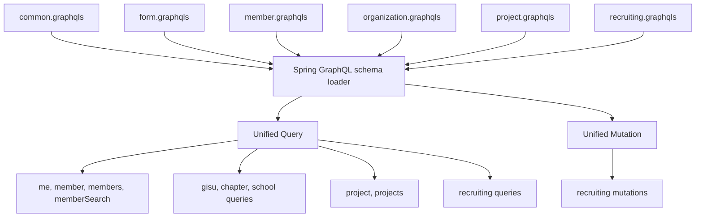
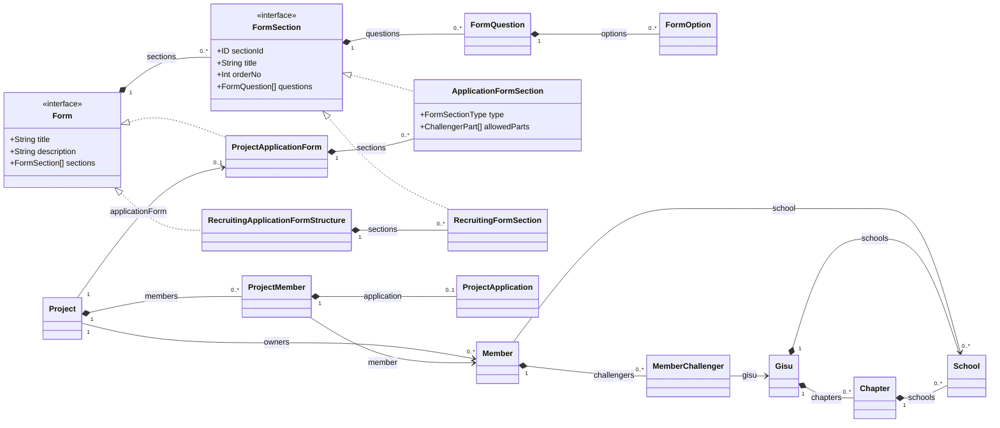
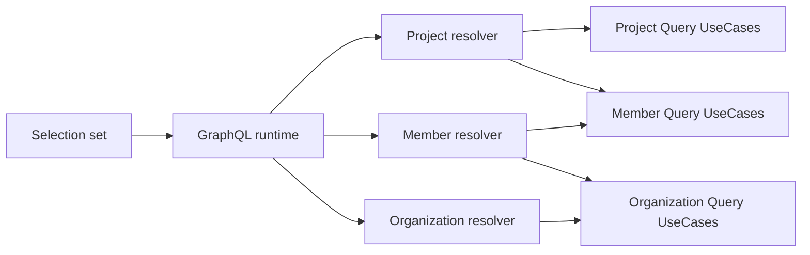

# GraphQL Schema 관계

이 문서는 unified GraphQL schema의 파일 소유권과 type 관계를 설명한다. 실행 계약의 source of truth는
`src/main/resources/graphql/*.graphqls`이며, 이 문서는 schema 변경 위치와 domain 간 참조 방향을 결정할 때 사용한다.

## 파일 소유권

SDL 파일은 하나의 실행 schema로 합쳐지며 type 이름은 전역 namespace를 사용한다.

| SDL | 소유하는 선언 |
| --- | --- |
| `common.graphqls` | `Long`, `Instant`, `ChallengerPart`, `ChallengerTrack` |
| `form.graphqls` | `Form`, `FormSection`, `FormQuestion`, `FormOption`, form enum |
| `member.graphqls` | `Member`와 member query·검색 type |
| `organization.graphqls` | root `Query`, `Gisu`, `Chapter`, `School` |
| `project.graphqls` | Project query와 Project concrete type |
| `recruiting.graphqls` | root `Mutation`, Recruiting query·mutation과 concrete type |

공유 선언은 한 파일만 소유한다. `SharedGraphQlArchitectureTest`가 owner 중복과 domain schema의 재선언을 검사한다.

## Type 관계

아래 diagram은 database ERD가 아니라 GraphQL object/interface 관계다. Cardinality는 SDL의 nullable과 list 계약을 기준으로 하며 JPA association이나 foreign key를 의미하지 않는다.

## 공통 Form 계약

`Form`과 `FormSection`은 여러 form domain이 공유할 수 있는 최소 계약이다.

- 제목, 설명, section, question, option처럼 의미와 lifecycle이 같은 field는 `form.graphqls`가 소유한다.
- `ApplicationFormSection.type`, `allowedParts`처럼 Project 지원 폼에만 필요한 field는 concrete type에 둔다.
- 공통 interface field를 추가할 때는 모든 구현이 같은 의미와 nullability로 제공할 수 있어야 한다.
- domain 전용 metadata를 공통 type에 올려 다른 구현에 의미 없는 field를 강제하지 않는다.

Project의 `ProjectApplicationForm`과 Recruiting의 `RecruitingApplicationFormStructure`는 `Form`을 구현한다.
각 domain section은 `FormSection`을 구현하며 질문과 옵션은 concrete wrapper를 만들지 않고
`FormQuestion`, `FormOption`을 직접 재사용한다. 조건부 이동 대상인 `FormOption.nextSectionId`는 form 엔진의
공통 개념이고, 사용하지 않는 form에서는 `null`이다.

## IDL 경계

SDL 파일은 코드 정리 단위일 뿐 독립 schema가 아니다. 외부 IDL은 모든 SDL을 합친 결과를 기준으로 한다.
따라서 `recruiting.graphqls`만 전달하면 `Form`, `QuestionType`, `ChallengerTrack`, `Instant` 선언이 빠진 불완전한 계약이 된다.

- client codegen 입력은 전체 SDL glob 또는 schema registry의 조립된 schema를 사용한다.
- 공통 선언은 owner 파일 한 곳에서만 정의하고 domain 파일에서는 참조한다.
- domain 이름은 business context를 구분할 때만 붙인다. 공통 identity나 lifecycle을 DTO projection 이름으로 복제하지 않는다.
- 공개 후 field 삭제, field type 변경, non-null 강화, enum value 삭제는 breaking change로 관리한다.

## Canonical Domain Type

같은 domain identity는 하나의 object type으로 표현한다.

- 회원은 `Member` 하나를 사용한다. `MemberSummary`, `MemberBrief`, `ProjectMemberSummary`를 만들지 않는다.
- 조직은 `Gisu`, `Chapter`, `School`을 사용한다. parent별 projection 이름을 GraphQL type 이름으로 노출하지 않는다.
- client가 필요한 field 수는 selection set으로 조절한다. field 공개 범위 차이는 별도 type이 아니라 field resolver와 권한 정책으로 처리한다.

단, 동일한 ID를 참조하더라도 lifecycle과 의미가 다른 snapshot은 별도 type으로 둘 수 있다. 예를 들어
`ProjectApplicant`는 지원 당시 정보를 나타내는 Project-owned view이므로 canonical `Member`와 다른 계약이다.

## Resolver 연결

다른 domain type을 참조한다고 controller끼리 호출하지 않는다. 각 resolver는 필요한 application inbound port만 주입한다.

`Project.productOwner`가 `MemberInfo` source를 반환하면 GraphQL runtime이 `Member` field resolver를 실행한다.
`Member.school`이 `School`을 반환한 뒤 더 깊은 field를 선택하면 organization resolver가 이어서 처리한다.

## 변경 체크리스트

- 새 type이 기존 domain identity를 중복 표현하지 않는가?
- 공통 field와 domain 전용 field의 소유권이 분리되어 있는가?
- interface 구현의 field type과 nullability가 일치하는가?
- schema source와 Java source DTO가 resolver 체인 전체에서 호환되는가?
- nested collection이 batch 조회되어 N+1을 만들지 않는가?
- `SharedGraphQlArchitectureTest`의 owner map과 실제 SDL이 일치하는가?
- 전체 SDL을 조립한 IDL로 introspection과 client codegen이 성공하는가?
