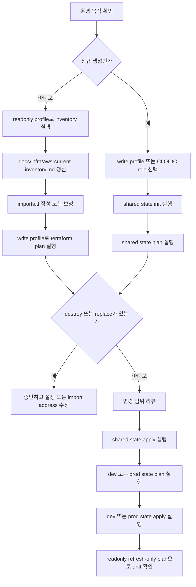

# Terraform 기반 AWS 인프라 운영 온보딩

## 목적과 범위

이 문서는 UMC Product 서버의 AWS 인프라를 Terraform으로 생성, import, 변경, 확장하는 운영 절차를 설명한다. Terraform 관리 대상 도메인은 `university.neordinary.com` 계열로 제한하며, 실행 예시와 관리 대상은 아래 두 호스트만 사용한다.

- `api.university.neordinary.com`
- `dev.api.university.neordinary.com`

현재 저장소의 Terraform 코드는 `infra/terraform` 아래에서 단계적으로 구현한다. 이 문서는 이미 추가된 root/env/module 파일의 책임과, 이후 ALB/IAM/ASG/RDS/DNS 모듈까지 확장할 때 따라야 할 운영 기준을 함께 설명한다. `load-test` root는 운영 도메인을 관리하지 않는 예외적 ephemeral 환경이며, apply 후 ALB DNS로 테스트하고 종료 시 destroy한다.

`umcproduct-readonly` 같은 readonly profile은 현재 인프라 실사, inventory 수집, import 이후 `refresh-only` 확인에만 사용한다. 실제 import와 `terraform apply`는 write 권한 profile 또는 CI OIDC role로 실행해야 한다.

## 디렉터리와 파일 책임

### Root와 지원 파일

| 경로 | 책임 |
| --- | --- |
| `infra/terraform/README.md` | Terraform 프로젝트의 빠른 시작, profile 사용 원칙, import 안전 수칙, 검증 명령을 안내한다. |
| `infra/terraform/versions.tf` | Terraform CLI와 AWS provider 버전 범위를 고정한다. |
| `infra/terraform/providers.tf` | AWS provider region/profile/default tags를 정의한다. |
| `infra/terraform/backend.example.hcl` | S3 remote state와 DynamoDB lock 설정 예시를 제공한다. 실제 backend 값은 운영 계정에 맞게 별도 파일로 관리한다. |
| `scripts/aws-infra-inventory.sh` | readonly profile로 VPC, subnet, SG, route table, ALB, ASG, RDS 등 현재 AWS 리소스 정보를 수집한다. secret 값과 user-data 원문은 출력하지 않는다. |
| `docs/infra/aws-current-inventory.md` | inventory 결과를 사람이 검토할 수 있게 요약하고, import 대상과 운영 리스크를 기록한다. |

### Network module

| 경로 | 책임 |
| --- | --- |
| `infra/terraform/modules/network/main.tf` | VPC, subnet, internet gateway, route table, route table association, S3 gateway endpoint를 생성한다. |
| `infra/terraform/modules/network/variables.tf` | VPC CIDR, subnet map, route table 구분, subnet role, S3 gateway endpoint 활성화 여부를 입력받는다. |
| `infra/terraform/modules/network/outputs.tf` | VPC ID, subnet ID map, role별 subnet ID 목록, public/private route table ID를 다른 모듈에 전달한다. |

### Security module

| 경로 | 책임 |
| --- | --- |
| `infra/terraform/modules/security/main.tf` | ALB, ASG, DB 등 security group과 ingress/egress rule을 관리한다. SG rule은 독립 리소스로 두어 순환 참조를 줄인다. |
| `infra/terraform/modules/security/variables.tf` | VPC ID/CIDR, SSH 허용 CIDR, parity용 공개 SSH 허용 여부를 입력받는다. rebuild 기본값은 공개 SSH를 허용하지 않는다. |
| `infra/terraform/modules/security/outputs.tf` | ALB/ASG/DB security group ID를 ALB, ASG, RDS 모듈에 전달한다. |

### IAM module

| 경로 | 책임 |
| --- | --- |
| `infra/terraform/modules/iam/main.tf` | EC2 instance role/profile, ECR pull 정책, prod 목적별 Secrets Manager 읽기 정책, KMS decrypt 정책을 관리한다. |
| `infra/terraform/modules/iam/variables.tf` | 환경명, ECR repository ARN, dev secret source, prod 목적별 secret ARN, KMS key ARN을 입력받는다. |
| `infra/terraform/modules/iam/outputs.tf` | ASG launch template에서 사용할 instance profile ARN/name을 전달한다. |
| `infra/terraform/modules/iam/user-data/asg-app.sh.tftpl` | EC2 부팅 시 ECR 로그인, secret source별 env 로딩, Docker Compose 실행, health check 대기를 수행하는 user-data template이다. |

### ALB module

| 경로 | 책임 |
| --- | --- |
| `infra/terraform/modules/alb/main.tf` | Application Load Balancer, target group, HTTP to HTTPS redirect listener, HTTPS listener, host 기반 listener rule을 관리한다. |
| `infra/terraform/modules/alb/variables.tf` | VPC ID, public subnet IDs, ALB SG ID, ACM certificate ARN, dev/prod host header를 입력받는다. |
| `infra/terraform/modules/alb/outputs.tf` | ALB ARN/DNS/zone ID와 dev/prod target group ARN을 ASG와 DNS 모듈에 전달한다. |

### Compute ASG module

| 경로 | 책임 |
| --- | --- |
| `infra/terraform/modules/compute-asg/main.tf` | Launch template, Auto Scaling Group, target group 연결, rolling instance refresh, encrypted root EBS 설정을 관리한다. |
| `infra/terraform/modules/compute-asg/variables.tf` | AMI, instance type, key pair, subnet IDs, SG, instance profile, target groups, user-data, desired/min/max 용량을 입력받는다. |
| `infra/terraform/modules/compute-asg/outputs.tf` | launch template ID와 ASG name을 import, 운영, downstream 참조에 제공한다. |

### RDS module

| 경로 | 책임 |
| --- | --- |
| `infra/terraform/modules/rds/main.tf` | DB subnet group과 PostgreSQL RDS instance를 관리한다. 신규 생성 기본값은 private, encrypted, deletion protection enabled를 목표로 한다. |
| `infra/terraform/modules/rds/variables.tf` | DB identifier, subnet IDs, SG IDs, instance class, engine version, storage, deletion protection을 입력받는다. |
| `infra/terraform/modules/rds/outputs.tf` | DB identifier, endpoint, port를 운영 확인과 애플리케이션 설정에 전달한다. |

### DNS module

| 경로 | 책임 |
| --- | --- |
| `infra/terraform/modules/dns/main.tf` | Route53 A alias record를 ALB로 연결한다. |
| `infra/terraform/modules/dns/variables.tf` | record별 hosted zone ID, record name, ALB DNS name, ALB zone ID, health evaluation 여부를 입력받는다. |
| `infra/terraform/modules/dns/outputs.tf` | Terraform이 관리하는 record FQDN 목록을 출력한다. |

### Environment files

| 경로 | 책임 |
| --- | --- |
| `infra/terraform/envs/shared/backend.tf` | shared state의 S3 backend를 선언한다. backend bucket/key 값은 별도 backend config로 주입한다. |
| `infra/terraform/envs/shared/main.tf` | VPC, subnet, SG, ALB, target group, Route53 record처럼 dev/prod가 함께 쓰는 리소스를 한 state에서 조립한다. DNS는 `dev.api.university.neordinary.com`, `api.university.neordinary.com`만 관리한다. |
| `infra/terraform/envs/shared/variables.tf` | shared 리소스 입력 변수와 기본값을 정의한다. |
| `infra/terraform/envs/shared/terraform.tfvars.example` | shared state 실행에 필요한 비밀이 아닌 값과 ARN/ID 입력 예시를 제공한다. |
| `infra/terraform/envs/shared/imports.tf` | 기존 VPC, subnet, SG, ALB, target group, Route53 record를 shared state로 가져오기 위한 import block을 둔다. |
| `infra/terraform/envs/shared/moved.tf` | shared resource address 변경 시 state 이동 기록을 남긴다. |
| `infra/terraform/envs/shared/outputs.tf` | dev/prod root가 참조할 VPC, subnet, SG, ALB, target group output을 제공한다. |
| `infra/terraform/envs/dev/backend.tf` | dev state의 S3 backend를 선언한다. shared state와 다른 key를 사용한다. |
| `infra/terraform/envs/dev/main.tf` | dev ASG와 dev 전용 IAM/policy를 조립한다. VPC, SG, ALB target group은 shared state output 또는 data source로 참조한다. |
| `infra/terraform/envs/dev/variables.tf` | dev 환경 입력 변수와 기본값을 정의한다. 기본 secret source는 홈서버/로컬 env file이며, 필요할 때만 SSM 또는 Secrets Manager ARN을 선택한다. |
| `infra/terraform/envs/dev/terraform.tfvars.example` | dev 실행에 필요한 비밀이 아닌 값과 local env file path 또는 선택적 ARN 입력 예시를 제공한다. 실제 secret 값은 넣지 않는다. |
| `infra/terraform/envs/dev/imports.tf` | 기존 dev 리소스를 Terraform state로 가져오기 위한 import block을 둔다. |
| `infra/terraform/envs/dev/moved.tf` | Terraform resource address 변경 시 state 이동 기록을 남긴다. 수동 state 조작 대신 moved block을 우선한다. |
| `infra/terraform/envs/prod/backend.tf` | prod state의 S3 backend를 선언한다. shared/dev state와 다른 key를 사용한다. |
| `infra/terraform/envs/prod/main.tf` | prod ASG, prod 전용 IAM/policy, RDS를 조립한다. VPC, SG, ALB target group은 shared state output 또는 data source로 참조한다. |
| `infra/terraform/envs/prod/variables.tf` | prod 환경 입력 변수와 기본값을 정의한다. JWT key ring, OAuth client, data protection, database secret ARN을 분리해 받는다. |
| `infra/terraform/envs/prod/terraform.tfvars.example` | prod 실행에 필요한 비밀이 아닌 값과 목적별 secret ARN 입력 예시를 제공한다. 실제 secret 값은 넣지 않는다. |
| `infra/terraform/envs/prod/imports.tf` | 기존 prod 리소스를 Terraform state로 가져오기 위한 import block을 둔다. |
| `infra/terraform/envs/prod/moved.tf` | Terraform resource address 변경 시 state 이동 기록을 남긴다. 운영 리소스 rename은 moved block으로 추적한다. |
| `loadtest/terraform/*` | 부하 테스트 env은 배포 env가 아니라 ephemeral 테스트 리그(local backend·self-contained·ECR pull·로컬 `load-test.env` 주입)라 `infra/terraform`에서 분리했다. 파일 구성·실행은 `loadtest/README.md`, 설계 근거는 `docs/superpowers/plans/2026-07-22-load-test-v1-simplification.md` 참조. |

주의: 같은 VPC, ALB, Route53 record를 둘 이상의 Terraform state가 동시에 소유하면 안 된다. dev/prod root를 분리해 구현하는 경우 shared 리소스 소유자를 먼저 정하고, 다른 root는 remote state output 또는 data source로만 참조한다. `load-test`는 이 충돌을 피하기 위해 shared VPC/ALB/RDS를 참조하지 않고 독립 리소스를 만든다.

## Terraform 운영 흐름



## 사전 준비

Terraform 실행자는 아래를 준비한다.

- Terraform CLI와 AWS CLI
- remote state backend 값
- readonly profile: 실사와 refresh-only 전용
- write profile 또는 CI OIDC role: plan/apply/import 적용 전용
- `terraform.tfvars`: secret 값이 아닌 ARN/ID와 운영 파라미터만 포함

Secrets 정책:

- `.tfvars`에 DB password, JWT secret, OAuth secret, access token 같은 실제 secret 값을 저장하지 않는다.
- 애플리케이션은 secret backend를 직접 알지 않고 환경변수만 읽는다.
- dev 기본값은 비용이 들지 않는 홈서버/로컬 env file이다. 공유 dev가 필요할 때만 SSM Parameter Store Standard 또는 Secrets Manager를 선택한다.
- prod는 Secrets Manager를 사용하되 하나의 runtime secret으로 합치지 않는다.
- prod secret은 JWT key ring, OAuth client, data protection, database 단위로 분리한다.
- JWT key ring 안에서도 access, refresh, OAuth verification, email verification key를 용도별로 분리한다.
- EC2 instance role은 prod에서 필요한 Secrets Manager ARN과 KMS key ARN에 대해서만 읽기 권한을 가진다.

JWT key ring 예시:

```json
{
  "access": {
    "current": "access-2026-07",
    "keys": {
      "access-2026-07": "REDACTED",
      "access-2026-06": "REDACTED"
    }
  },
  "refresh": {
    "current": "refresh-2026-07",
    "keys": {
      "refresh-2026-07": "REDACTED",
      "refresh-2026-06": "REDACTED"
    }
  },
  "oauthVerification": {
    "current": "oauth-verification-2026-07",
    "keys": {
      "oauth-verification-2026-07": "REDACTED"
    }
  },
  "emailVerification": {
    "current": "email-verification-2026-07",
    "keys": {
      "email-verification-2026-07": "REDACTED"
    }
  }
}
```

## 전체 인프라 생성 절차

신규 환경을 Terraform으로 생성할 때는 write profile 또는 CI OIDC role을 사용한다. readonly profile로는 `apply`를 시도하지 않는다. 생성 순서는 shared state, dev/prod state 순서다.

```bash
cd infra/terraform/envs/shared
cp terraform.tfvars.example terraform.tfvars
```

shared `terraform.tfvars`에는 hosted zone, ACM certificate, 리소스 파라미터처럼 비밀이 아닌 값만 둔다.

```hcl
aws_region  = "ap-northeast-2"
aws_profile = "umcproduct-admin"
environment = "shared"
```

shared state 초기화와 검증:

```bash
terraform init -backend-config=../../backend.shared.hcl
terraform fmt -check -recursive ../../
terraform validate
```

shared 계획 확인과 적용:

```bash
terraform plan -var-file=terraform.tfvars -out=tfplan
terraform apply tfplan
```

shared/dev/prod `plan`에서 관리 대상이 `api.university.neordinary.com`, `dev.api.university.neordinary.com` 범위를 벗어나면 중단한다. `load-test`는 운영 도메인을 만들지 않고 output의 ALB DNS만 사용한다. 의도하지 않은 `destroy` 또는 `replace`가 있으면 적용하지 않는다.

dev/prod root는 shared 적용 이후 실행한다. dev는 비용 절감을 위해 기본적으로 홈서버 또는 로컬 env file을 secret source로 사용한다.

```bash
cd ../dev
cp terraform.tfvars.example terraform.tfvars
terraform init -backend-config=../../backend.dev.hcl
terraform plan -var-file=terraform.tfvars -out=tfplan
terraform apply tfplan
```

dev `terraform.tfvars`에는 예를 들어 아래처럼 secret 값이 아닌 env file 경로와 배포 파라미터만 둔다.

```hcl
aws_region  = "ap-northeast-2"
aws_profile = "umcproduct-admin"
environment = "dev"

dev_secret_source         = "local_env_file"
dev_runtime_env_file_path = "/etc/umc-product/dev.env"
image_tag                 = "2026-06-30-001"
```

적용 후 확인:

```bash
curl -fsSI https://dev.api.university.neordinary.com

DEV_TG_ARN=$(aws elbv2 describe-target-groups \
  --names server-tg-ec2-dev \
  --query 'TargetGroups[0].TargetGroupArn' \
  --output text)

aws elbv2 describe-target-health \
  --target-group-arn "$DEV_TG_ARN" \
  --query 'TargetHealthDescriptions[].TargetHealth.State'
```

prod는 동일한 방식으로 `infra/terraform/envs/prod`에서 실행한다. prod `terraform.tfvars`에는 secret 값이 아닌 목적별 secret ARN만 둔다.

```hcl
aws_region  = "ap-northeast-2"
aws_profile = "umcproduct-admin"
environment = "prod"

jwt_key_ring_secret_arn    = "arn:aws:secretsmanager:ap-northeast-2:137809407320:secret:umc-product/prod/jwt-key-rings"
oauth_client_secret_arn    = "arn:aws:secretsmanager:ap-northeast-2:137809407320:secret:umc-product/prod/oauth-clients"
data_protection_secret_arn = "arn:aws:secretsmanager:ap-northeast-2:137809407320:secret:umc-product/prod/data-protection"
database_secret_arn        = "arn:aws:secretsmanager:ap-northeast-2:137809407320:secret:umc-product/prod/database"
runtime_secret_kms_key_arn = "arn:aws:kms:ap-northeast-2:137809407320:key/runtime-secret"
image_tag                  = "2026-06-30-001"
```

prod 적용 전에는 변경 범위, RDS 영향, ASG rolling refresh 여부를 별도 리뷰한다.

## 부하 테스트 환경 생성과 정리

부하 테스트 env은 배포 env와 분리된 `loadtest/terraform`(local backend·self-contained)에서 실행한다. 운영 VPC/ALB/RDS를 재사용하지 않고 테스트 전용 VPC·SUT·k6 generator·monitoring·RDS를 만들고, 끝나면 destroy로 전체를 정리한다.

v1 기준 주요 사항:

- **backend**: local (S3 아님). `terraform -chdir=loadtest/terraform init` 만으로 시작한다.
- **secret**: SSM Parameter Store가 아니라 로컬 `load-test.env` 파일을 base64로 SUT app.env에 주입한다. `terraform.tfvars`에는 `app_env_file_path = "./load-test.env"` 경로만 둔다.
- **registry**: ECR 전용(generic/public 미지원). SUT IAM role은 ECR pull 권한만 갖는다.

실행 순서(로컬 값 준비 → init/plan/apply → 시딩 → k6 → destroy)와 명령은 `loadtest/README.md`를 따른다. 설계 근거는 `docs/superpowers/plans/2026-07-22-load-test-v1-simplification.md`.

## 기존 인프라 import 절차

기존 리소스를 Terraform으로 관리하기 전에는 현재 상태를 먼저 실사한다.

```bash
AWS_PROFILE=umcproduct-readonly AWS_REGION=ap-northeast-2 scripts/aws-infra-inventory.sh
```

실사 결과를 `docs/infra/aws-current-inventory.md`에 반영하고, 리소스 ID와 Terraform address를 맞춰 `imports.tf`를 작성한다.

shared import 예시:

```hcl
import {
  to = module.alb.aws_lb_target_group.dev_ec2
  id = "arn:aws:elasticloadbalancing:ap-northeast-2:137809407320:targetgroup/server-tg-ec2-dev/a987266b77a658a5"
}
```

dev import 예시:

```hcl
import {
  to = module.dev_asg.aws_autoscaling_group.this
  id = "dev-umc-product-server-asg"
}
```

import 적용은 write profile 또는 CI OIDC role로 실행한다.

```bash
cd infra/terraform/envs/shared
terraform init -backend-config=../../backend.shared.hcl
terraform plan -var-file=terraform.tfvars -out=tfplan
terraform apply tfplan

cd ../dev
terraform init -backend-config=../../backend.dev.hcl
terraform plan -var-file=terraform.tfvars -out=tfplan
terraform apply tfplan
```

prod ASG와 RDS import는 prod root에서 실행한다.

```bash
cd infra/terraform/envs/prod
terraform init -backend-config=../../backend.prod.hcl
terraform plan -var-file=terraform.tfvars -out=tfplan
terraform apply tfplan
```

중단 기준:

- `plan`에 기존 운영 리소스의 `destroy`가 나오면 즉시 중단한다.
- `plan`에 의도하지 않은 `replace`가 나오면 즉시 중단한다.
- import address가 잘못되어 새 리소스 생성과 기존 리소스 삭제가 동시에 보이면 즉시 중단한다.
- RDS, ALB, ASG, Route53 변경은 사람이 리소스 ID와 이름을 재검증한 뒤 진행한다.

shared ALB import 후 첫 plan에서 아래 변경은 의도된 전환인지 별도로 확인한다.

- HTTPS listener 기본 인증서를 `university.neordinary.com` ACM 인증서로 전환
- listener rule host header에서 legacy domain 제거
- listener rule weighted forward에서 legacy IP target group 제거

import 후 drift 확인은 readonly profile로 `refresh-only`만 실행한다.

```bash
cd infra/terraform/envs/dev
terraform init -backend-config=../../backend.dev.hcl
terraform plan \
  -refresh-only \
  -var-file=terraform.tfvars \
  -var='aws_profile=umcproduct-readonly'
```

## 부분 scale out/in

scale out/in은 ASG 인스턴스 수 조정이다. EC2 크기나 RDS 크기를 바꾸는 scale up/down과 구분한다.

`infra/terraform/envs/dev/main.tf` 또는 환경 변수 파일에서 ASG 용량을 조정한다.

```hcl
module "dev_asg" {
  desired_capacity = 2
  min_size         = 2
  max_size         = 4
}
```

적용:

```bash
cd infra/terraform/envs/dev
terraform plan -var-file=terraform.tfvars -out=tfplan
terraform apply tfplan
```

운영 기준:

- scale out: `desired_capacity`, 필요 시 `min_size`, `max_size`를 올린다.
- scale in: `desired_capacity`를 낮춘 뒤 `min_size`도 맞춘다. `max_size`는 향후 burst 필요성을 보고 조정한다.
- ASG가 ALB target group health check를 통과할 때까지 기다린다.
- scale in 전에는 현재 배포, batch 작업, migration 실행 여부를 확인한다.

## 부분 scale up/down

scale up/down은 리소스 한 대의 크기를 바꾸는 작업이다. EC2와 RDS는 영향 범위가 다르므로 절차를 분리한다.

### EC2 instance_type 변경

ASG module의 `instance_type`을 변경한다.

```hcl
module "dev_asg" {
  instance_type = "t4g.medium"
}
```

적용하면 launch template 새 version이 만들어지고 ASG instance refresh가 실행될 수 있다.

```bash
cd infra/terraform/envs/dev
terraform plan -var-file=terraform.tfvars -out=tfplan
terraform apply tfplan
```

확인:

```bash
curl -fsSI https://dev.api.university.neordinary.com

DEV_TG_ARN=$(aws elbv2 describe-target-groups \
  --names server-tg-ec2-dev \
  --query 'TargetGroups[0].TargetGroupArn' \
  --output text)

aws elbv2 describe-target-health \
  --target-group-arn "$DEV_TG_ARN" \
  --query 'TargetHealthDescriptions[].TargetHealth.State'
```

주의할 점:

- AMI architecture와 instance type architecture가 맞아야 한다.
- instance refresh 중 최소 정상 인스턴스 수를 유지해야 한다.
- prod는 `api.university.neordinary.com` health check와 ALB target health를 확인한 뒤 종료한다.

### RDS instance_class 변경

RDS vertical scaling은 DB 인스턴스 크기 변경이다. EC2보다 위험도가 높으므로 prod에서는 반드시 사전 snapshot, maintenance window, 다운타임 리스크를 검토한다.

```hcl
module "rds" {
  instance_class = "db.t4g.medium"
}
```

권장 순서:

```bash
cd infra/terraform/envs/prod
terraform plan -var-file=terraform.tfvars -out=tfplan
```

적용 전 체크리스트:

- 최신 automated backup 또는 manual snapshot이 있는가
- 변경 시간이 maintenance window 안에 있는가
- DB 재시작 또는 짧은 연결 단절을 감수할 수 있는가
- 애플리케이션 connection pool과 retry 정책이 버틸 수 있는가
- `plan`에 의도하지 않은 storage, subnet group, identifier 교체가 없는가

문제가 없을 때만 적용한다.

```bash
terraform apply tfplan
```

적용 후에는 RDS status, 애플리케이션 health, 주요 API 오류율을 확인한다.

```bash
curl -fsSI https://api.university.neordinary.com

PROD_TG_ARN=$(aws elbv2 describe-target-groups \
  --names server-tg-ec2-prod \
  --query 'TargetGroups[0].TargetGroupArn' \
  --output text)

aws elbv2 describe-target-health \
  --target-group-arn "$PROD_TG_ARN" \
  --query 'TargetHealthDescriptions[].TargetHealth.State'
```

## 자주 쓰는 검증 명령

Terraform 형식과 정적 검증:

```bash
cd infra/terraform
terraform fmt -check -recursive

cd envs/shared
terraform init -backend=false
terraform validate

cd ../dev
terraform init -backend=false
terraform validate

cd ../prod
terraform init -backend=false
terraform validate
```

readonly drift 확인:

```bash
cd infra/terraform/envs/prod
terraform init -backend-config=../../backend.prod.hcl
terraform plan \
  -refresh-only \
  -var-file=terraform.tfvars \
  -var='aws_profile=umcproduct-readonly'
```

도메인 정책 확인:

```bash
rg -n "api\\.university\\.neordinary\\.com|dev\\.api\\.university\\.neordinary\\.com" infra/terraform docs/infra docs/onboarding/project/terraform-aws-infra.md
rg -n "u[m]c\\.it\\.kr|a[p]i\\.u[m]c\\.it\\.kr|d[e]v\\.a[p]i\\.u[m]c\\.it\\.kr|Z0322165[1]|0221280[b]" \
  infra/terraform docs/infra/aws-current-inventory.md docs/onboarding/project/terraform-aws-infra.md
```

운영자가 의도하지 않은 Route53 record나 ALB host header가 보이면 적용하지 않는다.
